

<h1 align="center"> 《动手学习深度学习》</h1>

[项目动机](https://github.com/MLNLP-World/DeepLearning-MuLi-Notes/blob/main/README.md#项目动机),[课程简介](https://github.com/MLNLP-World/DeepLearning-MuLi-Notes/blob/main/README.md#课程简介), [课程资源](https://github.com/MLNLP-World/DeepLearning-MuLi-Notes/blob/main/README.md#课程资源), [教材目录](https://github.com/MLNLP-World/DeepLearning-MuLi-Notes/blob/main/README.md#课程目录), [笔记](https://github.com/MLNLP-World/DeepLearning-MuLi-Notes/blob/main/README.md#笔记), [文件夹说明](https://github.com/MLNLP-World/DeepLearning-MuLi-Notes/blob/main/README.md#文件夹说明), [组织者](https://github.com/MLNLP-World/DeepLearning-MuLi-Notes/blob/main/README.md#组织者), [贡献者](https://github.com/MLNLP-World/DeepLearning-MuLi-Notes/blob/main/README.md#贡献者)

---

##  项目动机

《动手学习深度学习》是**李沐老师**（AWS 资深首席科学家，美国卡内基梅隆大学计算机系博士）主讲的一系列深度学习视频。本项目收集了我们在寒假期间学习《动手学习深度学习》过程中详细的**markdown笔记**和相关的**jupyter代码**。赠人玫瑰，手留余香，我们将所有的**markdown**笔记开源，希望在自己学习的同时，也对大家学习掌握李沐老师的《动手学习深度学习》有所帮助。

>本项目的特色：
>1. **markdown笔记**与原课程视频一一对应，可以帮助大家一边听课一边理解。
>2. **jupyter代码**均有详细中文注释，帮助大家更快上手实践。

课程视频**共73节**，单个视频平均时长**不超过30分钟**，预计**寒假40天**内可以学习完毕。

本项目所用徽章来自互联网，如侵犯了您的图片版权请联系我们删除，谢谢。

##  课程简介

通常我们提到深度学习，常常会忘记深度学习只是机器学习的一小部分，而认为它是独立于机器学习的单独模块。这是因为机器学习作为一门历史更悠久的学科，在深度学习没有问世之前，在现实世界的应用范围很窄。在语音识别、计算机视觉、自然语言处理等领域，由于需要大量的领域知识并且现实情况异常复杂，机器学习往往只是解决这些领域问题方案中的一小部分。但是就在过去的几年里，深度学习的问世和应用给世界带来了惊喜，推动了计算机视觉、自然语言处理、自动语音识别、强化学习和统计建模等领域的快速发展，并逐渐引领潮流，在世界掀起了一波人工智能的革命。

在 **《动手学习深度学习》** 课程中，既有少量的机器学习的基础知识，比如：__线性神经网络，多层感知机__ 等等；又有如今前沿应用的 __各种深度学习模型：包括leNet，ResNet，LSTM，BERT……__ 同时每一章节的讲解还配备由pytorch实现的代码、教科书等等，可以帮助同学在短期内掌握深度学习的基础模型与前沿知识和并提高实践能力。

##  课程资源

- B站教学网址：[动手学习深度学习（已完结）](https://space.bilibili.com/1567748478/channel/seriesdetail?sid=358497)
- 教材网址：[《动手学深度学习》(中文版)](https://zh-v2.d2l.ai), [《Dive into Deep Learning》 0.17.1 documentation](https://d2l.ai)
- 课程主页：[https://courses.d2l.ai/zh-v2/](https://courses.d2l.ai/zh-v2/)
- 论坛网址：[discuss.d2l.ai](https://discuss.d2l.ai/c/chinese-version/16)，[discuss.pytorch](https://discuss.pytorch.org)

此外，本门课程还有相应的代码实现。**每章都有相应的jupyter记事本，提供模型的完整python代码**，所有的资源都可在网上免费获取。

##  教材目录

[《动手学深度学习》(中文版)](https://zh-v2.d2l.ai)和英文版[Dive into Deep Learning 0.17.1 documentation](https://d2l.ai)教材目录及章节链接如下：

| 章节 | 中文版                                                       | 英文版                                                       |
| ---- | ------------------------------------------------------------ | ------------------------------------------------------------ |
| 1    | [前言](https://zh-v2.d2l.ai/chapter_introduction/index.html) | [Introduction]((https://d2l.ai/chapter_introduction/index.html)) |
| 2    | [预备知识](https://zh-v2.d2l.ai/chapter_preliminaries/index.html) | [Preliminaries](https://d2l.ai/chapter_preliminaries/index.html) |
| 3    | [线性神经网络](https://zh-v2.d2l.ai/chapter_linear-networks/index.html) | [Linear Neural Networks](https://d2l.ai/chapter_linear-networks/index.html) |
| 4    | [多层感知机](https://zh-v2.d2l.ai/chapter_multilayer-perceptrons/index.html) | [Multilayer Perceptrons](https://d2l.ai/chapter_multilayer-perceptrons/index.html) |
| 5    | [深度学习计算](https://zh-v2.d2l.ai/chapter_deep-learning-computation/index.html) | [Deep Learning Computation](https://d2l.ai/chapter_deep-learning-computation/index.html) |
| 6    | [卷积神经网络](https://zh-v2.d2l.ai/chapter_convolutional-neural-networks/index.html) | [Convolutional Neural Networks](https://d2l.ai/chapter_convolutional-neural-networks/index.html) |
| 7    | [现代卷积神经网络](https://zh-v2.d2l.ai/chapter_convolutional-modern/index.html) | [Modern Convolutional Neural Networks](https://d2l.ai/chapter_convolutional-modern/index.html) |
| 8    | [循环神经网络](https://zh-v2.d2l.ai/chapter_recurrent-neural-networks/index.html) | [Recurrent Neural Networks](https://d2l.ai/chapter_recurrent-neural-networks/index.html) |
| 9    | [现代循环神经网络](https://zh-v2.d2l.ai/chapter_recurrent-modern/index.html) | [Modern Recurrent Neural Networks](https://d2l.ai/chapter_recurrent-modern/index.html) |
| 10   | [注意力机制](https://zh-v2.d2l.ai/chapter_attention-mechanisms/index.html) | [Attention Mechanisms](https://d2l.ai/chapter_attention-mechanisms/index.html) |
| 11   | [优化算法](https://zh-v2.d2l.ai/chapter_optimization/index.html) | [Optimization Algorithms](https://d2l.ai/chapter_optimization/index.html) |
| 12   | [计算性能](https://zh-v2.d2l.ai/chapter_computational-performance/index.html) | [Computational Performance](https://d2l.ai/chapter_computational-performance/index.html) |
| 13   | [计算机视觉](https://zh-v2.d2l.ai/chapter_computer-vision/index.html) | [Computer Vision](https://d2l.ai/chapter_computer-vision/index.html) |
| 14   | [自然语言处理：预训练](https://zh-v2.d2l.ai/chapter_natural-language-processing-pretraining/index.html) | [Natural Language Processing: Pretraining](https://d2l.ai/chapter_natural-language-processing-pretraining/index.html) |
| 15   | [自然语言处理：应用](https://zh-v2.d2l.ai/chapter_natural-language-processing-applications/index.html) | [Natural Language Processing Applications](https://d2l.ai/chapter_natural-language-processing-applications/index.html) |
| 16   | 推荐系统                                                     | [Recommender Systems](https://d2l.ai/chapter_recommender-systems/index.html) |
| 17   | 生成对抗网络                                                 | [Generative Adversarial Networks](https://d2l.ai/chapter_generative-adversarial-networks/index.html) |
| 18   | 附录： 深度学习中的数学基础                                               | [Appendix: Mathematics for Deep Learning](https://d2l.ai/chapter_appendix-mathematics-for-deep-learning/index.html) |
| 19   | [附录： 深度学习工具](https://zh-v2.d2l.ai/chapter_appendix-tools-for-deep-learning/index.html) | [Appendix: Tools for Deep Learning](https://d2l.ai/chapter_appendix-tools-for-deep-learning/index.html) |

##  笔记

| 视频                                                         | 笔记                                                         | 讲义                                                         | 代码                                                         | 贡献者                                                       |
| :----------------------------------------------------------- | :----------------------------------------------------------- | ------------------------------------------------------------ | :----------------------------------------------------------- | :----------------------------------------------------------- |
|  | [00-预告](https://github.com/HIT-UG-Group/DeepLearning-MuLi-Notes/blob/main/notes/00-%E9%A2%84%E5%91%8A.md) | [讲义](https://github.com/HIT-UG-Group/DeepLearning-MuLi-Notes/blob/main/notes/00-预告.md) |                                                              |  |
| <a href="https://www.bilibili.com/video/BV1oX4y137bC?spm_id_from=333.999.0.0">  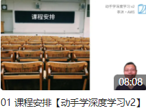</a> | [01-课程安排](notes/01-%E8%AF%BE%E7%A8%8B%E5%AE%89%E6%8E%92.md) | [讲义](https://courses.d2l.ai/zh-v2/assets/pdfs/part-0_1.pdf) |                                                              |  |
|  | [02-深度学习介绍](https://github.com/HIT-UG-Group/DeepLearning-MuLi-Notes/blob/main/notes/02-%E6%B7%B1%E5%BA%A6%E5%AD%A6%E4%B9%A0%E4%BB%8B%E7%BB%8D.md) | [讲义](https://courses.d2l.ai/zh-v2/assets/pdfs/part-0_2.pdf) |                                                              |   |
|  | [03-安装](https://github.com/HIT-UG-Group/DeepLearning-MuLi-Notes/blob/main/notes/03-安装.md) | [讲义](https://courses.d2l.ai/zh-v2/assets/pdfs/part-0_3.pdf) |                                                              |   |
| <a href="https://www.bilibili.com/video/BV1CV411Y7i4?spm_id_from=333.999.0.0">  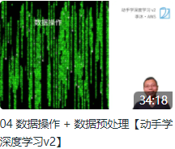</a> | [04-数据操作和数据预处理](notes/04-%E6%95%B0%E6%8D%AE%E8%AF%BB%E5%8F%96%E5%92%8C%E6%93%8D%E4%BD%9C.md) | [讲义](https://courses.d2l.ai/zh-v2/assets/pdfs/part-0_4.pdf) | [Jupyter 代码](code/04-%E6%95%B0%E6%8D%AE%E8%AF%BB%E5%8F%96%E5%92%8C%E6%93%8D%E4%BD%9C) |   |
| <a href="https://www.bilibili.com/video/BV1eK4y1U7Qy?spm_id_from=333.999.0.0">  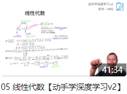</a> | [05-线性代数](notes/05-%E7%BA%BF%E6%80%A7%E4%BB%A3%E6%95%B0.md) | [讲义](https://courses.d2l.ai/zh-v2/assets/pdfs/part-0_5.pdf) |                                                              |   |
| <a href="https://www.bilibili.com/video/BV1eZ4y1w7PY?spm_id_from=333.999.0.0">  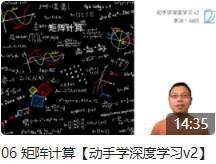</a> | [06-矩阵计算](notes/06-%E7%9F%A9%E9%98%B5%E8%AE%A1%E7%AE%97.md) | [讲义](https://courses.d2l.ai/zh-v2/assets/pdfs/part-0_6.pdf) |                                                              |  |
| <a href="https://www.bilibili.com/video/BV1KA411N7Px?spm_id_from=333.999.0.0">  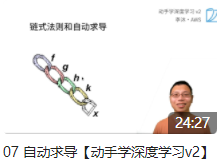</a> | [07-链式法则和自动求导](https://github.com/HIT-UG-Group/DeepLearning-MuLi-Notes/blob/main/notes/07-%E8%87%AA%E5%8A%A8%E6%B1%82%E5%AF%BC.md) | [讲义](https://courses.d2l.ai/zh-v2/assets/pdfs/part-0_7.pdf) | [Jupyter 代码](code/07-%E8%87%AA%E5%8A%A8%E6%B1%82%E5%AF%BC.ipynb) | <a href="https://github.com/Chigland">  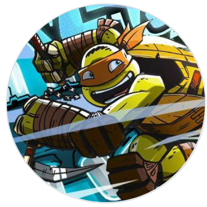</a>  |
| 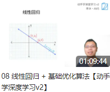               | [08-线性回归+基础优化算法](notes/08-线性回归+基础优化算法.md) | [讲义1](https://courses.d2l.ai/zh-v2/assets/pdfs/part-0_8.pdf) [2](https://courses.d2l.ai/zh-v2/assets/pdfs/part-0_9.pdf) | [Jupyter 代码](code/08-线性回归)                             |  |
| 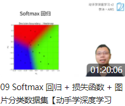               | [09-Softmax回归](notes/09-softmax回归.md)                    | [讲义1](https://courses.d2l.ai/zh-v2/assets/pdfs/part-0_10.pdf) [2](https://courses.d2l.ai/zh-v2/assets/pdfs/part-0_11.pdf) | [Jupyter 代码](code/09-Softmax回归)                          |   |
|  | [10-多层感知机](notes/10-%E5%A4%9A%E5%B1%82%E6%84%9F%E7%9F%A5%E6%9C%BA.md) | [讲义1](https://courses.d2l.ai/zh-v2/assets/pdfs/part-0_12.pdf) [2](https://courses.d2l.ai/zh-v2/assets/pdfs/part-0_13.pdf) | [Jupyter 代码](code/10-多层感知机)                           |   |
| 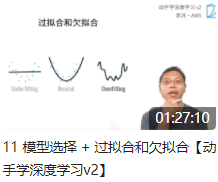               | [11-模型选择+过拟合和欠拟合](notes/11-模型选择+过拟合和欠拟合.md) | [讲义1](https://courses.d2l.ai/zh-v2/assets/pdfs/part-0_14.pdf) [2](https://courses.d2l.ai/zh-v2/assets/pdfs/part-0_15.pdf) |                                                              |   |
| 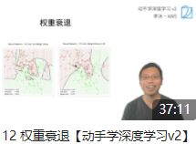               | [12-权重衰退](notes/12-权重衰退.md)                          | [讲义](https://courses.d2l.ai/zh-v2/assets/pdfs/part-0_16.pdf) | [Jupyter 代码](code/12-权重衰退.ipynb)                       |   |
|                | [13-丢弃法](notes/13-丢弃法.md)                              | [讲义](https://courses.d2l.ai/zh-v2/assets/pdfs/part-0_17.pdf) | [Jupyter 代码](code/13-丢弃法.ipynb)                         |  |
| <a href="https://www.bilibili.com/video/BV1u64y1i75a?spm_id_from=333.999.0.0">  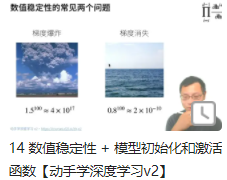</a> | [14-数值稳定性](notes/14-数值稳定性.md)                      | [讲义1](https://courses.d2l.ai/zh-v2/assets/pdfs/part-0_18.pdf) [2](https://courses.d2l.ai/zh-v2/assets/pdfs/part-0_19.pdf) |                                                              |  |
|  | [15-实战Kaggle预测房价](notes/15-实战Kaggle比赛：预测房价.md) | [讲义](https://courses.d2l.ai/zh-v2/assets/pdfs/part-0_20.pdf) | [Jupyter 代码](https://zh-v2.d2l.ai/chapter_multilayer-perceptrons/kaggle-house-price.html) |   |
| <a href="https://www.bilibili.com/video/BV1AK4y1P7vs?spm_id_from=333.999.0.0">  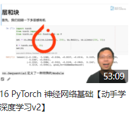</a> | [16-Pytorch神经网络基础](notes/16-Pytorch神经网络基础.md)    | [讲义](https://zh-v2.d2l.ai/chapter_deep-learning-computation/model-construction.html) | [Jupyter 代码](code/16-Pytorch神经网络基础)                  |   |
| <a href="https://www.bilibili.com/video/BV1z5411c7C1?spm_id_from=333.999.0.0">  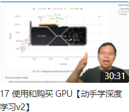</a> | [17-使用和购买GPU](notes/17-使用和购买GPU.md)                | [讲义](https://zh-v2.d2l.ai/chapter_deep-learning-computation/use-gpu.html) | [Jupyter 代码](code/17-使用和购买GPU.ipynb)                  |   |
|  | [18-预测房价竞赛总结](notes/18-预测房价竞赛总结.md)          | [讲义](https://courses.d2l.ai/zh-v2/assets/pdfs/part-1_1.pdf) |                                                              |   |
|  | [19-卷积层]                                                  | [讲义1](https://courses.d2l.ai/zh-v2/assets/pdfs/part-1_2.pdf) [2](https://courses.d2l.ai/zh-v2/assets/pdfs/part-1_3.pdf) |                                                              |  |
| <a href="https://www.bilibili.com/video/BV1Th411U7UN?spm_id_from=333.999.0.0">  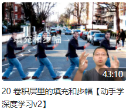</a> | [20-填充和步幅](notes/20-填充和步幅.md)                      | [讲义](https://courses.d2l.ai/zh-v2/assets/pdfs/part-1_4.pdf) | [Jupyter 代码](code/20-填充和步幅.ipynb)                     |  |
|  | [21-多输入输出通道](notes/21-多输入输出通道.md)              | [讲义](https://courses.d2l.ai/zh-v2/assets/pdfs/part-1_5.pdf) | [Jupyter 代码](code/21-多输入输出通道.ipynb)                 |   |
| <a href="https://www.bilibili.com/video/BV1EV411j7nX?spm_id_from=333.999.0.0">  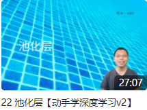</a> | [22-池化层](notes/22-池化层.md)                              | [讲义](https://courses.d2l.ai/zh-v2/assets/pdfs/part-1_6.pdf) | [Jupyter 代码](code/22-池化层.ipynb)                         |   |
| <a href="https://www.bilibili.com/video/BV1t44y1r7ct?spm_id_from=333.999.0.0">  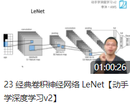</a> | [23-LeNet](notes/23-经典卷积神经网络LeNet.md)                | [讲义](https://courses.d2l.ai/zh-v2/assets/pdfs/part-1_7.pdf) | [Jupyter 代码](code/23-LeNet.ipynb)                          |   |
| <a href="https://www.bilibili.com/video/BV1h54y1L7oe?spm_id_from=333.999.0.0">  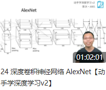</a> | [24-AlexNet](notes/24-AlexNet.md)                            | [讲义](https://courses.d2l.ai/zh-v2/assets/pdfs/part-1_8.pdf) | [Jupyter 代码](code/24-AlexNet.ipynb)                        |  |
| <a href="https://www.bilibili.com/video/BV1Ao4y117Pd?spm_id_from=333.999.0.0">  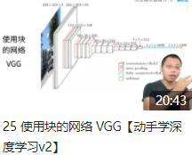</a> | [25-使用块的网络VGG](notes/25-使用块的网络VGG.md)            | [讲义](https://courses.d2l.ai/zh-v2/assets/pdfs/part-1_9.pdf) | [Jupyter 代码](code/25-VGG.ipynb)                            |  |
| <a href="https://www.bilibili.com/video/BV1Uv411G71b?spm_id_from=333.999.0.0">  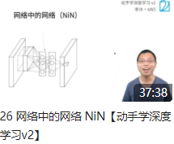</a> | [26-NiN](notes/26-NiN.md)                                    | [讲义](https://courses.d2l.ai/zh-v2/assets/pdfs/part-1_10.pdf) | [Jupyter 代码](code/26-NiN.ipynb)                            |  |
| <a href="https://www.bilibili.com/video/BV1b5411g7Xo?spm_id_from=333.999.0.0">  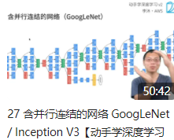</a> | [27-GoogLeNet](notes/27-GoogLeNet.md)                        | [讲义](https://courses.d2l.ai/zh-v2/assets/pdfs/part-1_11.pdf) | [Jupyter 代码](code/27-googlenet.ipynb)                      |   |
|  | [28-批量归一化](notes/28-批量归一化.md)                      | [讲义](https://courses.d2l.ai/zh-v2/assets/pdfs/part-1_12.pdf) | [Jupyter 代码](code/28-批量归一化.ipynb)                     |   |
| <a href="https://www.bilibili.com/video/BV1bV41177ap?spm_id_from=333.999.0.0">  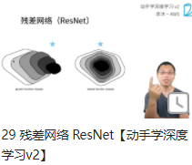</a> | [29-残差网络ResNet](notes/29-残差网络ResNet.md)              | [讲义](https://courses.d2l.ai/zh-v2/assets/pdfs/part-1_13.pdf) |                                                              |   |
| <a href="https://www.bilibili.com/video/BV1z64y1o7iz?spm_id_from=333.999.0.0">  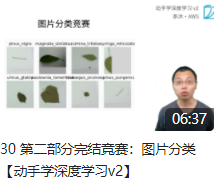</a> | [30-第二部分完结竞赛](notes/30-第二部分完结竞赛：图片分类.md) | [讲义](https://courses.d2l.ai/zh-v2/assets/pdfs/part-1_14.pdf) |                                                              |  |
| <a href="https://www.bilibili.com/video/BV1TU4y1j7Wd?spm_id_from=333.999.0.0">  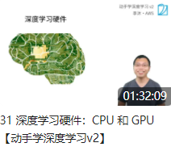</a> | [31-CPU和GPU](notes/31-CPU和GPU.md)                          | [讲义](https://courses.d2l.ai/zh-v2/assets/pdfs/part-2_1.pdf) |                                                              |   |
|  | [32-深度学习硬件](notes/32-深度学习硬件.md)                                            | [讲义](https://courses.d2l.ai/zh-v2/assets/pdfs/part-2_2.pdf) |                                                              |  |
| <a href="https://www.bilibili.com/video/BV1vU4y1V7rd?spm_id_from=333.999.0.0">  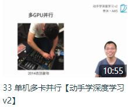</a> | [33-单机多卡并行](notes/33-单机多卡并行])                    | [讲义](https://courses.d2l.ai/zh-v2/assets/pdfs/part-2_3.pdf) |                                                              |   |
| <a href="https://www.bilibili.com/video/BV1MQ4y1R7Qg?spm_id_from=333.999.0.0">  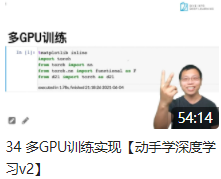</a> | [34-多GPU训练实现](code/34-多GPU训练实现.ipynb)              | [讲义](https://zh-v2.d2l.ai/chapter_computational-performance/multiple-gpus-concise.html) | [Jupyter 代码](code/34-多GPU训练实现.ipynb)                  |   |
| <a href="https://www.bilibili.com/video/BV1jU4y1G7iu?spm_id_from=333.999.0.0">  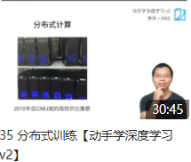</a> | [35-分布式训练](notes/35-分布式训练.md)                      | [讲义](https://courses.d2l.ai/zh-v2/assets/pdfs/part-2_4.pdf) |                                                              |   |
| <a href="https://www.bilibili.com/video/BV17y4y1g76q?spm_id_from=333.999.0.0">  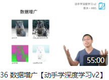</a> | [36-数据增广](notes/36-数据增广.md)                          | [讲义](https://courses.d2l.ai/zh-v2/assets/pdfs/part-2_5.pdf) | [Jupyter 代码](code/36-数据增广.ipynb)                       |   |
|  | [37-微调](notes/37-微调.md)                                  | [讲义](https://courses.d2l.ai/zh-v2/assets/pdfs/part-2_6.pdf) | [Jupyter 代码](code/37-微调.ipynb)                           |   |
|  | [38-第二次竞赛树叶分类结果](notes/38-第二次竞赛树叶分类结果.md) | [讲义]((notes/38-第二次竞赛树叶分类结果.md))                 |                                                              |  |
|  | [39-实战Kaggle比赛-1](notes/39-实战Kaggle竞赛：CIFAR-10.md)  | [讲义](https://zh-v2.d2l.ai/chapter_computer-vision/kaggle-cifar10.html) |                                                              |   |
|  | [40-实战Kaggle比赛-2](code/40-实战Kaggle比赛：狗的品种识别.ipynb) | [讲义](https://zh-v2.d2l.ai/chapter_computer-vision/kaggle-dog.html) | [Jupyter 代码](code/40-实战Kaggle比赛：狗的品种识别.ipynb)   |   |
| <a href="https://www.bilibili.com/video/BV1Lh411Y7LX?spm_id_from=333.999.0.0">  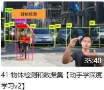</a> | [41-物体检测和数据集](41-物体检测和数据集.md)                | [讲义](https://courses.d2l.ai/zh-v2/assets/pdfs/part-2_7.pdf) |                                                              |   |
|  | [42-锚框]                                                    | [讲义](https://courses.d2l.ai/zh-v2/assets/pdfs/part-2_8.pdf) |                                                              |   |
|  | [43-树叶分类竞赛技术总结](notes/43-树叶分类竞赛技术总结.md)  | [讲义](https://courses.d2l.ai/zh-v2/assets/pdfs/part-2_9.pdf) |                                                              |  |
|  | [44-物体检测算法](notes/44-物体检测算法：R-CNN,SSD,YOLO.md)                                            | [讲义1](https://courses.d2l.ai/zh-v2/assets/pdfs/part-2_10.pdf)[2](https://courses.d2l.ai/zh-v2/assets/pdfs/part-2_11.pdf)[3](https://courses.d2l.ai/zh-v2/assets/pdfs/part-2_12.pdf) |                                                              |  |
| <a href="https://www.bilibili.com/video/BV1ZX4y1c7Sw?p=2">  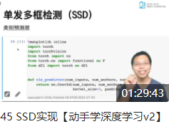</a> | [45-SSD实现](code/45-ssd)                                    | [讲义](https://zh-v2.d2l.ai/chapter_computer-vision/ssd.html) | [Jupyter 代码](code/45-ssd)                                  |   |
| <a href="https://www.bilibili.com/video/BV1BK4y1M7Rd">  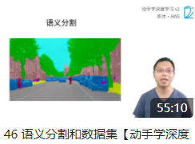</a> | [46-语义分割和数据集](notes/46-语义分割.md)                  | [讲义](https://courses.d2l.ai/zh-v2/assets/pdfs/part-2_13.pdf) | [Jupyter 代码](code/46-语义分割.ipynb)                       |   |
| <a href="https://www.bilibili.com/video/BV17o4y1X7Jn/">  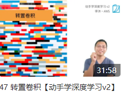</a> | [47-转置卷积](notes/47-转置卷积.md)                          | [讲义1](https://courses.d2l.ai/zh-v2/assets/pdfs/part-2_14.pdf) [2](https://courses.d2l.ai/zh-v2/assets/pdfs/part-2_15.pdf) |                                                              |   |
| <a href="https://www.bilibili.com/video/BV1af4y1L7Zu/">  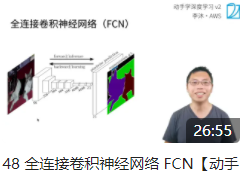</a> | [48-FCN](notes/48-全连接卷积神经网络（FCN）.md)                                                     | [讲义](https://courses.d2l.ai/zh-v2/assets/pdfs/part-2_16.pdf) | [Jupyter 代码](code/48-全卷积神经网络（FCN）/fcn.ipynb)                                                             |  |
|  | [49-样式迁移](notes/49-样式迁移.md)                          | [讲义](https://courses.d2l.ai/zh-v2/assets/pdfs/part-2_17.pdf) | [Jupyter 代码](code/49-样式迁移.ipynb)                       |  |
| <a href="https://www.bilibili.com/video/BV1F64y1x7xP/">  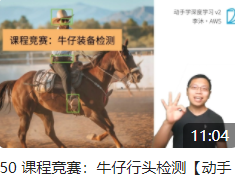</a> | [50-课程竞赛](notes/50-课程竞赛：牛仔行头检测.md)            | [讲义](https://courses.d2l.ai/zh-v2/assets/pdfs/part-2_18.pdf) |                                                              |  |
| <a href="https://www.bilibili.com/video/BV1L44y1m768/">  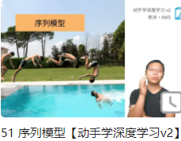</a> | [51-序列模型](notes/51-序列模型.md)                          | [讲义](https://courses.d2l.ai/zh-v2/assets/pdfs/part-3_1.pdf) |                                                              |   |
|  | [52-文本预处理](code/52-文本预处理.ipynb)                    | [讲义](https://zh-v2.d2l.ai/chapter_recurrent-neural-networks/text-preprocessing.html) | [Jupyter 代码](code/52-文本预处理.ipynb)                     |   |
| <a href="https://www.bilibili.com/video/BV1ZX4y1F7K3/">  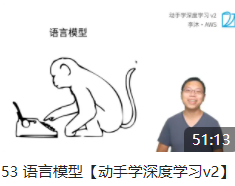</a> | [53-语言模型](notes/53-语言模型.md)                          | [讲义](https://courses.d2l.ai/zh-v2/assets/pdfs/part-3_2.pdf) |                                                              |   |
|  | [54-循环神经网络](notes/54-循环神经网络RNN.md)               | [讲义](https://courses.d2l.ai/zh-v2/assets/pdfs/part-3_3.pdf) |                                                              |   |
| <a href="https://www.bilibili.com/video/BV1kq4y1H7sw/">  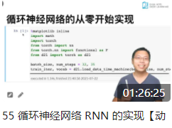</a> | [55-RNN实现](code/55-RNN.ipynb)                              | [讲义](https://zh-v2.d2l.ai/chapter_recurrent-neural-networks/rnn-scratch.html) | [Jupyter 代码](code/55-RNN.ipynb)                            |  |
|  | [56-GRU](notes/56-GRU.md)                                    | [讲义](https://courses.d2l.ai/zh-v2/assets/pdfs/part-3_4.pdf) | [Jupyter 代码](code/56-GRU.ipynb)                            |  |
| <a href="https://www.bilibili.com/video/BV1JU4y1H7PC/">  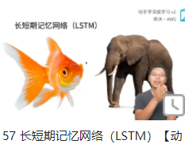</a> | [57-LSTM]                                                    | [讲义](https://courses.d2l.ai/zh-v2/assets/pdfs/part-3_5.pdf) |                                                              |   |
|  | [58-深层循环神经网络]                                        | [讲义](https://courses.d2l.ai/zh-v2/assets/pdfs/part-3_6.pdf) |                                                              |   |
| <a href="https://www.bilibili.com/video/BV12X4y1c71W/">  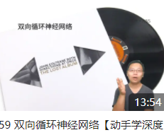</a> | [59-双向循环神经网络]                                        | [讲义](https://courses.d2l.ai/zh-v2/assets/pdfs/part-3_7.pdf) |                                                              |   |
|  | [60-机器翻译数据集]                                          | [讲义](https://zh-v2.d2l.ai/chapter_recurrent-modern/machine-translation-and-dataset.html) |                                                              |   |
|  | [61-编码器-解码器架构](notes/61-编码器-解码器架构.md)        | [讲义](https://courses.d2l.ai/zh-v2/assets/pdfs/part-3_8.pdf) |                                                              |  |
| <a href="https://www.bilibili.com/video/BV16g411L7FG/">  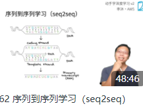</a> | [62-序列到序列的学习](notes/62-序列到序列学习.md)            | [讲义](https://courses.d2l.ai/zh-v2/assets/pdfs/part-3_9.pdf) | [Jupyter 代码](code/62-Seq2Seq.ipynb)                        |  |
|  | [63-束搜索](notes/63-束搜索.md)                              | [讲义](https://courses.d2l.ai/zh-v2/assets/pdfs/part-3_10.pdf) |                                                              |  |
|  | [64-注意力机制](code/64-注意力机制.ipynb)                    | [讲义](https://zh-v2.d2l.ai/chapter_attention-mechanisms/nadaraya-waston.html) | [Jupyter 代码](code/64-注意力机制.ipynb)                     |   |
|  | [65-注意力分数](notes/65-注意力分数.md)                      | [讲义](https://zh-v2.d2l.ai/chapter_attention-mechanisms/attention-scoring-functions.html) |                                                              |   |
|  | [66-使用注意力的seq2seq]                                     | [讲义](https://zh-v2.d2l.ai/chapter_attention-mechanisms/bahdanau-attention.html) |                                                              |   |
|  | [67-自注意力]                                                | [讲义](https://courses.d2l.ai/zh-v2/assets/pdfs/part-4_4.pdf) |                                                              |   |
|  | [68-Transformer](notes/68-Transformer.md)                                              | [讲义](https://courses.d2l.ai/zh-v2/assets/pdfs/part-4_5.pdf) |  [Jupyter 代码](code/68-Transforemer/transformer.ipynb)                                                             |  |
|  | [69-BERT预训练]                                             | [讲义](https://courses.d2l.ai/zh-v2/assets/pdfs/part-4_6.pdf) |                                                              |   |
|  | [70-BERT微调]                                                | [讲义](https://courses.d2l.ai/zh-v2/assets/pdfs/part-4_7.pdf) |                                                              |   |
| <a href="https://www.bilibili.com/video/BV13b4y1m7y8">  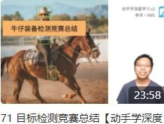</a> | [71-目标检测竞赛总结]                                        | [讲义](https://courses.d2l.ai/zh-v2/assets/pdfs/part-4_1.pdf) |                                                              |   |
| <a href="https://www.bilibili.com/video/BV1bP4y1p7Gq">  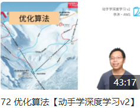</a> | [72-优化算法](notes/72-优化算法.md)                                                 | [讲义](https://courses.d2l.ai/zh-v2/assets/pdfs/part-4_2.pdf) |                                                              |  |
|  | [73-课程总结和进阶学习]                                      | [讲义](https://courses.d2l.ai/zh-v2/assets/pdfs/part-4_3.pdf) |                                                              |  |

##  文件夹说明

- **imgs**：笔记涉及到的图片
- **notes**：笔记的markdown版本
- **code**：课程涉及到的python代码

##  组织者
感谢以下同学对本项目的组织

 
 

##  贡献者
感谢以下同学对本项目的支持与贡献

 
 

 

 

