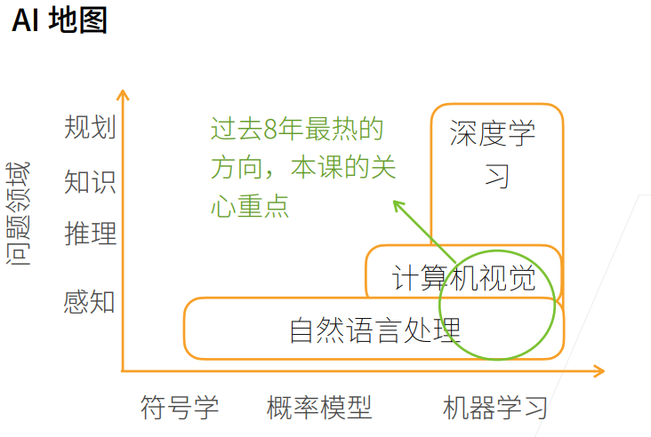
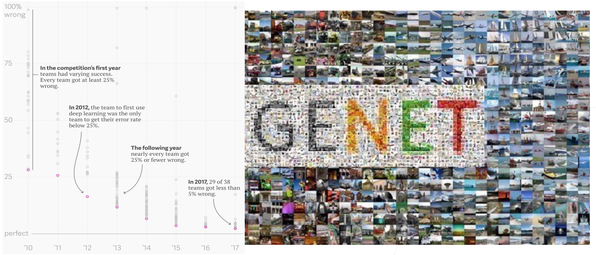
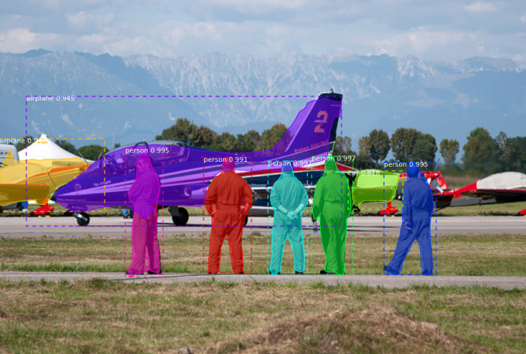
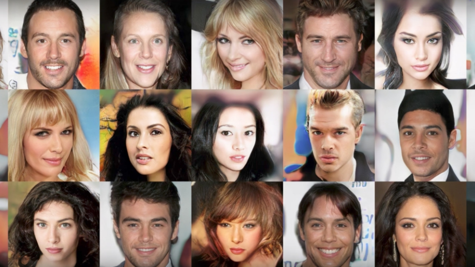
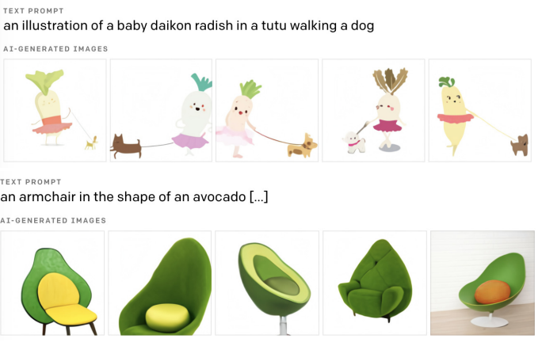
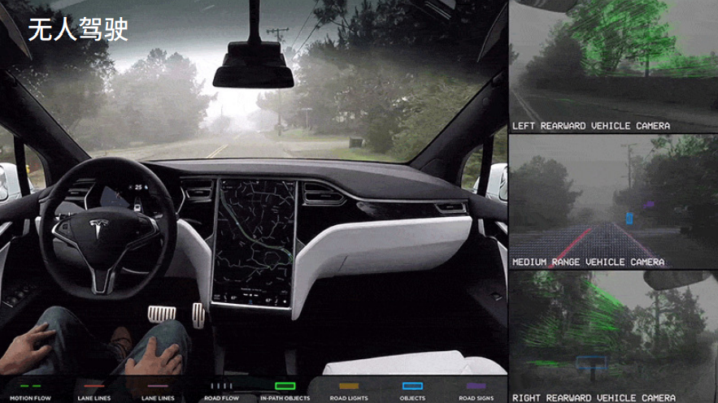
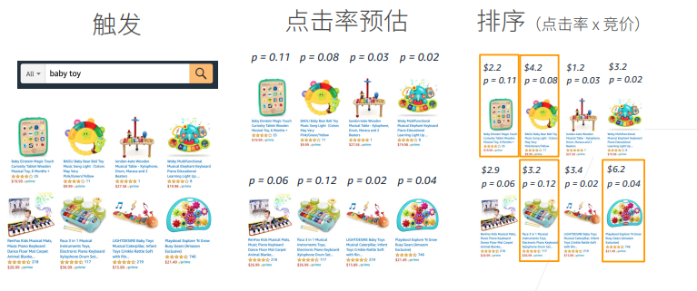
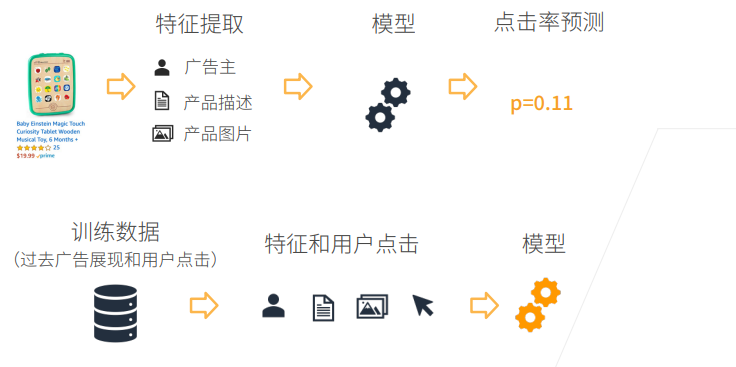
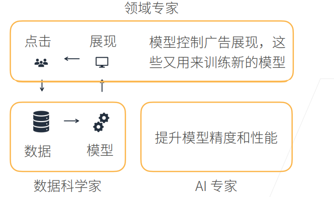

## 02-深度学习介绍

### 本节目录

- [1. 概述](#1-概述)
  - [1.1 AI地图](#11-ai地图)
  - [1.2 AI地图解读](#12-ai地图解读)
- [2. 深度学习的应用](#2-深度学习的应用)
  - [2.1 图片分类](#21-图片分类)
  - [2.2 物体检测和分割](#22-物体检测和分割)
  - [2.3 样式迁移](#23-样式迁移)
  - [2.4 人脸合成](#24-人脸合成)
  - [2.5 文字生成图片](#25-文字生成图片)
  - [2.6 文字生成](#26-文字生成)
  - [2.7 无人驾驶](#27-无人驾驶)
  - [2.8 案例研究——广告点击](#28-案例研究广告点击)
    - [2.8.1 步骤](#281-步骤)
    - [2.8.2 模型的<mark>预测与训练</mark>](#282-模型的mark预测与训练mark)
    - [2.8.3 完整的故事](#283-完整的故事)
- [3. 总结](#3-总结)
- [4. 深度学习介绍 Q&A](#4-深度学习介绍-qa)

### 1. 概述

#### 1.1 AI地图
首先画一个简单的人工智能地图：

   

- x轴表示不同的模式or方法：最早的是符号学，接下来是概率模型，之后是机器学习

- y轴表示可以达到的层次：由底部向上依次是

  > 感知：了解是什么，比如能够可以看到物体，如面前的一块屏幕
  >
  > 推理：基于感知到的现象，想象或推测未来会发生什么
  >
  > 知识：根据看到的数据或者现象，形成自己的知识
  >
  > 规划：根据学习到的知识，做出长远的规划

#### 1.2 AI地图解读
- 问题领域的一个简单分类

  - **自然语言处理**：
    - 停留在比较简单的**感知**层面，比如自然语言处理用的比较多的机器翻译，给一句中文翻译成英文，很多时候是人的潜意识里面大脑感知的一个问题。一般来说，人可以几秒钟内反应过来的东西，属于感知范围。
    - 自然语言处理最早使用的方法是**符号学**，由于语言具有符号性；之后一段时间比较流行的有**概率模型**，以及现在也用的比较多的**机器学习**。
  
  - **计算机视觉**：
    - 在简单的感知层次之上，可以对图片做一些**推理**。 
    - 图片里都是一些像素，很难用符号学解释，所以一般采用**概率模型**和**机器学习**。
  
  - **深度学习**
    - 机器学习的一种，更深层的神经网络。
    - 可以做计算机视觉，自然语言处理，强化学习等。

- 过去八年最热的方向，也是本课程关心的重点：

  - 深度学习+计算机视觉 / 自然语言处理

本节课只关注AI中的一小部分领域，即深度学习背景下的视觉和自然语言处理相关的基础应用。

------

### 2. 深度学习的应用

#### 2.1 图片分类

深度学习最早是在图片分类上有比较大的突破，ImageNet是一个比较大的图片分类数据集，

`x轴`：年份      `y轴`：错误率     `圆点`：表示某年份某研究工作/paper的错误率  [IMAGENET](https://image-net.org/)   [数据来源](https://qz.com/1034972/the-data-that-changed-the-direction-of-ai-research-and-possibly-the-world/)

> 在2010年时，错误率比较高，最好的工作错误率也在26%、%27左右；
>
> 在2012年，有团队首次使用深度学习将错误率降到25%以下；
>
> 在接下来几年中，使用深度学习可以将误差降到很低。
>
> 2017年基本所有的团队可以将错误率降到5%以下，基本可以达到人类识别图片的精度。

#### 2.2 物体检测和分割

当你不仅仅想知道图片里有什么内容，还想知道物体是什么，在什么位置，这就是**物体检测**。**物体分割**是指每一个像素属于什么，属于飞机还是属于人(如下图)，这是图像领域更深层次的一个应用。

   

#### 2.3 样式迁移

原图片+想要迁移的风格=风格迁移后的图片，加了一个可以根据输入改变图片风格的滤镜。

   

#### 2.4 人脸合成

下图中所有的人脸都是假的，由机器合成的图片：

   

#### 2.5 文字生成图片

1. 描述：一个胡萝卜宝宝遛狗的图片。

2. 描述：一个牛油果形状的靠背椅。

   

#### 2.6 文字生成 

> 示例1：
>
> 问题输入：如何举行一个有效的董事会议 
>
> 机器输出：生成篇章回答

> 示例2：
>
> 输入：将Students从School这个table中选出来
>
> 输出：用于查询的SQL语言

#### 2.7 无人驾驶

识别车、道路以及各种障碍物等，并规划路线。

#### 2.8 案例研究——广告点击

> 用户输入想要搜索的广告内容，如：baby toy

> 网站呈现最具有效益的广告(用户更可能点击，且给网站带来更高经济效益)

##### 2.8.1 步骤

1. 触发：用户输入关键词，机器先找到一些相关的广告
2. 点击率预估：   利用机器学习的模型预测用户对广告的点击率
3. 排序：利用点击率x竞价的结果进行排序呈现广告，排名高的在前面呈现

##### 2.8.2 模型的<mark>预测与训练</mark>

上述步骤的第二步中涉及到模型预测用户的点击率，具体过程如下：

   

**模型预测**

数据 (待预测广告) → 特征提取 → 模型 → 点击率预测

**模型训练**

训练数据 (过去广告展现和用户点击) → 特征(X)和用户点击(Y) → 喂给模型训练

##### 2.8.3 完整的故事

   

**领域专家**：对特定的应用有比较深的了解，根据展现情况以及用户点击分析用户的行为，期望模型对应用做一些拟合，符合真实数据和分析情况。

**数据科学家**：利用数据训练模型，训练后模型投入使用，进行预测呈现。

**AI专家**：应用规模扩大，用户数量增多，模型更加复杂，需要进一步提升精度和性能。

### 3. 总结
- 通过AI地图，课程从纵向和横向两个维度解读了深度学习在重要问题领域的概况。
- 介绍了深度学习在CV和NLP方面的一些应用
- 简单分析并研究了深度学习实例——广告点击。

------

### 4. 深度学习介绍 Q&A
◆ **Q1：机器学习的可解释性？机器学习在图片分割为什么有效，目前有没有定论？**

> A1：模型的可解释性不管是深度学习还是机器学习都是非常受人关注的点，因为这像是一个黑盒，训练了一个模型，也不知道为什么work或者为什么不work。对于深度学习来说，模型的**可解释性**是做得不够好的；对于机器学习来说，我们对简单的模型可以理解，但当模型变得很深的时候，几乎只能放弃理解的过程。
>
> 特别地，**为什么有效**和**可解释性**是两个不同的概念，所有提出的新模型都会解释一下为什么有效，可解释性是说人是不是能理解这个模型，理解模型为什么工作是一个方面，还需要知道它什么时候不工作以及在什么地方会出现偏差。
>
> 目前来说，一个模型在一个应用/领域上为什么可以工作，会有一些解释，我们会在解释不同的模型的时候给大家进行讲解。

◆ **Q2：领域专家是什么意思？**

> A2：举个例子，比如我要做农业上的物体识别，我种了一棵树，想要看今年的收成怎么样，我有很多很多土地，用人去一个个查看很费力，于是我用一个无人机，将农作物的情况拍下来，假设得到了树的一些图片，而数据科学家不知道农作物什么样的情况是好，什么样是坏，于是**领域专家进行解释**，比如多少叶子算是好，什么样不好。同时**数据科学家**将领域专家的**问题翻译**成机器学习能做的任务。所以可以认为**领域专家**是**提需求**的人**甲方**，而**数据科学家**是**乙方**。

◆ **Q3：MXNet的GPU版本的安装必须要卸载CPU版本的吗？**

> A3：是的，但我们的课程是**基于Pytorch**，Pytorch会不一样一些。

◆ **Q4：深度学习无法用数学规范表述，只能用直觉理解是吗？**

> A4：不一定，深度学习模型可以用**数学形式表示**，接下来也会讲到很多数学的东西，但是说具体用数学解释它**为什么工作**，**为什么不工作**，这个是目前我们做的不好的地方。

◆ **Q5：符号学可以和机器学习融合起来吗？**

> A5：确实是可以的。目前来说，**符号学**在**深度学习**有一些新的进展，以前说符号学就是做一些符号上的推理，目前**深度学习如图神经网络**，可以做一些比较复杂的推理。

◆ **Q6：数据科学家和AI专家的主要区别在哪里？**

> A6：我觉得没有太多区别。数据科学家很多时候关注的是给一个数据，赶紧出一个模型，能工作就好了，**关注**的是如何把领域专家的一个实际的业务问题，变成一个机器学习能做的任务，训练成一个还不错的模型。**AI专家也可能是数据科学家**，也就是说其不仅要训练出来一个模型能用，而且会**关心**如何把模型精度做得很高，或者可以说，**资深数据科学家可以认为是AI专家**。
>
> 数据科学家可以有**两条路线**，一个是**不断开拓新领域**，比如机器学习在农业上的应用，在医疗上的应用等，这个是**往广的走**，**往深的走**的话可以称为是AI专家，在某一块方面了解得很深。

◆ **Q7：MAC是不是可以支持Pytorch？**

> A7：可以。

◆ **Q8：说自然语言处理仅仅停留在感知层面似乎不太合适？因为语言的理解和产出不仅仅是感知，也涉及到语言知识和世界知识，也涉及到规划，比如机器规划下一步要做什么。**

> A8：确实是这样，语言当然是一个很复杂的过程，我只是想说，自然语言处理我们做得还很一般，虽然能做一些感知以外的东西，但是我感觉是说，**不如**深度学习特别机器学习，在图片上的应用做得好一些。当然AI地图上也只是一个**大致的分类**，大家不用特别纠结。

◆ **Q9：请问老师有考虑后面讲一讲如何寻找自己领域的paper的经验吗？**

> A9：这是一个很好的问题，因为大家如果现在去读paper的话，可能每天都有一百篇paper出来，你怎么样去找到你想要的paper，总不能天天看朋友圈推文，这样只能知道别人读过的paper，不会有自己**独特的见解**，怎么样找到自己感兴趣和有启发性的论文，后面有机会和大家分享一下我的做法。

◆ **Q10：以无人驾驶为例，误判率在不断下降，但误判的影响还是很严重的，有可能从已有的判断case(样例)得到修正，从而完全避免这样的错误吗？**

> A10：**无人驾驶**中，任何一次出现的错误，都可能带来毁灭性的灾难。大家可能看到，特斯拉今天撞了，明天又撞了。所以说，无人驾驶对于**错误率**确实是非常注重的。
>
> 机器学习在学术界现在有很多关于**uncertainty**或者**robustness**的研究，就是说模型在数据偏移或者极端情况下会不会给出很不好的答案，我们不会特别深入去讲这个事情，但是无人驾驶这一块确实会通过大量的技术，比如说把不同的模型融合在一起，不是仅仅train一个模型，用多个模型来做投票。汽车有很多雷达、摄像头，它会通过不同的传感器来进行模型的融合，从而降低误差。
>
> 我们这个课程不会特别地讲，因为涉及到评价无人驾驶的特别技术，但在竞赛中我们会给大家看到如何通过**融合多个模型提升精度**的做法。
