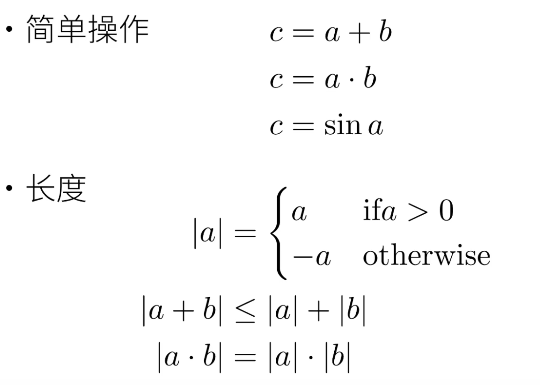
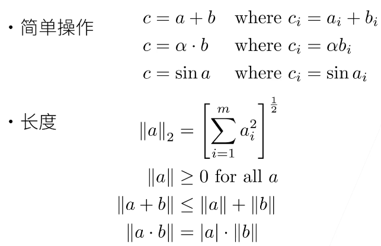
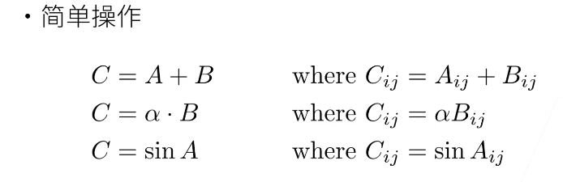
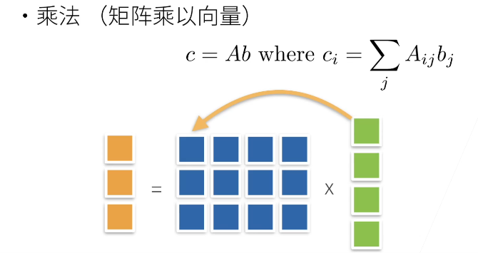
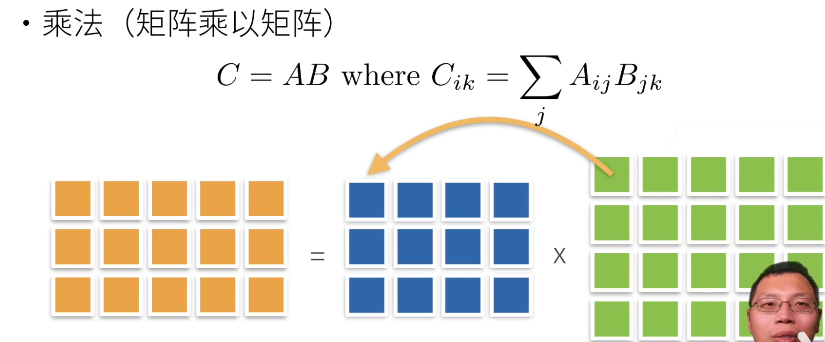
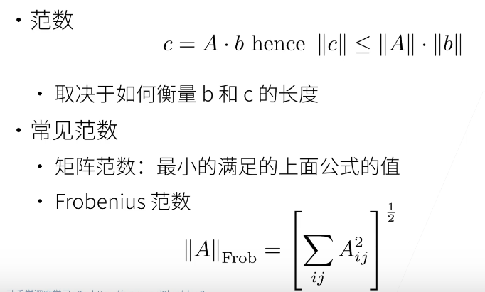
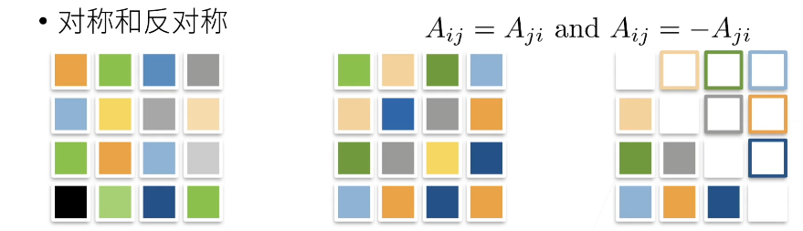
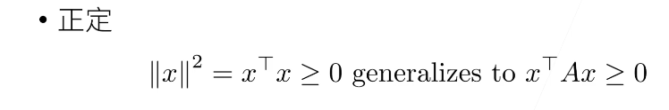
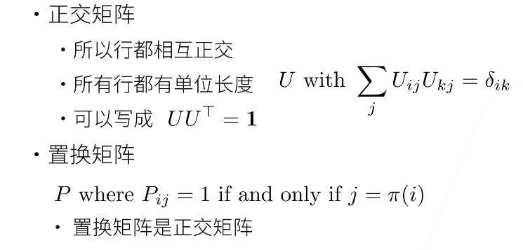
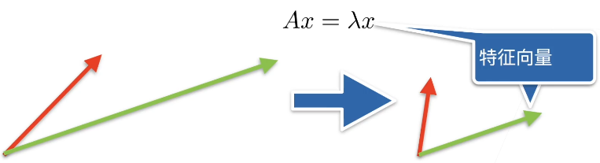

## 05-线性代数

### 本节目录

- [1. 线性代数基础知识](#1-线性代数基础知识)
  - [1.1 标量](#11-标量)
  - [1.2 向量](#12-向量)
  - [1.3 矩阵](#13-矩阵)
    - [1.3.1 矩阵的操作](#131-矩阵的操作)
    - [1.3.2 特殊矩阵](#132-特殊矩阵)
    - [1.3.3 特征向量和特征值](#133-特征向量和特征值)
- [2. 线性代数实现](#2-线性代数实现)
  - [2.1 标量](#21-标量)
  - [2.2 向量](#22-向量)
  - [2.3 矩阵](#23-矩阵)
    - [2.3.1 创建](#231-创建)
    - [2.3.2 转置](#232-转置)
    - [2.3.3 reshape](#233-reshape)
    - [2.3.4 clone](#234-clone)
    - [2.3.5 sum](#235-sum)
    - [2.3.6 numel](#236-numel)
    - [2.3.7 mean](#237-mean)
    - [2.3.8 dot](#238-dot)
    - [2.3.9 mm、mv](#239-mmmv)
    - [2.3.10  L1、L2、F范数](#2310--l1l2f范数)
    - [2.3.11  运算](#2311--运算)
    - [2.3.12 广播](#2312-广播)

### 1. 线性代数基础知识 ###

这部分主要是由标量过渡到向量，再从向量拓展到矩阵操作，重点在于理解矩阵层面上的操作（都是大学线代课的内容，熟悉的可以自动忽略）

#### 1.1 标量



#### 1.2 向量




#### 1.3 矩阵

##### 1.3.1 矩阵的操作









​	(矩阵范数麻烦且不常用，一般用F范数)

##### 1.3.2 特殊矩阵







​	(深度学习里基本不会涉及到正定、置换矩阵，这里明确个概念就行)

##### 1.3.3 特征向量和特征值

- 数学定义：设A是n阶方阵，如果存在常数及非零n向量x，使得，则称是矩阵A的特征值，x是A属于特征值的特征向量

- 直观理解：不被矩阵A改变方向的向量x就是A的一个特征向量

  

- 矩阵不一定有特征向量，但是对称矩阵总是可以找到特征向量


### 2. 线性代数实现

这部分主要是应用pytorch实现基本矩阵操作，同样由标量过渡到向量最后拓展到矩阵

#### 2.1 标量

```python
import torch    # 应用pytorch框架

# 标量由只有一个元素的张量表示
x = torch.tensor([3.0])     # 单独一个数字表示标量也可以
y = torch.tensor([2.0])     # 单独一个数字表示标量也可以
print(x + y)    # tensor([5.])
print(x * y)    # tensor([6.])
print(x / y)    # tensor([1.5000])
print(x ** y)   # tensor([9.]) 指数运算
```

#### 2.2 向量

```python
# 向量可以看作是若干标量值组成的列表
x = torch.arange(4)     # tensor([0, 1, 2, 3])
                        # 生成[0, 4)范围内所有整数构成的张量tensor
print(x[3])             # tensor(3)
                        # 和列表相似，通过张量的索引访问元素
print(len(x))           # 4
                        # 获取张量x的长度
print(x.shape)          # torch.Size([4])
                        # 获取张量形状，这里x是只有一个轴的张量因此形状只有一个元素

```

#### 2.3 矩阵

##### 2.3.1 创建

```python
A = torch.arange(6)     # tensor([0, 1, 2, 3, 4, 5])
B = torch.tensor([[1,2,3],[2,0,4],[3,4,5]])
C = torch.tensor([[[1,2,3],
                   [4,5,6],
                   [7,8,9]],
                  [[0,0,0],
                   [1,1,1],
                   [2,2,2]]])
D = torch.arange(20, dtype=torch.float32)
```

##### 2.3.2 转置

```python
A = torch.arange(6)     # tensor([0, 1, 2, 3, 4, 5])
A = A.reshape(3,2)      # tensor([[0, 1],
                        #         [2, 3],
                        #         [4, 5]])

A = A.T                 # 转置 A.T
                        # tensor([[0, 2, 4],
                        #         [1, 3, 5]])
```

##### 2.3.3 reshape 

```python
# 使用reshape方法创建一个形状为3 x 2的矩阵A
A = torch.arange(6)     # tensor([0, 1, 2, 3, 4, 5])
A = A.reshape(3,2)      # tensor([[0, 1],
                        #         [2, 3],
                        #         [4, 5]])
```
*<u>tips（确定矩阵shape)：*</u>

<u>*由外层到内层依次去中括号，并记下去掉中括号后此时元素的个数，任选其中一个元素重复上述去括号的操作直到该元素中无中括号，记下的数字从左到右依次排序中间用x连接即为矩阵shape*</u>

##### 2.3.4 clone

```python
A = torch.arange(20, dtype=torch.float32)
A = A.reshape(5,4)
B = A.clone()   # 通过分配新内存，将A的一个副本分给B，该边B并不影响A的值
print(B)        # tensor([[ 0.,  1.,  2.,  3.],
                #         [ 4.,  5.,  6.,  7.],
                #         [ 8.,  9., 10., 11.],
                #         [12., 13., 14., 15.],
                #         [16., 17., 18., 19.]])
```

##### 2.3.5 sum

```python
A = torch.tensor([[[1,2,3],
                   [4,5,6],
                   [7,8,9]],
                  [[0,0,0],
                   [1,1,1],
                   [2,2,2]]])
print(A.shape)
# torch.Size([2, 3, 3])

print(A.sum())
# tensor(54)

print(A.sum(axis=0))
"""
tensor([[ 1,  2,  3],
        [ 5,  6,  7],
        [ 9, 10, 11]])
"""
print(A.sum(axis=0, keepdims=True))
"""
tensor([[[ 1,  2,  3],
         [ 5,  6,  7],
         [ 9, 10, 11]]])
"""

print(A.sum(axis=1))
"""
tensor([[12, 15, 18],
        [ 3,  3,  3]])
"""
print(A.sum(axis=1, keepdims=True))
"""
tensor([[[12, 15, 18]],

        [[ 3,  3,  3]]])
"""

print(A.sum(axis=2))
"""
tensor([[ 6, 15, 24],
        [ 0,  3,  6]])
"""
print(A.sum(axis=2, keepdims=True))
"""
tensor([[[ 6],
         [15],
         [24]],

        [[ 0],
         [ 3],
         [ 6]]])
"""

print(A.sum(axis=[0,1]))
# tensor([15, 18, 21])

print(A.sum(axis=[0,1], keepdims=True))
# tensor([[[15, 18, 21]]])
```

##### 2.3.6 numel

```python
A = torch.tensor([[0.,0.,0.],[1.,1.,1.]])
print(A.numel())    # 6 元素个数
```

##### 2.3.7 mean

```python
A = torch.tensor([[0.,0.,0.],[1.,1.,1.]])
print(A.numel())    # 6 元素个数
print(A.sum())      # tensor(3.)
print(A.mean())     # tensor(0.5000)

# 特定轴
A = torch.tensor([[0.,0.,0.],[1.,1.,1.]])
print(A.shape[0])       # 2
print(A.sum(axis=0))    # tensor([1., 1., 1.])
print(A.mean(axis=0))   # tensor([0.5000, 0.5000, 0.5000])	平均值
```

##### 2.3.8 dot

```python
x = torch.tensor([0.,1.,2.,3.])
y = torch.tensor([1.,1.,1.,1.])
print(torch.dot(x, y))  # tensor(6.)
```

##### 2.3.9 mm、mv

```python
A = torch.tensor([[0,1,2],
                  [3,4,5]])
B = torch.tensor([[2,2],
                  [1,1],
                  [0,0]])
x = torch.tensor([3,3,3])

print(torch.mv(A, x))
"""
向量积
tensor([ 9, 36])
"""

print(torch.mm(A, B))
"""
矩阵积
tensor([[ 1,  1],
        [10, 10]])
"""
```

##### 2.3.10  L1、L2、F范数

```python
x = torch.tensor([3.0, -4.0])
print(torch.abs(x).sum())   # 向量的L1范数: tensor(7.)  x中的每个元素绝对值的和
print(torch.norm(x))        # 向量的L2范数: tensor(5.)  x中的每个元素平方的和开根号

A = torch.ones((4, 9))
print(torch.norm(A))        # 矩阵的F范数:  tensor(6.)  A中的每个元素平方的和开根号
```


##### 2.3.11  运算

```python
A = torch.arange(20, dtype=torch.float32)
A = A.reshape(5,4)
B = A.clone()   

print(B)        # tensor([[ 0.,  1.,  2.,  3.],
                #         [ 4.,  5.,  6.,  7.],
                #         [ 8.,  9., 10., 11.],
                #         [12., 13., 14., 15.],
                #         [16., 17., 18., 19.]])
                
print(A == B)
"""
tensor([[True, True, True, True],
        [True, True, True, True],
        [True, True, True, True],
        [True, True, True, True],
        [True, True, True, True]])
"""

print(A + B)
"""
tensor([[ 0.,  2.,  4.,  6.],
        [ 8., 10., 12., 14.],
        [16., 18., 20., 22.],
        [24., 26., 28., 30.],
        [32., 34., 36., 38.]])
"""


print(A * B)
"""
tensor([[  0.,   1.,   4.,   9.],
        [ 16.,  25.,  36.,  49.],
        [ 64.,  81., 100., 121.],
        [144., 169., 196., 225.],
        [256., 289., 324., 361.]])
"""
```


##### 2.3.12 广播

```python
A = torch.tensor([[1.,2.,3.],
                  [4.,5.,6.]])
B = A.sum(axis=1, keepdims=True)

print(B)
"""
tensor([[ 6.],
        [15.]])
"""

print(A / B)
"""
tensor([[0.1667, 0.3333, 0.5000],
        [0.2667, 0.3333, 0.4000]])
"""

print(A + B)
"""
tensor([[ 7.,  8.,  9.],
        [19., 20., 21.]])
"""

print(A * B)
"""
tensor([[ 6., 12., 18.],
        [60., 75., 90.]])
"""
```


