## 06-矩阵计算

### 本节目录

- [1. 导数的概念及几何意义](#1-导数的概念及几何意义)
  - [1.1 标量导数](#11-标量导数)
  - [1.2 亚导数](#12-亚导数)
- [2. 函数与标量，向量，矩阵](#2-函数与标量向量矩阵)
  - [2.1 f 为是一个标量](#21-f-为是一个标量)
    - [2.1.1 input是一个标量](#211-input是一个标量)
    - [2.1.2 input是一个向量](#212-input是一个向量)
    - [2.1.3 input是一个矩阵](#213-input是一个矩阵)
  - [2.2 f是一个向量](#22-f是一个向量)
    - [2.2.1 input是一个标量](#221-input是一个标量)
    - [2.2.2 input是一个向量](#222-input是一个向量)
    - [2.2.3 input是一个矩阵](#223-input是一个矩阵)
  - [2.3 F是一个矩阵](#23-f是一个矩阵)
    - [2.3.1 input是一个标量](#231-input是一个标量)
    - [2.3.2 input是一个向量](#232-input是一个向量)
    - [2.3.3 input是一个向量](#233-input是一个向量)
- [3. 求导的本质](#3-求导的本质)
- [4. 矩阵求导的布局](#4-矩阵求导的布局)
    - [4.1 分子布局](#41-分子布局)
    - [4.2 分母布局](#42-分母布局)

### 1. 导数的概念及几何意义

#### 1.1 标量导数

+ 导数是切线的斜率

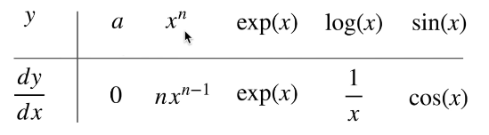

+ 指向值变化最大的方向

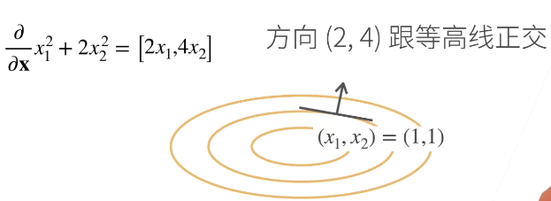

#### 1.2 亚导数

+ 将导数拓展到不可微的函数，在不可导的点的导数可以用一个范围内的数表示

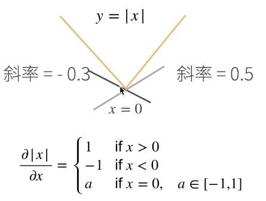

### 2. 函数与标量，向量，矩阵

该部分结合课程视频和参考文章进行总结（参考了知乎文章：[矩阵求导的本质与分子布局、分母布局的本质（矩阵求导——本质篇） - 知乎 (zhihu.com)](https://zhuanlan.zhihu.com/p/263777564)）
+ 当f，input为不同形式时，f(input)结果的表达形式

#### 2.1 f 为是一个标量

##### 2.1.1 input是一个标量

##### 2.1.2 input是一个向量

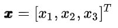

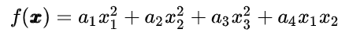

##### 2.1.3 input是一个矩阵

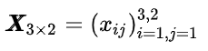

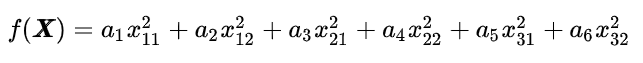

#### 2.2 f是一个向量

+ **f**是由若干个f(标量)组成的向量

##### 2.2.1 input是一个标量

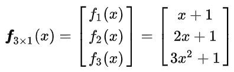

##### 2.2.2 input是一个向量

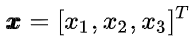

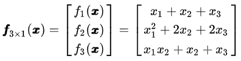

##### 2.2.3 input是一个矩阵

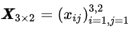

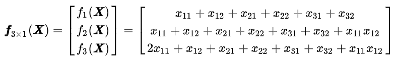

#### 2.3 F是一个矩阵

+ **F**是一个由若干**f**组成的一个矩阵

##### 2.3.1 input是一个标量

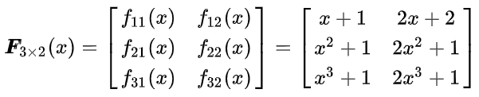

##### 2.3.2 input是一个向量

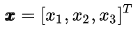

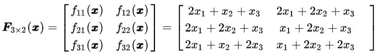

##### 2.3.3 input是一个向量

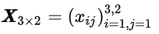

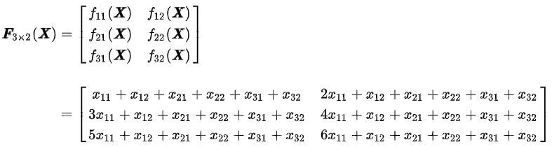

### 3. 求导的本质

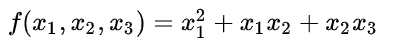

**可以将f对x1，x2，x3的偏导分别求出来，即**

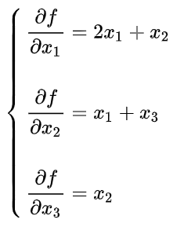

+ 矩阵求导也是一样的，**本质就是** ![[公式]](https://www.zhihu.com/equation?tex=%5Ctext%7Bfunction%7D) 中的**每个** ![[公式]](https://www.zhihu.com/equation?tex=f) **分别对变元中的每个元素逐个求偏导，只不过写成了向量、矩阵形式而已。**

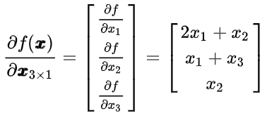

（课上是按行向量展开的）

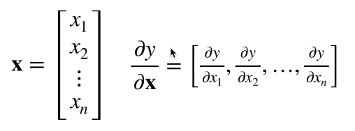

**X为矩阵时**，先把矩阵变元 ![[公式]](https://www.zhihu.com/equation?tex=%5Cpmb%7BX%7D) 进行**转置**，再对**转置后**的**每个位置**的元素逐个求偏导，结果布局和**转置布局一样**。（课上讲的是这种展开方式）

+ 所以，如果 ![[公式]](https://www.zhihu.com/equation?tex=%5Ctext%7Bfunction%7D) 中有 ![[公式]](https://www.zhihu.com/equation?tex=m) 个 ![[公式]](https://www.zhihu.com/equation?tex=f) (标量)，变元中有 ![[公式]](https://www.zhihu.com/equation?tex=n) 个元素，那么，每个 ![[公式]](https://www.zhihu.com/equation?tex=f) 对变元中的每个元素逐个求偏导后，我们就会产生 ![[公式]](https://www.zhihu.com/equation?tex=m+%5Ctimes+n) 个结果。

### 4. 矩阵求导的布局
+ 经过上述对求导本质的推导，关于矩阵求导的问题，实质上就是对求导结果的进一步排布问题
**对于2.2（f为向量，input也为向量）中的情况，其求导结果有两种排布方式，一种是`分子布局`，一种是`分母布局`**

##### 4.1 分子布局
**分子布局**，就是分子是**列向量**形式，分母是**行向量**形式 （课上讲的）

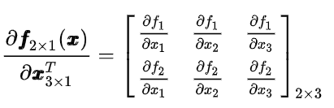

##### 4.2 分母布局
2.**分母布局**，就是分母是**列向量**形式，分子是**行向量**形式

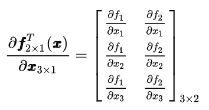

**将求导推广到矩阵，由于矩阵可以看作由多个向量所组成，因此对矩阵的求导可以看作先对每个向量进行求导，然后再增加一个维度存放求导结果。**

+  例如当F为矩阵，input为矩阵时，F中的每个元素f(标量）求导后均为一个矩阵（按照课上的展开方式），因此每个**f**（包含多个f（标量））求导后为存放多个矩阵的三维形状，再由于矩阵F由多个**f**组成，因此F求导后为存放多个**f**求导结果的四维形状。
**对于不同f和input求导后的维度情况总结如下图所示（课程中的截图）**

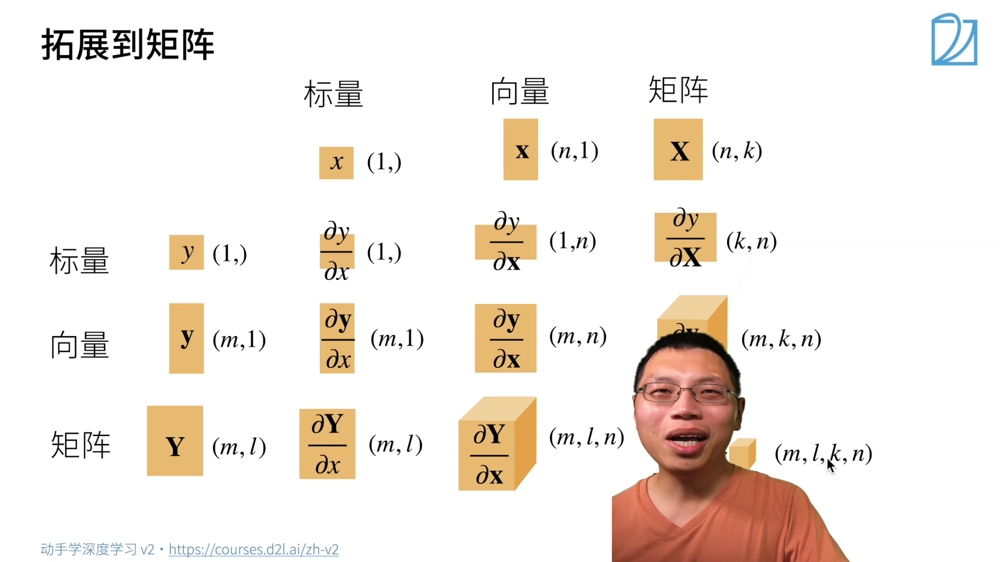
