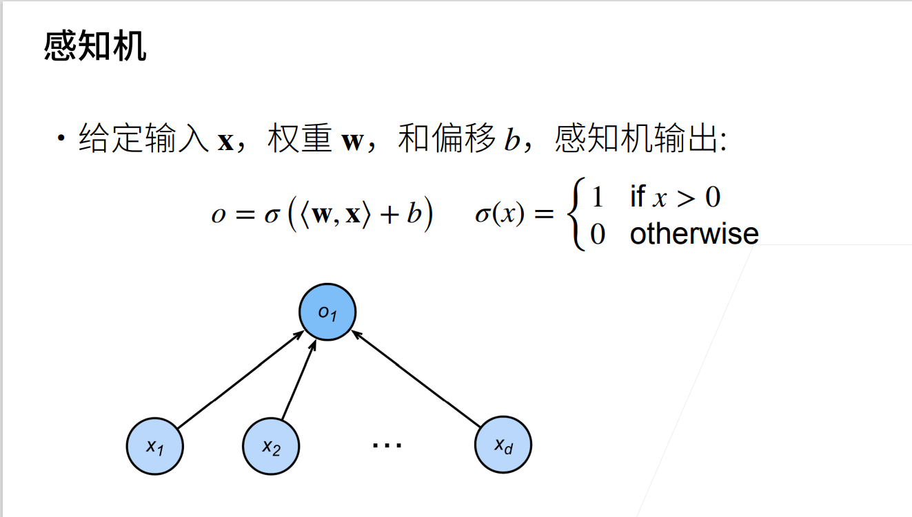
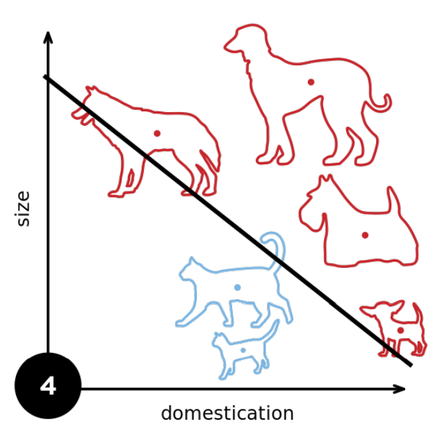
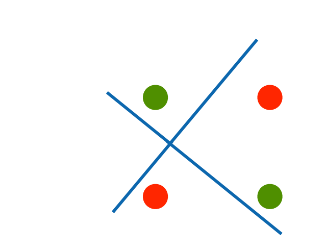
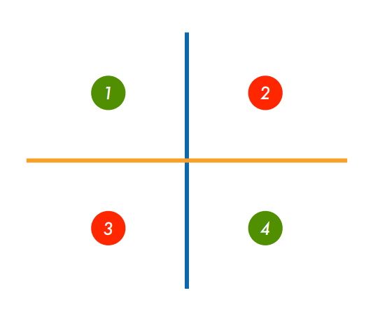
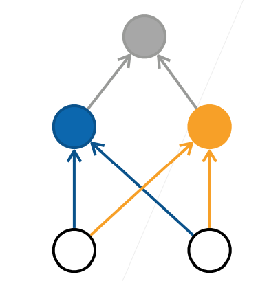
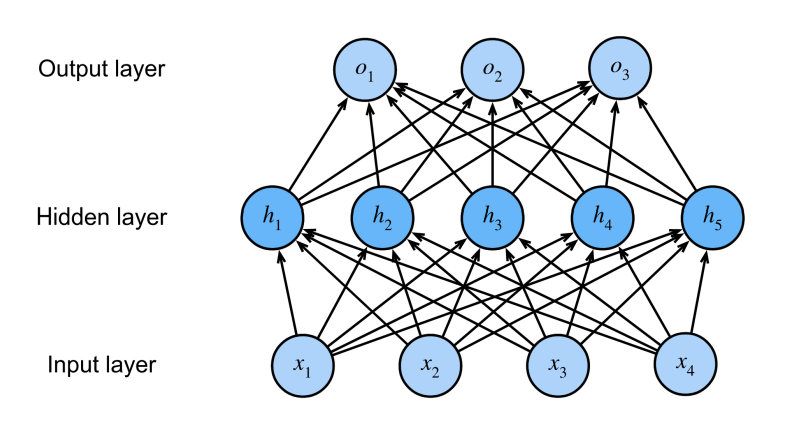

## 目录

-   [多层感知机](#多层感知机)
    -   [感知机](#感知机)
        -   [定义](#定义)
        -   [训练](#训练)
        -   [收敛定理](#收敛定理)
    -   [线性模型的缺陷](#线性模型的缺陷)
    -   [多层感知机](#多层感知机-1)
        -   [XOR问题的多层次解决](#xor问题的多层次解决)
        -   [多层感知机](#多层感知机-2)
        -   [激活函数](#激活函数)
        -   [补充](#补充)
    -   [练习](#练习)
    -   [总结](#总结)

## 多层感知机

### 感知机

#### 定义

从现在的观点来看，感知机实际上就是神经网络中的一个神经单元



感知机能解决二分类问题，但与线性回归和softmax回归有所区别：线性回归与softmax回归的输出均为实数，softmax回归的输出同时还满足概率公理。

#### 训练

训练感知机的伪代码如下：

``` python
initialize w = 0 and b = 0
repeat
    #此处表达式小于0代表预测结果错误
    if y_i[<w,x_i>+b] <= 0 then
        w=w + yixi
        b=b + yi
    end if
until all classified correctly
```

可以看出这等价于使用如下损失函数的随机梯度下降（batch_size=1）: 
$$
\ell(y,\bold x,\bold w)=max(0,-y<\bold w,\bold x>)\\
=max(0,-y\bold w^T\bold x)
$$
当预测错误时，偏导数为 
$$
\frac{\partial \ell}{\partial \bold w}=-y\cdot \bold x 
$$

注：此处为了方便计算，将偏置项b归入w中的最后一维，并在特征x中相应的最后一维加入常数1

#### 收敛定理

设数据在特征空间能被半径为r的圆（球）覆盖，并且分类时有余量（即$\sigma$函数的输入不会取使输出模棱两可的值）$y(\bold x^T\bold w)\geq \rho$，若初始参数满足$\|\bold w\|^2+b^2 \leq 1$，则感知机保证在$\frac{r^2+1}{\rho ^2}$步内收敛

[收敛性的证明](https://zhuanlan.zhihu.com/p/46762820)

### 线性模型的缺陷

在前面的课程中我们学习了softmax回归，线性回归，他们有将输入向量与一个权重向量做内积再与一个偏置相加得到一个值的过程：
$$
O =W^TX+b
$$
这个过程被称为仿射变换，它是一个带有偏置项的线性变换，它最终产生的模型被称为线性模型，线性模型的特点是只能以线性的方式对特征空间进行划分：



然而，这种线性划分依赖于线性假设，是非常不可靠的

-   线性假设意味着单调假设，这是不可靠的：
    -   对于人体的体温与健康情况的建模，人体在37℃时最为健康，过小过大均有风险，然而这不是单调的
-   线性假设意味着特征与预测存在线性相关性，这也是不可靠的：
    -   如果预测一个人偿还债务的可能性，那这个人的资产从0万元增至5万元和从100万元增至105万元对应的偿还债务的可能性的增幅肯定是不相等的，也就是不线性相关的
-   线性模型的评估标准是有位置依赖性的，这是不可靠的：
    -   如果需要判断图片中的动物是猫还是狗，对于图片中一个像素的权重的改变永远是不可靠的，因为如果将图片翻转，它的类别不会改变，但是线性模型不具备这种性质，像素的权重将会失效

课程中所提到的例子是XOR问题，即希望模型能预测出XOR分类（分割图片中的一三象限与二四象限）：



### 多层感知机

#### XOR问题的多层次解决

仍以XOR问题为例，XOR问题的一个解决思路是分类两次，先按x轴分类为+和-，再按y轴分类为+和-，最后将两个分类结果相乘，+即为一三象限，-即为二四象限：




这实际上将信息进行了多层次的传递：



其中蓝色为按X坐标的正负进行的分类，橙色为按Y坐标的正负进行的分类，灰色为将二者信息的综合，这就实现了用多层次的线性模型对非线性进行预测

#### 多层感知机

有了XOR问题的解决经验，可以想到如果将多个感知机堆叠起来，形成具有多个层次的结构，如图：



这里的模型称为多层感知机，第一层圆圈$x_1,x_2,x_3,x_4$称为输入（实际上他并非感知机），之后的一层称为隐藏层，由5个感知机构成，他们均以前一层的信息作为输入，最后是输出层，以前一层隐藏层的结果作为输入。除了输入的信息和最后一层的感知机以外，其余的层均称为隐藏层，隐藏层的设置为模型一个重要的超参数，这里的模型有一个隐藏层。

#### 激活函数

但是仅仅有线性变换是不够的，如果我们简单的将多个线性变换按层次叠加，由于线性变换的结果仍为线性变换，所以最终的结果等价于线性变换，与单个感知机并无区别，反而加大了模型，浪费了资源，为了防止这个问题，需要对每个单元（感知机）的输出通过激活函数进行处理再交由下一层的感知机进行运算，这些激活函数就是解决非线性问题的关键。

*激活函数*（activation function）通过计算加权和并加上偏置来确定神经元是否应该被激活，它们将输入信号转换为输出的可微运算。大多数激活函数都是非线性的。

主要的激活函数有：

##### ReLU函数

最受欢迎的激活函数是*修正线性单元*（Rectified linear
unit，*ReLU*），因为它实现简单，同时在各种预测任务中表现良好。**ReLU提供了一种非常简单的非线性变换**。给定元素$x$，ReLU函数被定义为该元素与$0$的最大值：
$$
\operatorname{ReLU}(x) = \max(x, 0)
$$
ReLU函数通过将相应的活性值设为0，仅保留正元素并丢弃所有负元素。为了直观感受一下，我们可以画出函数的曲线图。正如从图中所看到，激活函数是分段线性的。使用ReLU的原因是，它求导表现得特别好：要么让参数消失，要么让参数通过。这使得优化表现的更好，并且ReLU减轻了困扰以往神经网络的梯度消失问题

##### sigmoid函数

**对于一个定义域在$\mathbb{R}$中的输入，*sigmoid函数*将输入变换为区间(0,1)上的输出**。 因此，sigmoid通常称为*挤压函数*（squashing function）：它将范围$（-\infty, \infty）$中的任意输入压缩到区间（0,1）中的某个值：
$$
\operatorname{sigmoid}(x) = \frac{1}{1 + e^{-x}}.
$$
在基于梯度的学习中，sigmoid函数是一个自然的选择，因为它是一个平滑的、可微的阈值单元近似。当我们想要将输出视作二元分类问题的概率时，sigmoid仍然被广泛用作输出单元上的激活函数（你可以将sigmoid视为softmax的特例）。然而，sigmoid在隐藏层中已经较少使用，它在大部分时候被更简单、更容易训练的ReLU所取代。

##### tanh函数

与sigmoid函数类似，**tanh(双曲正切)函数也能将其输入压缩转换到区间(-1,1)上**。tanh函数的公式如下： 
$$
\operatorname{tanh}(x) = \frac{1 - e^{-2x}}{1 + e^{-2x}}
$$

#### 补充

还可以使用更多隐藏层的感知机和softmax函数解决分类问题

### 练习

1.  证明一个仅使用ReLU（或pReLU）的多层感知机构造了一个连续的分段线性函数。

> 绘制出RELU的图像后，我们可以发现，输出值在经过下一层隐藏层的计算后，如果结果小于等于0，则这个数据被舍弃，结果大于0则被保留，类似一个筛选的过程。相当于上一层的输出经过线性变换后在下一层被筛选，线性变换和上述筛选的过程都是连续的，因此就会产生连续而且分段的结果。

2.  构建多个超参数的搜索方法。

> 有四种主要的策略可用于搜索最佳配置。
>
> -   试错
> -   网格搜索
> -   随机搜索
> -   贝叶斯优化

详见[超参数搜索不够高效？这几大策略了解一下](https://www.jiqizhixin.com/articles/101401)

3.  权重初始化方法

> 1.  全零初始化：在神经网络中，把w初始化为0是不可以的。这是因为如果把w初始化0，那么每一层的神经元学到的东西都是一样的（输出是一样的），而且在BP的时候，每一层内的神经元也是相同的，因为他们的gradient相同，weight
>     update也相同。
> 2.  随机初始化
> 3.  Xavier初始化：保持输入和输出的方差一致（服从相同的分布），这样就避免了所有输出值都趋向于0。
> 4.  He
>     initialization：在ReLU网络中，假定每一层有一半的神经元被激活，另一半为0（x负半轴中是不激活的），所以要保持variance不变，只需要在Xavier的基础上再除以2。
> 5.  pre-training

详见[权重/参数初始化](https://zhuanlan.zhihu.com/p/72374385)

4.  超参数的调节

> 1.  在mlp中，第一个隐藏的的单元数可能大于输入的个数，每个隐藏层中的单元数由前至后递减，逐渐接近输出的个数。
> 2.  多数情况下，将mlp的深度设置得较深，而每层的单元数相对较少，这样易于训练，不易过拟合，也利于逐步学习样本特征。
> 3.  激活函数种类的选择对训练的影响小于其余的因素。

### 总结

-   多层感知机使用隐藏层和激活函数来得到非线性模型

-   常用激活函数：Sigmoid，Tanh，ReLU

-   使用softmax进行多分类

-   隐藏层数、大小为超参数
