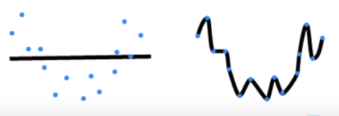
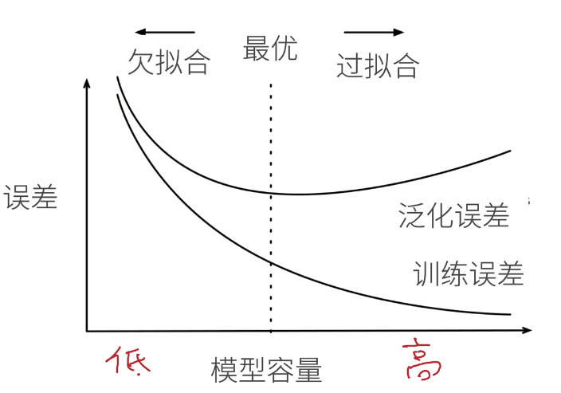
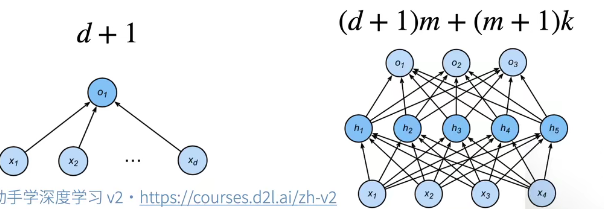
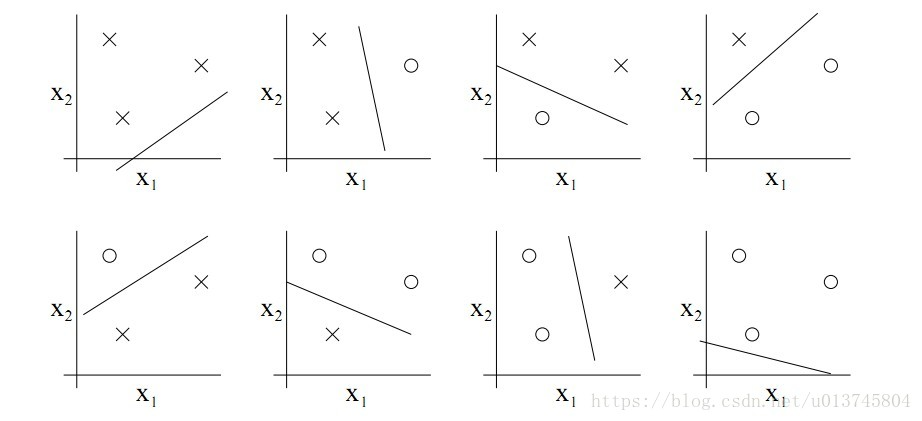
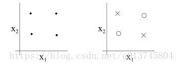
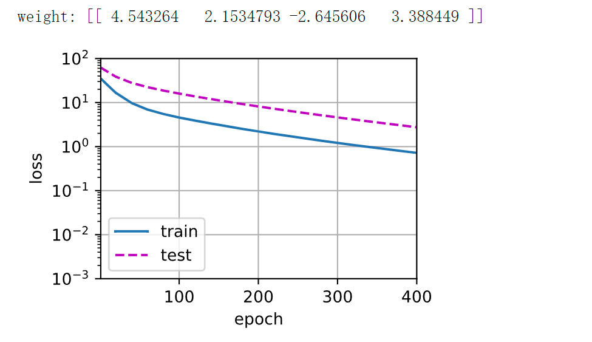
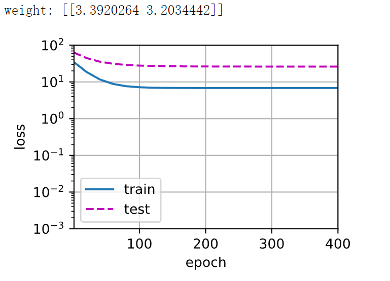
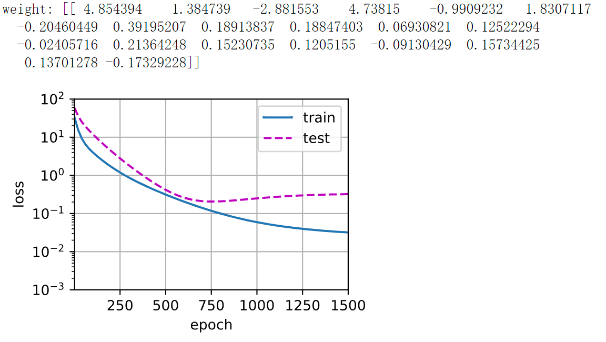

## 11-模型选择+过拟合和欠拟合

### 本节目录

- [1. 模型选择](#1-模型选择)
  - [1.1 实例分析：预测谁会偿还贷款](#11-实例分析预测谁会偿还贷款)
  - [1.2 训练误差和泛化误差](#12-训练误差和泛化误差)
  - [1.3 验证数据集和测试数据集](#13-验证数据集和测试数据集)
  - [1.4 K-则交叉验证](#14-k-则交叉验证)
  - [1.5 总结](#15-总结)
- [2. 过拟合和欠拟合](#2-过拟合和欠拟合)
  - [2.1 什么是过拟合和欠拟合？](#21-什么是过拟合和欠拟合)
  - [2.2 模型容量](#22-模型容量)
  - [2.3 模型容量的影响](#23-模型容量的影响)
  - [2.4 估计模型容量](#24-估计模型容量)
  - [2.5 VC维](#25-vc维)
  - [2.6 VC维的用处](#26-vc维的用处)
  - [2.7 数据复杂度](#27-数据复杂度)
  - [2.8 总结](#28-总结)
- [3. 多项式回归](#3-多项式回归)
  - [3.1 导入库](#31-导入库)
  - [3.2 生成数据集](#32-生成数据集)
  - [3.3 NumPyndarray转换为tensor](#33-numpyndarray转换为tensor)
  - [3.4 对模型进行训练和测试](#34-对模型进行训练和测试)
  - [3.5 [**三阶多项式函数拟合(正态)**]](#35-三阶多项式函数拟合正态)
  - [3.6 [**线性函数拟合(欠拟合)**]](#36-线性函数拟合欠拟合)
  - [3.7 [**高阶多项式函数拟合(过拟合)**]](#37-高阶多项式函数拟合过拟合)

### 1. 模型选择

本小节主要介绍了评估模型的一些指标和方法

#### 1.1 实例分析：预测谁会偿还贷款

- 银行雇你来调查谁会偿还贷款，你得到了100个申请人的信息，其中五个人在3年内违约了。然后你惊讶的发现，**所有的五个人在面试时都穿了蓝色衬衫**。显然，你的模型也发现了这个强信号，这会有什么问题？

**答案是，你的模型很有可能会认为所有来面试的人都会穿蓝色衬衫，而这当然是不对的。**

#### 1.2 训练误差和泛化误差

- 训练误差：模型在训练数据上的误差
- 泛化误差：模型在新数据上的误差
- 例子：根据模考成绩来预测未来考试分数
  - 在过去的考试中表现很好（**训练误差**）不代表未来会好（**泛化误差**）
  - 学生A通过背书在模考中拿到很好成绩
  - 学生B知道答案后面的原因

- **其中，泛化误差是我们所最关心的**

#### 1.3 验证数据集和测试数据集

- 验证数据集：一个用来评估模型好坏的数据集
  - 例如拿出50%的训练数据
  - 不要跟训练数据混在一起（常犯错误）
- 测试数据集：只用一次的数据集。例如：
  - 未来的考试
  - 我出价的房子的实际成交价
  - 用在kaggle私有排行榜中的数据集

- **二者最大的区别就是，验证数据集可以那来用很多次，相当于平时的模拟考，而测试数据集则只能用一次来评估模型的性能，相当于最终的考试。**

#### 1.4 K-则交叉验证

- 在没有足够多数据时使用（这是常态）
- 算法：
  - 将训练数据分割k块
  - For i = 1，……，k
    - 使用第i块作为验证数据集，其余的作为训练数据集
  - 报告k个验证集误差的平均
- 常用：k = 5或10

- K-则交叉验证的目的是在没有足够多数据使用时评估模型和超参数的性能，也就是说，**K次训练和验证使用的是相同的超参数和模型**

#### 1.5 总结

- 训练数据集：训练模型参数
- 验证数据集：选择模型超参数
- 非大数据集上通常使用k-则交叉验证

### 2. 过拟合和欠拟合

#### 2.1 什么是过拟合和欠拟合？

| 模型容量\数据 | 简单   |  复杂  |
| ------------- | ------ | :----: |
| 低            | 正常   | 欠拟合 |
| 高            | 过拟合 |  正常  |

- tips：模型容量即模型的复杂度，也代表了模型拟合各种函数的能力

#### 2.2 模型容量

- 拟合各种函数的能力
- 低容量的模型难以拟合训练数据
- 高容量的模型可以记住所有的训练数据



- 显然，模型容量太低或太高都不好。太低（对应第一种）过于简单，模型分类效果差，太高（对应第二种）则过于复杂，把噪声全部都拟合住了，这是我们所不希望的。

#### 2.3 模型容量的影响



- 我们的核心任务就是把泛化误差往下降

#### 2.4 估计模型容量

- 难以在不同的种类算法之间比较
  - 例如树模型和神经网络
- 给定一个模型种类，将有两个主要因素
  - 参数的个数
  - 参数的选择范围



#### 2.5 VC维

VC维是统计学习理论的一个核心思想，这里大致了解就行，因为很难计算之后学习的模型（如CNN,RNN)的VC维，故并不经常用

- 定义：对于一个分类模型，VC维等于一个最大的数据集的大小，不管如何给定标号，都存在一个模型对它进行完美分类。即存在H个样本，模型能把H个样本的2^H种标号方式打散的H的最大值。
- 例子：线性分类器的VC维
  - 2维输入的感知机，VC维=3（对于三个点的任意标号都能分类，而任意四个点的样本都存在不能被打散的标号形式个，如之前讲过的XOR）

3个点：



4个点：



- 支持N维输入的感知机的VC维是N+1
- 一些多层感知机的VC维是:

#### 2.6 VC维的用处

- 提供为什么一个模型好的理论依据
  - 它可以衡量训练误差和泛化误差之间的间隔
- 但深度学习中很少使用
  - 衡量不是很准确
  - 计算深度学习模型的VC维很困难

#### 2.7 数据复杂度

- 多个重要因素
  - 样本的元素个数
  - 每个样本的元素个数
  - 时间、空间结构
  - 多样性

#### 2.8 总结

- 模型容量需要匹配数据复杂度，否则可能导致欠拟合和过拟合
- 统计机器学习提供数学工具来衡量模型复杂度
- 实际中一般考观察训练误差和验证误差

### 3. 多项式回归

- 本小节使用多项式回归为例子，在pytorch上展示过拟合和欠拟合的实际表现

#### 3.1 导入库

```python
import math
import numpy as np
import torch
from torch import nn
from d2l import torch as d2l
```

#### 3.2 生成数据集

```python
max_degree = 20  # 多项式的最大阶数
n_train, n_test = 100, 100  # 训练和测试数据集大小
true_w = np.zeros(max_degree)  # 分配大量的空间
true_w[0:4] = np.array([5, 1.2, -3.4, 5.6])#前五个参数是有用的已知的参数，其他都是0，是不希望被学习的参数

features = np.random.normal(size=(n_train + n_test, 1))#创建特征值
np.random.shuffle(features)#打乱顺序
poly_features = np.power(features, np.arange(max_degree).reshape(1, -1))#通过广播机制得到每个特征值的所有多项式值
for i in range(max_degree):
    poly_features[:, i] /= math.gamma(i + 1)  # gamma(n)=(n-1)!，除以gamma防止梯度过大
# labels的维度:(n_train+n_test,)
labels = np.dot(poly_features, true_w)#将对应多项式值与其系数相乘
labels += np.random.normal(scale=0.1, size=labels.shape)#加上噪声项
```

#### 3.3 NumPyndarray转换为tensor

```python
true_w, features, poly_features, labels = [torch.tensor(x, dtype=
    torch.float32) for x in [true_w, features, poly_features, labels]]
```

#### 3.4 对模型进行训练和测试

首先让我们[实现一个函数来评估模型在给定数据集上的损失]。

```python
def evaluate_loss(net, data_iter, loss):  #@save
    """评估给定数据集上模型的损失"""
    metric = d2l.Accumulator(2)  # 损失的总和,样本数量
    for X, y in data_iter:
        out = net(X)#预测值
        y = y.reshape(out.shape)#将y维度变为与out一样
        l = loss(out, y)#计算损失
        metric.add(l.sum(), l.numel())#加入到迭代器中，进入下一个batch
    return metric[0] / metric[1]#返回平均损失
```

现在[定义训练函数]

```python
def train(train_features, test_features, train_labels, test_labels,
          num_epochs=400):
    loss = nn.MSELoss()#定义损失
    input_shape = train_features.shape[-1]
    # 不设置偏置，因为我们已经在多项式特征中实现了它（即x^0）
    net = nn.Sequential(nn.Linear(input_shape, 1, bias=False))#创建模型
    batch_size = min(10, train_labels.shape[0])
    train_iter = d2l.load_array((train_features, train_labels.reshape(-1,1)),
                                batch_size)#训练集
    test_iter = d2l.load_array((test_features, test_labels.reshape(-1,1)),
                               batch_size, is_train=False)#测试集
    trainer = torch.optim.SGD(net.parameters(), lr=0.001)#设置优化器，这里使用SGD
    animator = d2l.Animator(xlabel='epoch', ylabel='loss', yscale='log',
                            xlim=[1, num_epochs], ylim=[1e-3, 1e2],
                            legend=['train', 'test'])#动画
    for epoch in range(num_epochs):
        d2l.train_epoch_ch3(net, train_iter, loss, trainer)#训练
        if epoch == 0 or (epoch + 1) % 20 == 0:
            animator.add(epoch + 1, (evaluate_loss(net, train_iter, loss),
                                     evaluate_loss(net, test_iter, loss)))#将当前的训练集和测试集的损失存入animator中，用于绘图
    print('weight:', net[0].weight.data.numpy())#打印训练后的参数
```

#### 3.5 [**三阶多项式函数拟合(正态)**]

我们将首先使用三阶多项式函数，它与数据生成函数的阶数相同。 结果表明，该模型能有效降低训练损失和测试损失。 学习到的模型参数也接近真实值𝑤=[5,1.2,−3.4,5.6]。

```python
# 从多项式特征中选择前4个维度，即1,x,x^2/2!,x^3/3!
train(poly_features[:n_train, :4], poly_features[n_train:, :4],
      labels[:n_train], labels[n_train:])
```



#### 3.6 [**线性函数拟合(欠拟合)**]

让我们再看看线性函数拟合，减少该模型的训练损失相对困难。 在最后一个迭代周期完成后，训练损失仍然很高。 当用来拟合非线性模式（如这里的三阶多项式函数）时，线性模型容易欠拟合。

```python
# 从多项式特征中选择前2个维度，即1和x
train(poly_features[:n_train, :2], poly_features[n_train:, :2],
      labels[:n_train], labels[n_train:])
```



#### 3.7 [**高阶多项式函数拟合(过拟合)**]

现在，让我们尝试使用一个阶数过高的多项式来训练模型。 在这种情况下，没有足够的数据用于学到高阶系数应该具有接近于零的值。 因此，这个过于复杂的模型会轻易受到训练数据中噪声的影响。 虽然训练损失可以有效地降低，但测试损失仍然很高。 结果表明，复杂模型对数据造成了过拟合。

```python
# 从多项式特征中选取所有维度
train(poly_features[:n_train, :], poly_features[n_train:, :],
      labels[:n_train], labels[n_train:], num_epochs=1500)
```


