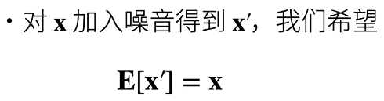
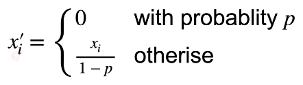
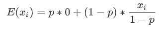
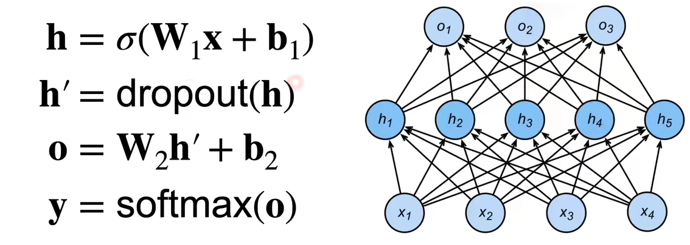
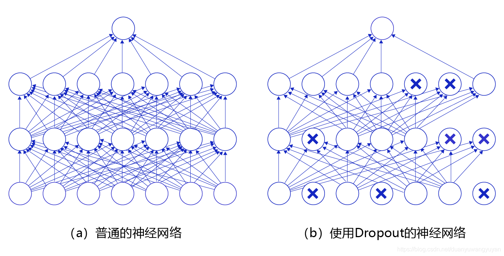

## 13-丢弃法

## 本节目录
  - [1.丢弃法动机、实现及原则](#1丢弃法动机实现及原则)
    - [1.1动机](#11动机)
    - [1.2如何实现模型的这一能力](#12如何实现模型的这一能力)
    - [1.3加入噪音的原则](#13加入噪音的原则)
  - [2.丢弃法内容](#2丢弃法内容)
  - [3.丢弃法使用](#3丢弃法使用)
    - [3.1丢弃法的使用位置](#31丢弃法的使用位置)
    - [3.2训练中的丢弃法](#32训练中的丢弃法)
  - [4.总结](#4总结)
  - [5.代码部分](#5代码部分)
    - [5.1Dropout部分](#51dropout部分)
    - [5.2在神经网络中使用丢弃法](#52在神经网络中使用丢弃法)

### 1.丢弃法动机、实现及原则

#### 1.1动机

+ 一个好的模型需要对输入数据的扰动鲁棒（健壮性）

####            

#### 1.2如何实现模型的这一能力

+ 使用有噪音的数据。
+ 丢弃法：在层之间加入噪音。

#### 1.3加入噪音的原则



+ 例如模型的功能是识别猫猫，加入噪音可以是输入模糊的猫猫图片，但尽量不要是狗狗的图片。

### 2.丢弃法内容
+ 丢弃法对每个元素作如下扰动



+ 能够满足加入噪音的期望相同原则



### 3.丢弃法使用

#### 3.1丢弃法的使用位置

+ 通常将丢弃法作用在隐藏全连接层的输出上



+ 随机选中某些神经元将其输出置位0，因此模型不会过分依赖某些神经元




#### 3.2训练中的丢弃法

+ 正则项（丢弃法）仅在训练中使用：影响模型参数的更新，预测的时候便不再使用

### 4.总结

+ 丢弃法将一些输出项随机置0来控制模型复杂度
+ 常作用在多层感知机的隐藏层输出上
+ 丢弃概率是控制模型复杂度的超参数（常取0.9，0.5，0.1）

### 5.代码部分

#### 5.1Dropout部分

```python
import torch
from torch import nn
from d2l import torch as d2l

def dropout_layer (X,dropout)：   #X为dropout层的输入，dropout为设置的丢弃概率
    assert 0<=dropout<=1        #丢弃概率介于0，1之间
    if dropout == 1:
       return torch.zeros_like(x) #若丢弃概率为1，则X的全部项均被置0
    if dropout == 0:
       return X                   #若丢弃概率为0，不对X作丢弃操作，直接返回X
    mask=(torch.Tensor(X.shape).uniform_(0,1)>dropout).float() #用uniform函数生成0-1间的随机实数，利用”>"，将大于dropout的记为1，小于dropout的记为0，实现丢弃操作
    return mask*X/(1-dropout) #将mask与X相乘实现丢弃操作，并除以(1-dropout)，这里不使用选中X中元素置0的原因是相乘操作相比选中操作更快
```

#### 5.2在神经网络中使用丢弃法

```python
num_inputs, num_outputs, num_hiddens1, num_hiddens2 = 784, 10, 256, 256
dropout1, dropout2 = 0.2, 0.5
class Net(nn.Module)
    def _init_(self,num_inputs,num_outputs,num_outputs,num_hiddens1,num_hiddens2,is_training=True):
       super(Net,self)._init_()
       self.num_inputs=num_inputs
       self.training=is_training
       self.lin1=nn.Linear(num_inputs,num_hiddens1)
       self.lin2=nn.Linear(num_hiddens1,num_hiddens2)
       self.lin2=nn.Linear(num_hiddens2,num_outputs)
       self.relu=nn.ReLU()
    def forward(self,X):
       H1=self.relu(self.lin1(X.reshape((-1,self.num_inputs))))
       if self.training == True:  #丢弃法仅在训练中使用
           H1=dropout_layer(H1,dropout1)
       H2=self.relu(self.lin2(H1))
       if self.training == True: #丢弃法仅在训练中使用
           H2=dropout_layer(H2,dropout2)
       out=self.lin3(H2)  #output层不再使用丢弃法
       return out
```
