## 14-数值稳定性+模型初始化和激活函数

### 本节目录

- [1. 数值稳定性](#1-数值稳定性)
  - [1.1 神经网络的梯度](#11-神经网络的梯度)
  - [1.2 数值稳定性的常见两个问题](#12-数值稳定性的常见两个问题)
  - [1.3 例子：MLP](#13-例子mlp)
  - [1.3 梯度爆炸](#13-梯度爆炸)
    - [1.3.1 使用ReLU作为激活函数](#131-使用relu作为激活函数)
    - [1.3.2 梯度爆炸问题](#132-梯度爆炸问题)
  - [1.4 梯度消失](#14-梯度消失)
    - [1.4.1 使用Sigmoid作为激活函数](#141-使用sigmoid作为激活函数)
    - [1.4.2 梯度消失的问题](#142-梯度消失的问题)
- [2. 模型初始化和激活函数](#2-模型初始化和激活函数)
  - [2.1 让训练更加稳定](#21-让训练更加稳定)
  - [2.2 基本假设：让每层的均值/方差是一个常数](#22-基本假设让每层的均值方差是一个常数)
  - [2.3 权重初始化](#23-权重初始化)
  - [2.4 例子：MLP](#24-例子mlp)
    - [2.4.1 模型假设](#241-模型假设)
    - [2.4.2 正向方差](#242-正向方差)
    - [2.4.3 反向均值和方差](#243-反向均值和方差)
    - [2.4.4 Xavier初始](#244-xavier初始)
    - [2.4.5 假设线性的激活函数](#245-假设线性的激活函数)
    - [2.4.6 检查常用激活函数](#246-检查常用激活函数)
- [3. 总结](#3-总结)
- [4.Q&A](#4qa)

### 1. 数值稳定性

数值稳定性是深度学习中比较重要的点，特别是当神经网络变得很深的时候，数值通常很容易变得不稳定。

#### 1.1 神经网络的梯度

   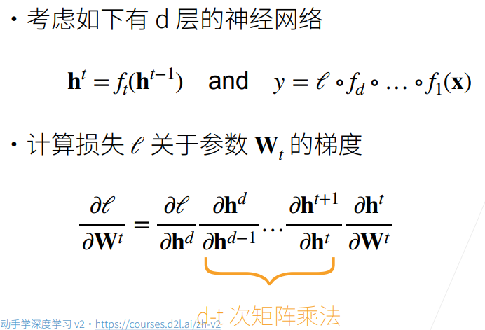

**考虑d层神经网络**

- t表示层数，表示第*t-1*层的输出，经过一个函数后，得到第*t*层的输出。

- 最终输出y的表示：输入x经过若干层(*d*层)的函数作用，最后被损失函数作用得到输出y。

**计算损失函数*L*关于第*t*层参数的梯度**

- 由链导法则得到上图中乘积公式

- 需要进行d-t次**矩阵乘法**（为什么是矩阵乘法？答：由于所有的*h*都是一些**向量**，导数中分子分母均为向量，所以求导得到的是矩阵，维数为[分子维度]x[分母维度]，可以参考第6节[视频](https://www.bilibili.com/video/BV1eZ4y1w7PY)和[笔记](./06-矩阵计算.md)）。这也是导致数值稳定性问题的**主要因素**，由于做了太多次的矩阵乘法。

#### 1.2 数值稳定性的常见两个问题

**梯度爆炸**

假设梯度都是一些比1大的数比如1.5，做100次乘积之后得到，这个数字很容易带来一些浮点数上限的问题（需了解更多请参考计算机系统-计算机中浮点数的存储方式）。

**梯度消失**

假设梯度都是一些比1小的数比如0.8，做100次乘积之后得到，也可能会带来浮点数下溢的问题。

#### 1.3 例子：MLP
此处我们着重探讨[1.1节](#11-神经网络的梯度)中所述的求梯度时所做的d-t次矩阵乘法，并以一个实例MLP来探讨其结果的具体形式。

   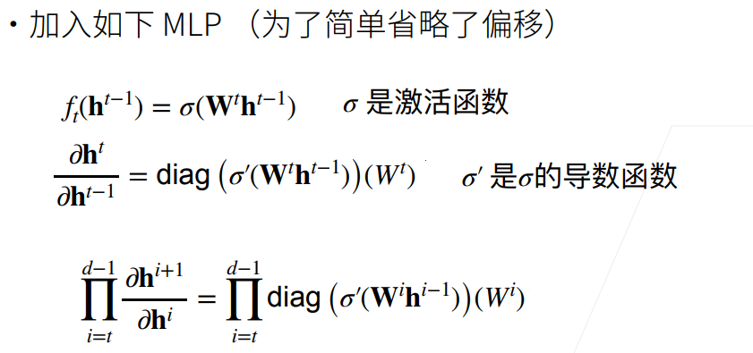

- 第一行公式，定义和(均为向量)的函数关系，第t层的权重矩阵作用于t-1层的输出后经过激活函数得到，注意激活函数逐元素计算。

- 第二行公式：这里用到链导法则，激活函数先对内部向量逐元素求导，然后把求导后这个向量变成对角矩阵（可以理解为链导法则中内部向量对自身进行求导，变成一个nxn的对角矩阵，更多请参考[邱锡鹏 《神经网络与深度学习》](https://nndl.github.io/nndl-book.pdf)[^ 图片1]）

  

     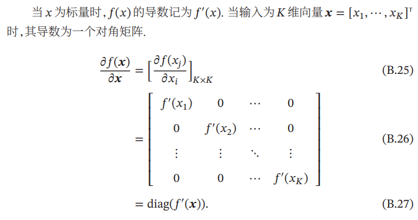
  

[^图片1]: 引自[邱锡鹏 《神经网络与深度学习》](https://nndl.github.io/nndl-book.pdf)附录：数学基础 

- 视频中**勘误说明**：链导法则中  而不是（这点由分子分母维度也容易推出），故最终求导结果包含，而不是其转置。

#### 1.3 梯度爆炸

##### 1.3.1 使用ReLU作为激活函数

   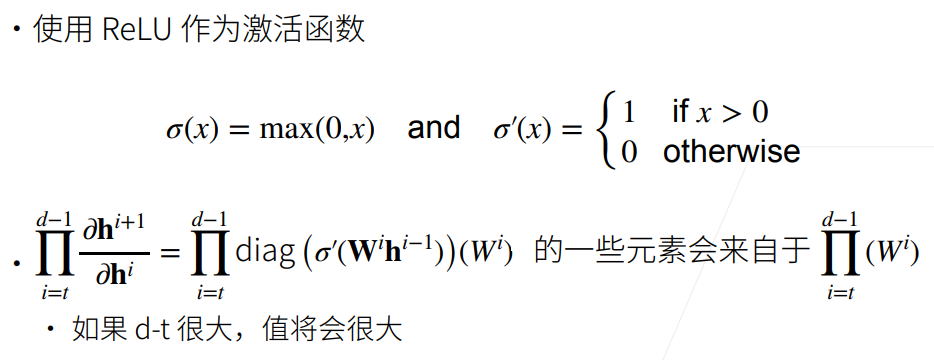

由于激活函数Relu求导后或者是1或者是0，变为对角矩阵的斜对角线元素后，与做乘积，斜对角线为1的部分会使得W中元素保留，最终该连乘式中有一些元素来自，如果大部分中 值都大于1，且层数比较大，那么连乘之后可能导致梯度爆炸的问题。

##### 1.3.2 梯度爆炸问题

- 值超出值域（infinity）

  - 对于16位浮点数尤为严重（数值区间 [6e-5 , 6e4]），GPU用16位浮点数更快

- 对学习率敏感

  - 如果学习率太大→大参数值→更大的梯度，如此循环几次，容易导致梯度爆炸

  - 如果学习率太小→训练无进展

  - 我们可能需要在训练过程中不断调整学习率

#### 1.4 梯度消失

##### 1.4.1 使用Sigmoid作为激活函数

   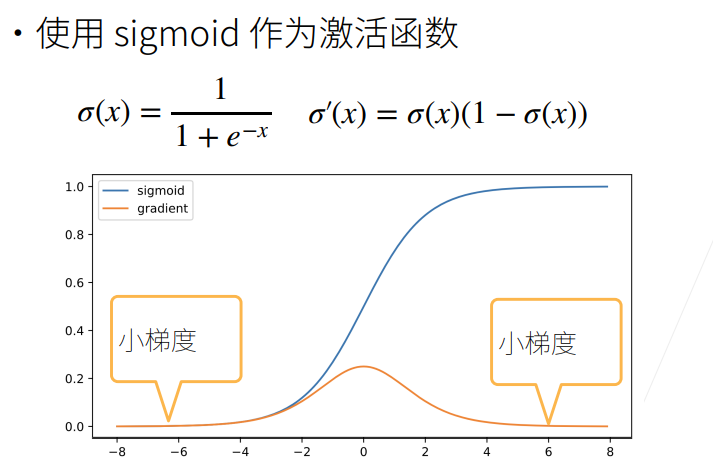

- 蓝色曲线为函数值
- 黄色曲线为梯度，注意到当输入x值取±6时，此时梯度已经变得很小，由图也可以看出，当输入值稍大或稍小都很容易引起小梯度。

   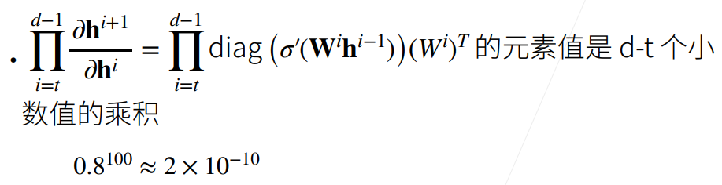

所以最终连乘式中项乘出来会很小，导致整个梯度很小，产生梯度消失问题。

##### 1.4.2 梯度消失的问题

- 梯度值变为0

  - 对16位浮点数尤为严重
- 训练没有进展

  - 不管如何选择学习率，由于梯度已经为0了，学习率x梯度=0
- 对于底部层尤为严重
  - 仅仅顶部层训练得较好。第*t*层导数包含d-t个矩阵乘积，越往底层走，t越小，乘得越多，梯度消失越严重，所以底部层效果更差。
  - 无法让神经网络更深。只能把顶部层训练得比较好，底部层跑不动，这和给一个浅的神经网络没有什么区别。

### 2. 模型初始化和激活函数

#### 2.1 让训练更加稳定

我们的一个核心目标是如何让训练更稳定，梯度值不要太大也不要太小

- 目标：让梯度值在合理的范围内
  - 例如 [1e-6, 1e3]
- 常用方法：
  - 将乘法变加法：
    - ResNet（跳跃连接，如果很多层，加入加法进去）
    -  LSTM（引入记忆细胞，更新门，遗忘门，通过门权重求和，控制下一步是否更新）
  - 归一化：
  
    - 梯度归一化（归一化均值，方差）
  
    - 梯度裁剪(clipping)：比如大于/小于一个固定的阈值，就让梯度等于这个阈值，将梯度限制在一个范围中。（可以缓解梯度爆炸）
  - 合理的权重初始和激活函数：本节课讲述重点

**下面我们重点探讨最后一种方法：合理的权重初始和激活函数**

#### 2.2 基本假设：让每层的均值/方差是一个常数

- **将每层的输出和梯度都看做随机变量**

  比如第i层有100维，就将输出和梯度分别看成100个随机变量

- **让它们的均值和方差都保持一致**

  我们的目标，这样不管神经网络多深，最后一层总与第一层差不多，从而不会梯度爆炸和消失

根据我们的假设，可以列出如下方程式：

   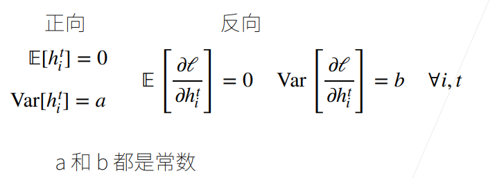

#### 2.3 权重初始化

- 在合理值区间里随机初始参数
- 训练**开始**的时候更容易有数值不稳定
  - 远离最优解的地方损失函数表面可能很复杂
  - 最优解附近表面会比较平
- 使用N(0, 0.01)分布来初始可能对小网络没问题，但不能保证深度神经网络

#### 2.4 例子：MLP

下面我们以MLP为例，考虑需要什么条件，才能满足[2.2节](#22-基本假设：让每层的均值/方差是一个常数)的假设。

##### 2.4.1 模型假设

- 每一层**权重**中的变量均为**独立同分布**，并设出均值、方差。
- 每一层**输入**的变量**独立于**该层**权重**变量。同时**输入变量**之间**独立同分布**。
- 假设没有激活函数(先简化分析，之后会考虑有激活函数的情况)，可以求得该层输出的期望为0。

   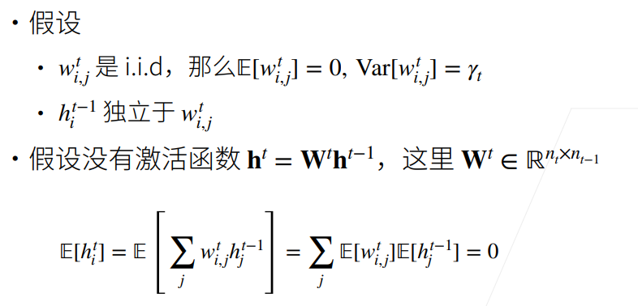

此处用到了一个重要性质：

   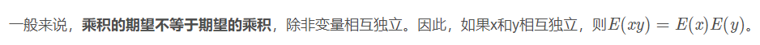

更多均值、方差运算可以参考[期望、方差、协方差及相关系数的基本运算](https://blog.csdn.net/MissXy_/article/details/80705828)

##### 2.4.2 正向方差

   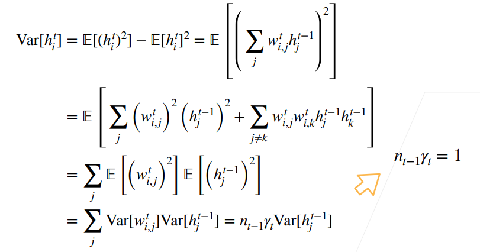

- 第二行的计算中仍然用到了[2.4.1节](241模型假设)的期望的重要性质：如果两个变量独立，它们乘积的均值=均值的乘积，再结合w的期望为0(注意w和h独立，w之间独立同分布)，即有第二行末项期望为0。

- 最后一行由于wi,j独立同分布，方差相同，加上做了hj独立同分布的假设，所以可以写成 **[t-1层输出维度] x [t层权重方差] x [t-1层输出方差]** 的形式

- 此时，我们回过头来看我们的终极目标[2.2节](#22-基本假设：让每层的均值/方差是一个常数)的假设，每层输出期望为0我们已经可以满足(2.4.1节已经推导出)，而方差相同这一目标，通过上图的推导，我们发现需要。

##### 2.4.3 反向均值和方差

   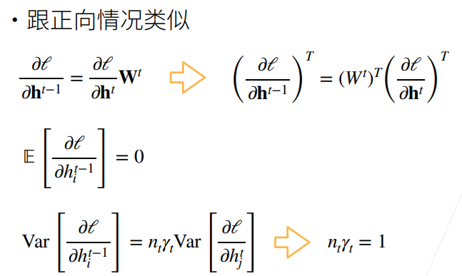

反向的情况和正向的类似，不过此时我们需要满足的式子变为。

##### 2.4.4 Xavier初始

- 上述推导带来的问题：难以同时满足和。（需要每层输出的维度都相同）

- 采用Xavier折中解决，不能同时满足上面两式，转而满足 [**上面两式做加法后除以2**] 得到的式子，用两种分布进行初始化（每层方差、均值满足推导式）。

  

     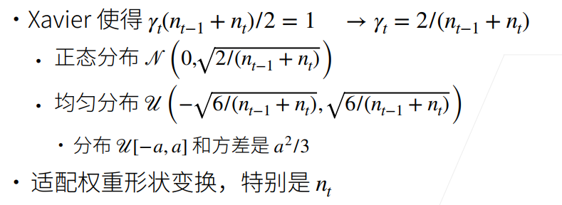
  

- 如果能确定每层输入、输出维度大小，则能确定该层权重的方差大小。
- 权重初始化方式：正态分布、均匀分布，均值/方差满足Xavier的假设。

##### 2.4.5 假设线性的激活函数

真实情况下，我们并不会用线性的激活函数（这样相当于没有进行激活），这里为了简化问题，假设激活函数是线性的。

- **正向**

   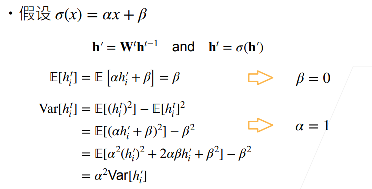

上述推导表明，为了使得前向传播的均值为0，方差固定的话，激活函数必须f(x)=x，这种恒等映射。

- **反向**

   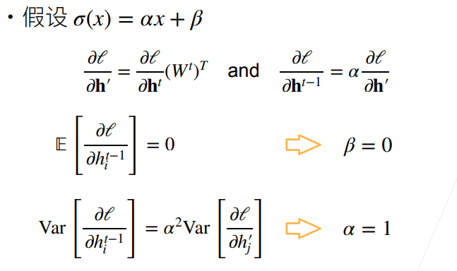

PPT上的推导似乎有点问题（上图中第二行方程），笔者重新进行了下述推导，读者也可自行推导验证：

   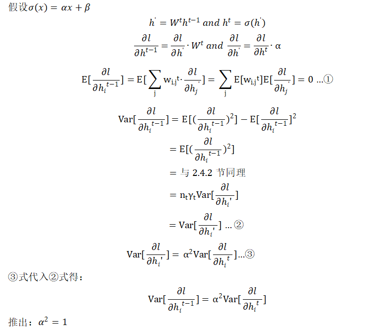

**通过正向和反向的推导，我们可以得出的【结论】是：当激活函数为f(x)=x，这种恒等映射更有利于维持神经网络的稳定性。**

##### 2.4.6 检查常用激活函数

   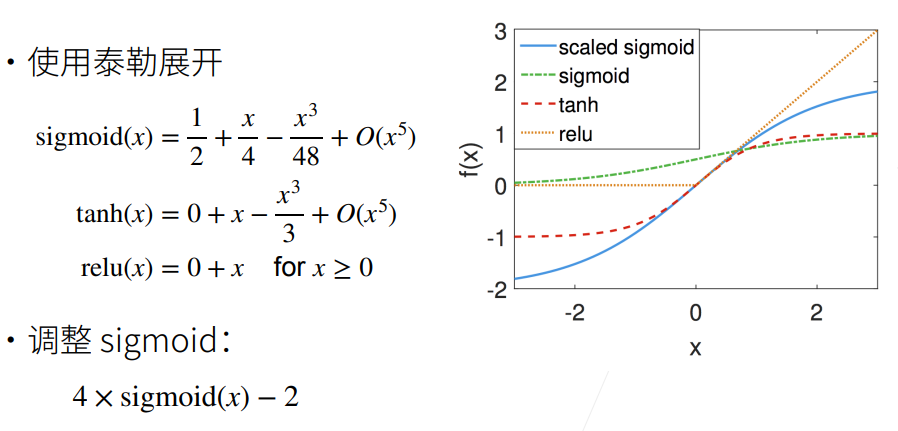

对于常用激活函数：tanh，relu满足在零点附近有f(x)=x，而sigmoid函数在零点附近不满足要求，可以对sigmoid函数进行调整（根据Taylor展开式，调整其过原点）

### 3. 总结

- 当数值过大或者过小时，会导致数值问题。
- 常发生在深度模型中，因为其会对n个数累乘。

- 合理的权重初始值(如Xavier)和激活函数的选取(如relu, tanh, 调整后的sigmoid)可以提升数值稳定性。

### 4.Q&A

**问题：nan, inf是怎么产生的以及怎么解决的？**

> NaN和Inf怎么产生的：参考[出现nan、inf原因](https://blog.csdn.net/qq_16334327/article/details/86526854)

> 如何解决：参考[深度学习中nan和inf的解决](https://blog.csdn.net/u011119817/article/details/103908065)以及[训练网络loss出现Nan解决办法 ](https://zhuanlan.zhihu.com/p/89588946#:~:text=一般来说，出现NaN有以下几种情况： 1.,如果在迭代的100轮以内，出现NaN，一般情况下的原因是因为你的学习率过高，需要降低学习率。 可以不断降低学习率直至不出现NaN为止，一般来说低于现有学习率1-10倍即可。)

**问题：训练过程中，如果网络层的输出的中间层特征元素的值突然变成nan了，是发生梯度爆炸了吗？**

> 参考[训练网络loss出现Nan解决办法 ](https://zhuanlan.zhihu.com/p/89588946#:~:text=一般来说，出现NaN有以下几种情况： 1.,如果在迭代的100轮以内，出现NaN，一般情况下的原因是因为你的学习率过高，需要降低学习率。 可以不断降低学习率直至不出现NaN为止，一般来说低于现有学习率1-10倍即可。)

**问题：老师，让每层方差是一个常数的方法，您指的是batch normalization吗？想问一下bn层为什么要有伽马和贝塔？去掉可以吗**

> 让每层方差是一个常数，和batch norm没有太多关系，(本节课介绍的方法是合理地初始化权重和设置激活函数)。batch norm可以让你的输出变成一个均值为0，方差差不多是一个固定值的东西，但它不一定能保证你的梯度。

(此处节选几个重要的Q&A，建议观看完整Q&A，获得更深的理解)
