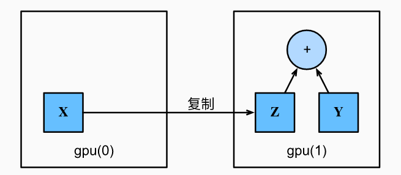
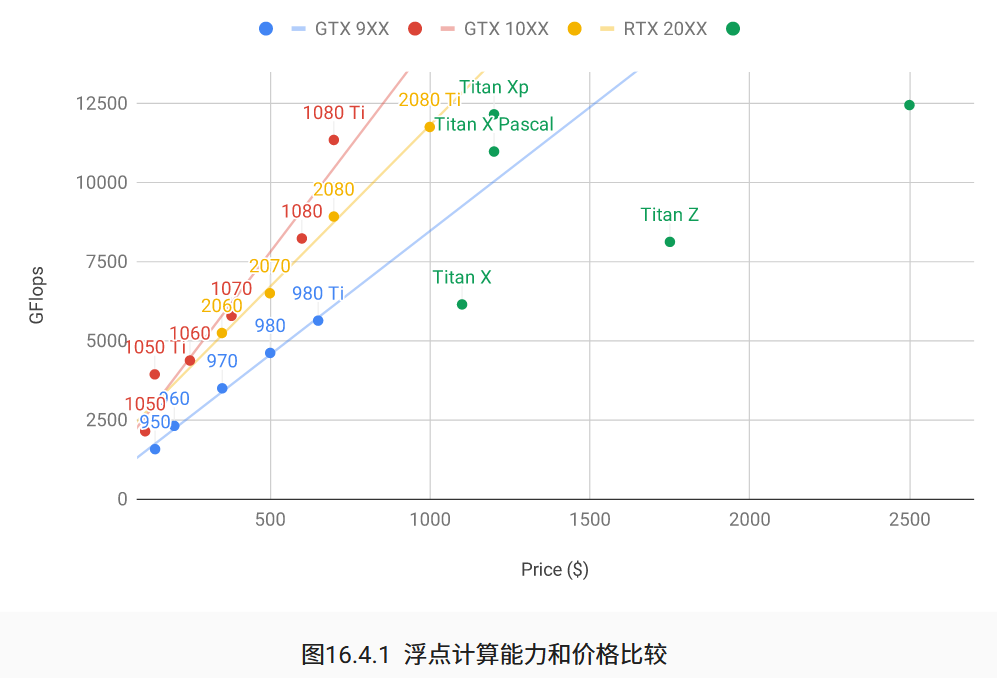
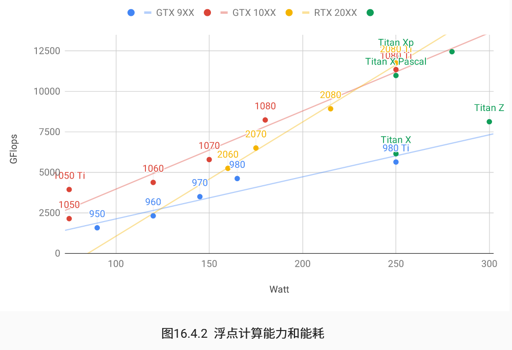

目录：

\- [使用和购买GPU](#使用和购买gpu)

 \- [使用GPU](#使用gpu)

 \- [购买GPU](#购买gpu)


## 使用和购买GPU

### 使用GPU

（简而言之，自2000年以来，GPU性能每10年增长1000倍，本节主要介绍如何利用这种计算性能进行研究，首先是使用单个GPU，然后是如何使用多个GPU和多个服务器）

- 准备：

  - （首先确保至少安装了一个NVDIA GPU，然后下载[NVIDIA驱动和CUDA](https://developer.nvidia.com/cuda-downloads)并按照提示设置适当的路径）

  - 查看显卡信息：		

```python
!nvidia-smi
```

```python
Fri Jan 14 03:23:18 2022
+-----------------------------------------------------------------------------+
| NVIDIA-SMI 418.67       Driver Version: 418.67       CUDA Version: 10.1     |
|-------------------------------+----------------------+----------------------+
| GPU  Name        Persistence-M| Bus-Id        Disp.A | Volatile Uncorr. ECC |
| Fan  Temp  Perf  Pwr:Usage/Cap|         Memory-Usage | GPU-Util  Compute M. |
|===============================+======================+======================|
|   0  Tesla V100-SXM2...  Off  | 00000000:00:1B.0 Off |                    0 |
| N/A   43C    P0    74W / 300W |   1608MiB / 16130MiB |      0%      Default |
+-------------------------------+----------------------+----------------------+
|   1  Tesla V100-SXM2...  Off  | 00000000:00:1C.0 Off |                    0 |
| N/A   42C    P0    62W / 300W |   1706MiB / 16130MiB |      9%      Default |
+-------------------------------+----------------------+----------------------+
|   2  Tesla V100-SXM2...  Off  | 00000000:00:1D.0 Off |                    0 |
| N/A   64C    P0    68W / 300W |     11MiB / 16130MiB |      0%      Default |
+-------------------------------+----------------------+----------------------+
|   3  Tesla V100-SXM2...  Off  | 00000000:00:1E.0 Off |                    0 |
| N/A   57C    P0    45W / 300W |     11MiB / 16130MiB |      0%      Default |
+-------------------------------+----------------------+----------------------+

+-----------------------------------------------------------------------------+
| Processes:                                                       GPU Memory |
|  GPU       PID   Type   Process name                             Usage      |
|=============================================================================|
|    0      5034      C   ...conda3/envs/d2l-en-release-0/bin/python  1597MiB |
|    1      5034      C   ...conda3/envs/d2l-en-release-0/bin/python  1695MiB |
```

（可以看到这里显示有4块Tesla V100的GPU，Memory-Usage显示的是“当前使用空间 / 总空间”，GPU-Util显示的是模型训练时GPU的使用率，如果为50%以下说明模型可能不太好）

- 准备（续）：

  - 在PyTorch中，每个数组都有一个设备（device）， 我们通常将其称为上下文（context）。 默认情况下，所有变量和相关的计算都分配给CPU。 有时上下文可能是GPU。 当我们跨多个服务器部署作业时，事情会变得更加棘手。 通过智能地将数组分配给上下文， 我们可以最大限度地减少在设备之间传输数据的时间。 例如，当在带有GPU的服务器上训练神经网络时， 我们通常希望模型的参数在GPU上。
  - 要运行此部分中的程序，至少需要两个GPU。 注意，对于大多数桌面计算机来说，这可能是奢侈的，但在云中很容易获得。 例如，你可以使用AWS EC2的多GPU实例。 本书的其他章节大都不需要多个GPU， 而本节只是为了展示数据如何在不同的设备之间传递。

- 计算设备：

  - 我们可以指定用于存储和计算的设备，如CPU和GPU。 默认情况下，张量是在内存中创建的，然后使用CPU计算它。所有的深度学习框架都是默认在CPU上做运算，如果要使用GPU则需要指定计算机更换运算位置 。

  - 在PyTorch中，CPU和GPU可以用`torch.device('cpu')` 和`torch.device('cuda')`表示。

  - `cpu`设备意味着所有物理CPU和内存， 这意味着PyTorch的计算将尝试使用所有CPU核心。 然而，`gpu`设备只代表一个卡和相应的显存。 

  - 如果有多个GPU，我们使用`torch.device(f'cuda:{i}')` 来表示第*i*块GPU（*i*从0开始）。 另外，`cuda:0`和`cuda`是等价的。

  - ```python
    import torch
    from torch import nn
    ```

  - ```python
    """指定cpu, gpu设备"""
    torch.device('cpu'), torch.device('cuda'), torch.device('cuda:1')
    # cpu, gpu0, gpu1
    
    """
    输出:
    (device(type='cpu'), device(type='cuda'), device(type='cuda', index=1))
    """
    ```

  - ```python
    """查询可用gpu数量"""
    torch.cuda.device_count()
    
    """
    输出:
    2
    """
    ```

  - ```python
    """定义了两个方便的函数， 这两个函数允许我们在不存在所需所有GPU的情况下运行代码"""
    
    
    """如果存在，则返回gpu(i)，否则返回cpu()"""
    def try_gpu(i=0):
    # 不输入参数则默认i = 0 
        if torch.cuda.device_count() >= i + 1:
            return torch.device(f'cuda:{i}')
         # 如果当前可用gpu的总数大于等于i+1，则返回第i个gpu（从0计数）		
        return torch.device('cpu')
    	# 否则证明当前没有更多可用gpu，则返回cpu
    
    
    """返回所有可用的GPU，如果没有GPU，则返回[cpu(),]"""
    def try_all_gpus():
        devices = [torch.device(f'cuda:{i}')
                 for i in range(torch.cuda.device_count())]
        # 所有可用gpu设备序号组成的列表devices
        
        return devices if devices else [torch.device('cpu')]
    	# 如果列表devices不为空则证明此时有可用的gpu，则返回可用gpu序号列表；否则证明没有可用gpu，则返回cpu
    
    try_gpu(), try_gpu(10), try_all_gpus()
    # 测试函数功能
    # try_gpu():检测是否有第i=0号gpu
    # try_gpu(10):检测是否有第i=10号gpu
    # try_all_gpus():返回所有可用gpu序号列表，如果没有gpu则返回cpu
    
    """
    输出：
    (device(type='cuda', index=0),
     device(type='cpu'),
     [device(type='cuda', index=0), device(type='cuda', index=1)])
    """
    
    # device(type='cuda', index=0): 有第0号gpu
    # device(type='cpu'): 没有第10号gpu
    # [device(type='cuda', index=0), device(type='cuda', index=1)]: 共有序号为0、1的两个gpu
    
    ```

- 张量与GPU

  - ```python
    """我们可以查询张量所在的设备。 默认情况下，张量是在CPU上创建的。"""
    x = torch.tensor([1, 2, 3])
    x.device
    
    """
    device(type='cpu')
    """
    # 默认情况下，张量是在CPU上创建的
    ```

  - 注意：无论何时我们要对多个项进行操作， 它们都必须在同一个设备上。 例如，如果我们对两个张量求和， 我们需要确保两个张量都位于同一个设备上， 否则框架将不知道在哪里存储结果，甚至不知道在哪里执行计算。

  - 存储在GPU上：

    ```python
    """我们在第一个gpu上创建张量变量X""" 
    X = torch.ones(2, 3, device=try_gpu())
    """
    tensor([[1., 1., 1.],
            [1., 1., 1.]], device='cuda:0')
    """
    
    """假设你至少有两个GPU，下面的代码将在第二个GPU上创建一个随机张量"""
    Y = torch.rand(2, 3, device=try_gpu(1))
    """
    tensor([[0.3432, 0.4088, 0.7725],
            [0.0571, 0.3341, 0.2544]], device='cuda:1')
    """
    ```

  - 复制：如果我们要计算`X + Y`，我们需要决定在哪里执行这个操作。 例如，如下图所示， 我们可以将`X`传输到第二个GPU并在那里执行操作。 *不要*简单地`X`加上`Y`，因为这会导致异常， 运行时引擎不知道该怎么做：它在同一设备上找不到数据会导致失败。 由于`Y`位于第二个GPU上，所以我们需要将`X`移到那里， 然后才能执行相加运算。

	


  - ```python
    """将gpu(0)中的X复制到gpu(1)中的Z"""
    Z = X.cuda(1)
    print(X)
    print(Z)
    
    """
    tensor([[1., 1., 1.],
            [1., 1., 1.]], device='cuda:0')
    tensor([[1., 1., 1.],
            [1., 1., 1.]], device='cuda:1')
    """
    
    
    """现在数据在同一个GPU上（Z和Y都在），我们可以将它们相加。"""
    Y + Z
    
    """
    tensor([[1.3432, 1.4088, 1.7725],
            [1.0571, 1.3341, 1.2544]], device='cuda:1')
    """
    
    
    """如果变量Z已经存在于第i个GPU上，再调用Z.cuda(i)只会返回Z并不会复制并分配新内存"""
    Z.cuda(1) is Z
    
    """
    True
    """
    ```

  - 旁注：人们使用GPU来进行机器学习，因为单个GPU相对运行速度快。 但是在设备（CPU、GPU和其他机器）之间传输数据比计算慢得多。 这也使得并行化变得更加困难，因为我们必须等待数据被发送（或者接收）， 然后才能继续进行更多的操作。 这就是为什么拷贝操作要格外小心。根据经验，多个小操作比一个大操作糟糕得多。 此外，一次执行几个操作比代码中散布的许多单个操作要好得多（除非你确信自己在做什么）。 如果一个设备必须等待另一个设备才能执行其他操作， 那么这样的操作可能会阻塞。 这有点像排队订购咖啡，而不像通过电话预先订购： 当你到店的时候，咖啡已经准备好了。当我们打印张量或将张量转换为NumPy格式时， 如果数据不在内存中，框架会首先将其复制到内存中， 这会导致额外的传输开销。 更糟糕的是，它现在受制于全局解释器锁，使得一切都得等待Python完成。				

- 神经网络与GPU

  - 类似地，神经网络模型可以指定设备。 下面的代码将模型参数放在GPU上。

    ```python
    net = nn.Sequential(nn.Linear(3, 1))
    net = net.to(device=try_gpu())
    ```

  - 当输入为GPU上的张量时，模型将在同一GPU上计算结果。总之，只要所有的数据和参数都在同一个设备上， 我们就可以有效地学习模型。

    ```python
    net(X)
    """
    tensor([[0.5037],
            [0.5037]], device='cuda:0', grad_fn=<AddmmBackward>)
    """
    
    net[0].weight.data.device
    """
    device(type='cuda', index=0)
    """
    ```

### 购买GPU

目前，AMD和NVIDIA是专用GPU的两大主要制造商。NVIDIA是第一个进入深度学习领域的公司，通过CUDA为深度学习框架提供更好的支持。因此，大多数买家选择NVIDIA GPU。

NVIDIA提供两种类型的GPU，针对个人用户（例如，通过GTX和RTX系列）和企业用户（通过其Tesla系列）。这两种类型的GPU提供了相当的计算能力。但是，企业用户GPU通常使用强制（被动）冷却、更多内存和ECC（纠错）内存。这些GPU更适用于数据中心，通常成本是消费者GPU的十倍。

如果你是一个拥有100个服务器的大公司，你应该考虑英伟达Tesla系列，或者在云中使用GPU服务器。对于实验室或10+服务器的中小型公司，英伟达RTX系列可能是最具成本效益的。你可以购买超微或华硕机箱的预配置服务器，这些服务器可以有效地容纳4-8个GPU。

GPU供应商通常每一到两年发布一代，例如2017年发布的GTX 1000（Pascal）系列和2019年发布的RTX 2000（Turing）系列。每个系列都提供几种不同的型号，提供不同的性能级别。GPU性能主要是以下三个参数的组合：

1. **计算能力**。通常我们追求32位浮点计算能力。16位浮点训练（FP16）也进入主流。如果你只对预测感兴趣，还可以使用8位整数。最新一代图灵GPU提供4-bit加速。不幸的是，目前训练低精度网络的算法还没有普及。
2. **内存大小**。随着你的模型变大或训练期间使用的批量变大，你将需要更多的GPU内存。检查HBM2（高带宽内存）与GDDR6（图形DDR）内存。HBM2速度更快，但成本更高。
3. **内存带宽**。只有当你有足够的内存带宽时，你才能最大限度地利用你的计算能力。如果使用GDDR6，请追求宽内存总线。

对于大多数用户来说，只需看看计算能力就足够了。请注意，许多GPU提供不同类型的加速。例如，NVIDIA的Tensor Cores将操作符子集的速度提高了5×

。确保你的库支持这一点。GPU内存应不小于4GB（8GB更好）。尽量避免将GPU也用于显示GUI（改用内置显卡）。如果无法避免，请添加额外的2GB RAM以确保安全。

下图比较了各种GTX 900、GTX 1000和RTX 2000系列的（GFlops）和价格（Price）。价格是维基百科上的建议价格。



我们可以看到很多事情：

1. 在每个系列中，价格和性能大致成比例。Titan因拥有大GPU内存而有相当的溢价。然而，通过比较980 Ti和1080 Ti可以看出，较新型号具有更好的成本效益。RTX 2000系列的价格似乎没有多大提高。然而，它们提供了更优秀的低精度性能（FP16、INT8和INT4）。
2. GTX 1000系列的性价比大约是900系列的两倍。
3. 对于RTX 2000系列，浮点计算能力是价格的“仿射”函数。



上图显示了能耗与计算量基本成线性关系。其次，后一代更有效率。这似乎与对应于RTX 2000系列的图表相矛盾。然而，这是TensorCore不成比例的大能耗的结果。
