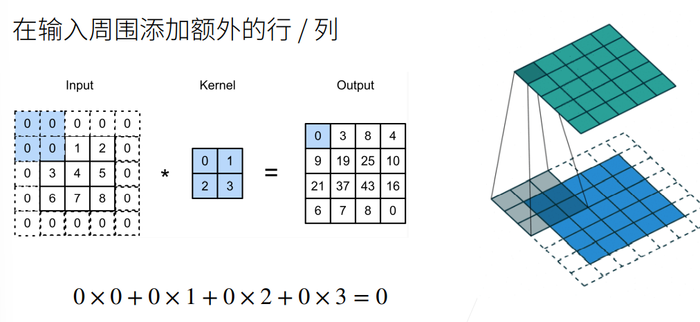
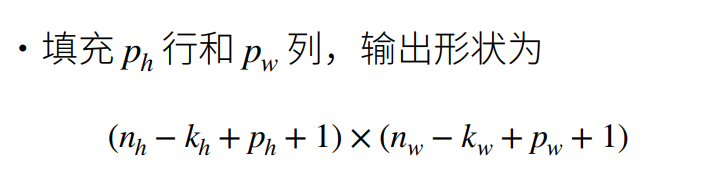
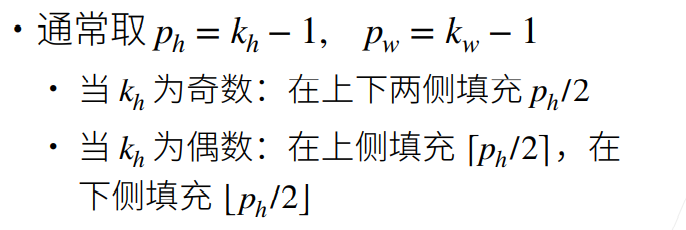
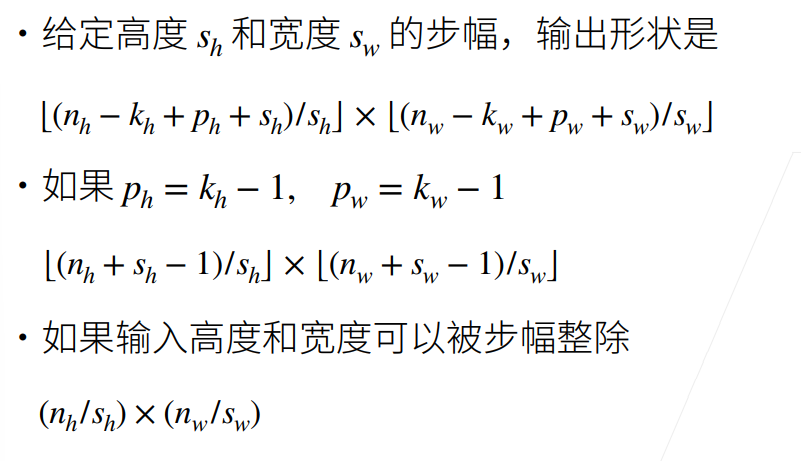

## 20-填充和步幅

### 1. 填充

**填充**(Padding)指的是在输入周围添加额外的行/列

<div align="center">
   
</div>

**维度变化**：

<div align="center">
   
</div>

**两种不同的卷积方式**：
①Valid 卷积：不进行填充，卷积运算过后得到的矩阵形状为(n-f+1)×(n-f+1)。 

②Same 卷积：先对矩阵进行填充，然后再进行卷积运算，使得运算前后矩阵大小不变。

<div align="center">
   
</div>

### 2. 步幅

**想法来源：**如果按照原来的操作(卷积步长为1)，那么给定输入大小为224x224，在使用5x5卷积核的情况下，需要**55层**才能将输出降低到4x4，也就是说，需要大量的计算才能得到维度较小的输出。

**步幅**是指行/列的滑动步长

<div align="center">
   
</div>

**维度变化**:

<div align="center">
   
</div>
注意：第三点可以当做结论来记(Same卷积或Valid卷积(且s≥k时))。一般来说，如果n是偶数，s取2，池化层做Valid卷积(不填充)且k=2，此时输出维度直接可以写成n/2 x n/2。如果怕搞混，直接记第一个公式每次现推也可。

### 3. 总结

- 填充和步幅是卷积层的**超参数**

- **填充**(padding)在输入周围添加额外的行/列，来控制输出形状的减少量
- **步幅**(stride)是每次滑动核窗口时的行/列的步长，可以成倍地减少输出形状

### 4. 代码

#### 4.1 填充和步幅

**导入包，定义comp_conv2d函数  (进行卷积操作, 输出后两维，便于观察高宽的维度变化)**


```python
import torch
from torch import nn

def comp_conv2d(conv2d, X):
    X = X.reshape((1, 1) + X.shape) #X的维度之前加入批量大小数(batch_size)和输入通道数(channel_in)
    Y = conv2d(X)                    
    return Y.reshape(Y.shape[2:])  #去掉前面的两维后(原来四维) 进行输出
```

#### 4.2 padding
**在所有侧边填充1个像素(padding=1, 即(1,1))**


```python
conv2d = nn.Conv2d(1, 1, kernel_size=3, padding=1) #输入输出通道数为1, 卷积核大小3x3, 填充为1(上下左右各填充一行)
X = torch.rand(size=(8, 8))         
comp_conv2d(conv2d, X).shape
```


```python
>>> torch.Size([8, 8])
```

**填充不同的高度和宽度(padding=(2,1))**


```python
conv2d = nn.Conv2d(1, 1, kernel_size=(5, 3), padding=(2, 1))
comp_conv2d(conv2d, X).shape
```


```python
>>> torch.Size([8, 8])
```

#### 4.3 stride
**将高度和宽度的步幅设置为2**


```python
conv2d = nn.Conv2d(1, 1, kernel_size=3, padding=1, stride=2)
comp_conv2d(conv2d, X).shape
```


```python
>>> torch.Size([4, 4])
```

**一个稍微复杂的例子**


```python
conv2d = nn.Conv2d(1, 1, kernel_size=(3, 5), padding=(0, 1), stride=(3, 4))
comp_conv2d(conv2d, X).shape
```


```python
>>> torch.Size([2, 2])
```
