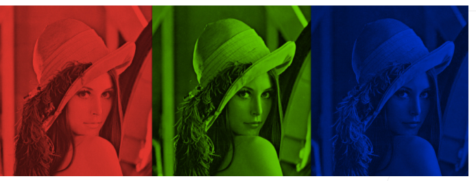
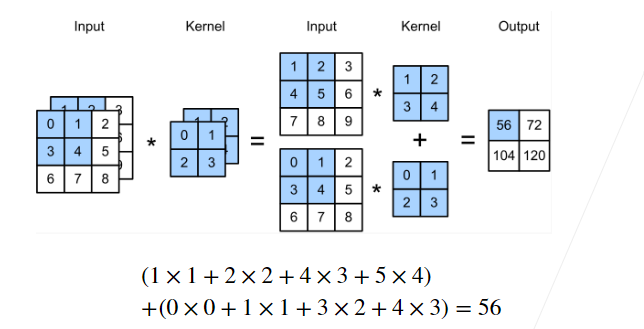
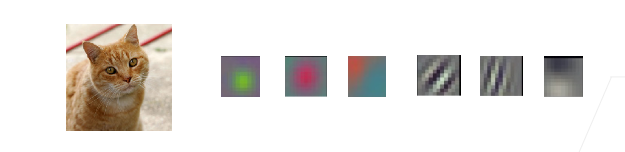
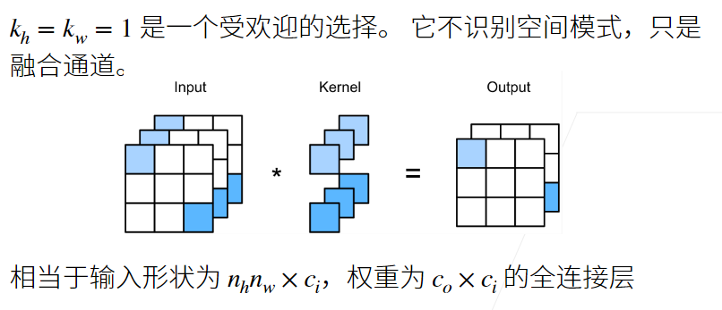
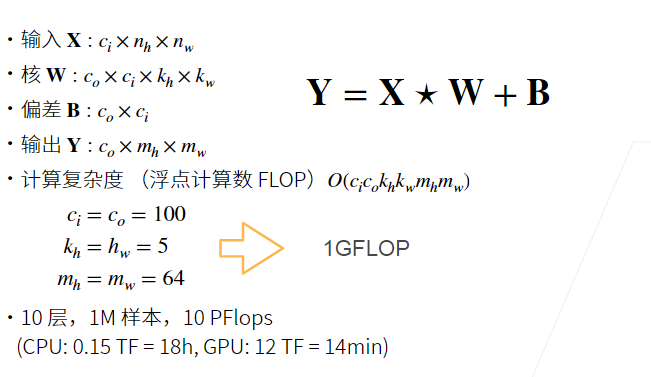

# 21-多个输入和输出通道

### 本节目录：
- [21-多个输入和输出通道](#21-多个输入和输出通道)
    - [本节目录：](#本节目录)
    - [1.多个输入通道：](#1多个输入通道)
    - [2.多个输出通道](#2多个输出通道)
    - [3.多个输入和输出通道](#3多个输入和输出通道)
    - [4.1X1卷积层](#41x1卷积层)
    - [5.二维卷积层](#5二维卷积层)
    - [6.总结](#6总结)
    - [7.Q&A](#7qa)

### 1.多个输入通道：

- 彩色图像可能有RGB三个通道

- 转换为灰度会丢失信息

  <div align="center">
      
  </div>

- 每个通道都有一个卷积和，结果是所有通道卷积结果的和

<div align="center">
    
</div>

- 输入**X**:
- 核**W**：
- 输出**Y**:


多个输入通道：

```python
import torch
from d2l import torch as d2l

def corr2d_multi_in(X, K):
    return sum(d2l.corr2d(x, k) for x, k in zip(X, K))
```


### 2.多个输出通道

- 无论有多少输入通道，到目前位置我们植绒到单输出通道
- 我们可以有多个三维卷积核，每个核生成一个输出通道
- 输入**X**:
- 核**W**：
- 输出**Y**：


多个输出通道：

```python
def corr2d_multi_in_out(X, K):
    return torch.stack([corr2d_multi_in(X, k) for k in K], 0)
```


### 3.多个输入和输出通道

- 每个通道可以识别特定的模式

<div align="center">
    
</div>

- 输入通道核识别并组合输入中的模式

### 4.1X1卷积层

<div align="center">
    
</div>

```python
def corr2d_multi_in_out_1x1(X, K):
    c_i, h, w = X.shape
    c_o = K.shape[0]
    X = X.reshape((c_i, h * w))
    K = K.reshape((c_o, c_i))
    Y = torch.matmul(K, X)
    return Y.reshape((c_o, h, w))
```


### 5.二维卷积层

<div align="center">
    
</div>

### 6.总结

- 输出通道数是卷积层的超参数
- 每个输入通道有独立的二维卷积和，所有通道结果相加得到一个输出通道结果
- 每个输出通道有独立的三维卷积核

### 7.Q&A

##### Q1:网络越深，Padding 0 越多，这里是否会影响性能？

> 这里性能分为计算性能和网络性能，Padding 0 不会影响网络精度，但会使计算复杂

##### Q2:计算卷积时，bias的有无对结果影响大吗？bias的作用怎么解释？

> 因为正则化的操作，bias对结果影响不大，但加入bias对计算性能基本无影响，故默认加入bias

##### Q3:如果是一个rgb图像，加上深度图，相当于是四个通道吗？

> 不是，输入输出通道单列，这里使用3d的卷积，输入变为4维，核是5维

##### Q4:怎么理解1x1卷积核不识别空间模式？

> 因为输出的一个像素只对应输入的一个像素，所以没有获取到空间信息

##### Q5:是不是可以3x3x3和1x1xN的卷积层叠加，来进行空间信息的检测和信息融合，以及输出通道的调整？

> 是的，mobile net就是这种思想                                                                                                                                                                                                                                                                                 

##### Q6：3d卷积是处理视频问题的吧？也可以处理rgb加深度信息吗？

> 都可以，rgb加深度信息甚至可以用2d卷积处理。