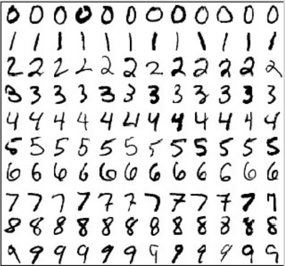
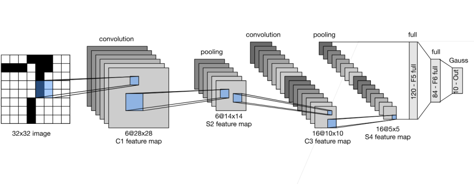
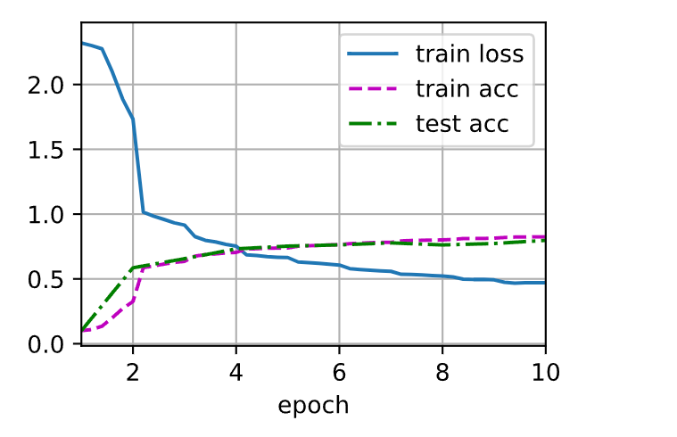

### 1.LeNet卷积神经网络

#### 1.1 手写数字识别

- LeNet网络最早是为了应用于手写数字的识别应用。
- 应用背景：
  - 邮政局希望可以自动读出信件上的邮政编码
  - 人们希望可以用支票自动取钱
- 该模型在80年代末的银行被真正的部署


#### 1.2 MNIST

- LeNet所使用的数据集
- 50，000个训练数据
- 10，000个测试数据
- 图像大小为28*28
- 10类



#### 1.3 LeNet的具体模型



#### 1.4 总结

- LeNet是早期成功的神经网络
- 先使用卷积层来学习图片空间信息
- 然后使用全连接层来转换到类别空间

### 2.代码部分

#### 2.1 定义网络结构和准备工作

- 导入所需的库

```python
#导入所需的库
import torch
from torch import nn
from d2l import torch as d2l
```

- 定义网络结构（具体可参考上文“具体模型”的图）

```python
#定义网络结构
net = nn.Sequential(
    nn.Conv2d(1, 6, kernel_size=5, padding=2), nn.Sigmoid(),
    nn.AvgPool2d(kernel_size=2, stride=2),
    nn.Conv2d(6, 16, kernel_size=5), nn.Sigmoid(),
    nn.AvgPool2d(kernel_size=2, stride=2),
    nn.Flatten(),
    nn.Linear(16 * 5 * 5, 120), nn.Sigmoid(),
    nn.Linear(120, 84), nn.Sigmoid(),
    nn.Linear(84, 10))
```

- 查看每一层数据的变化情况

```python
#把每一层数据的shape给打印出来
X = torch.rand(size=(1, 1, 28, 28), dtype=torch.float32)#创建符合要求的张量
for layer in net:
    X = layer(X)#通过每一层
    print(layer.__class__.__name__,'output shape: \t',X.shape)#打印
```

#### 2.2 模型训练

- 下载数据集

```python
batch_size = 256#批量大小
train_iter, test_iter = d2l.load_data_fashion_mnist(batch_size=batch_size)#下载或加载数据集，得到训练和测试集的迭代对象
```

- 使用GPU计算模型在数据集上的精度

```python
def evaluate_accuracy_gpu(net, data_iter, device=None): #@save
    """使用GPU计算模型在数据集上的精度"""
    if isinstance(net, nn.Module):
        net.eval()  # 设置为评估模式
        if not device:
            device = next(iter(net.parameters())).device
    # 正确预测的数量，总预测的数量
    metric = d2l.Accumulator(2)#创建一个累加器，包含2个要累加的元素
    with torch.no_grad():
        for X, y in data_iter:
            if isinstance(X, list):
                # BERT微调所需的（之后将介绍）
                X = [x.to(device) for x in X]
            else:
                X = X.to(device)
            y = y.to(device)
            metric.add(d2l.accuracy(net(X), y), y.numel())#把每一组数据预测结果正确的个数和长度累加
    return metric[0] / metric[1]
```

- 训练函数

```python
def train_ch6(net, train_iter, test_iter, num_epochs, lr, device):
    """用GPU训练模型(在第六章定义)"""
    def init_weights(m):
        if type(m) == nn.Linear or type(m) == nn.Conv2d:
            nn.init.xavier_uniform_(m.weight)#对linear类型的层用xavier初始化
    net.apply(init_weights)
    print('training on', device)
    net.to(device)
    optimizer = torch.optim.SGD(net.parameters(), lr=lr)
    loss = nn.CrossEntropyLoss()
    animator = d2l.Animator(xlabel='epoch', xlim=[1, num_epochs],
                            legend=['train loss', 'train acc', 'test acc'])#动画需要
    timer, num_batches = d2l.Timer(), len(train_iter)
    for epoch in range(num_epochs):
        # 训练损失之和，训练准确率之和，范例数
        metric = d2l.Accumulator(3)
        net.train()
        for i, (X, y) in enumerate(train_iter):
            timer.start()
            optimizer.zero_grad()#梯度清零
            X, y = X.to(device), y.to(device)
            y_hat = net(X)#正向传播
            l = loss(y_hat, y)#计算损失
            l.backward()#反向传播
            optimizer.step()#梯度下降
            with torch.no_grad():
                metric.add(l * X.shape[0], d2l.accuracy(y_hat, y), X.shape[0])#训练损失之和，训练准确率之和，范例数
            timer.stop()
            train_l = metric[0] / metric[2]
            train_acc = metric[1] / metric[2]
            if (i + 1) % (num_batches // 5) == 0 or i == num_batches - 1:
                animator.add(epoch + (i + 1) / num_batches,
                             (train_l, train_acc, None))
        test_acc = evaluate_accuracy_gpu(net, test_iter)#评估测试集的精度
        animator.add(epoch + 1, (None, None, test_acc))
    print(f'loss {train_l:.3f}, train acc {train_acc:.3f}, '
          f'test acc {test_acc:.3f}')
    print(f'{metric[2] * num_epochs / timer.sum():.1f} examples/sec '
          f'on {str(device)}')
```

- 运行

```python
lr, num_epochs = 0.9, 10
train_ch6(net, train_iter, test_iter, num_epochs, lr, d2l.try_gpu())
```



#### 2.3 总结

- 卷积神经网络（CNN）是一类使用卷积层的网络。
- 在卷积神经网络中，我们组合使用卷积层、非线性激活函数和汇聚层。
- 为了构造高性能的卷积神经网络，我们通常对卷积层进行排列，逐渐降低其表示的空间分辨率，同时增加通道数。
- 在传统的卷积神经网络中，卷积块编码得到的表征在输出之前需由一个或多个全连接层进行处理。
- LeNet是最早发布的卷积神经网络之一（80年代）
