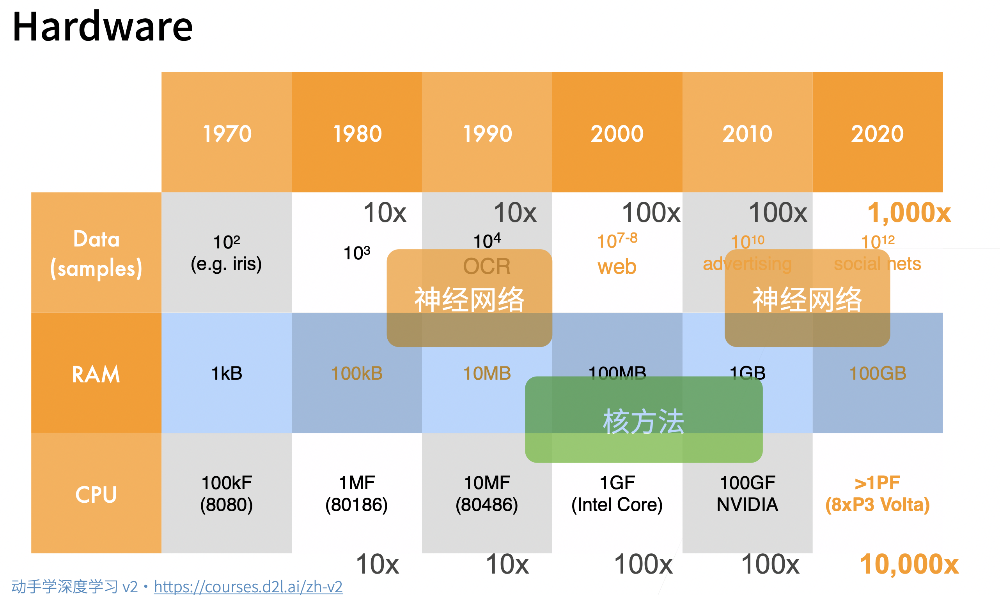
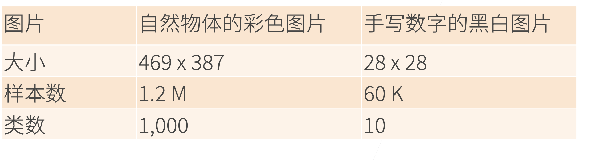
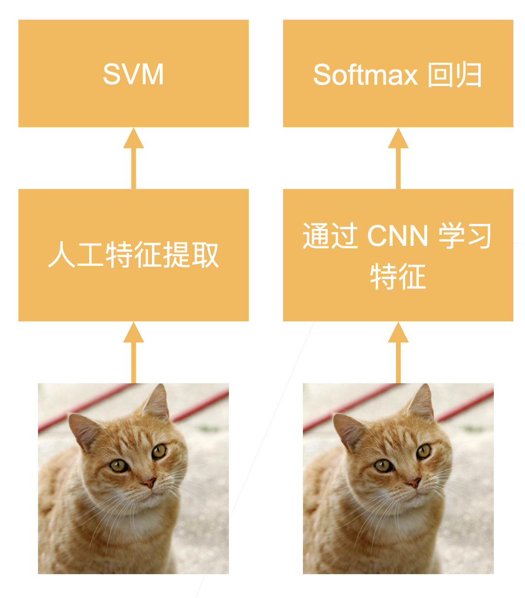
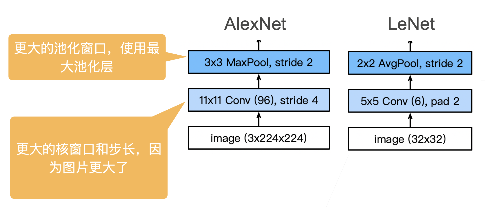
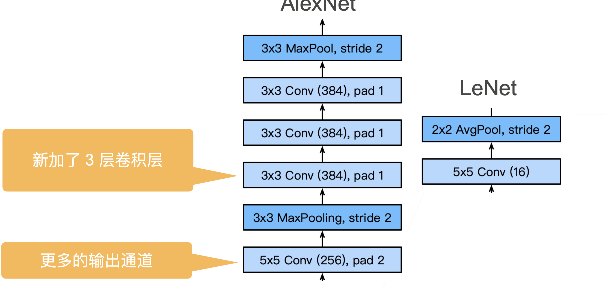
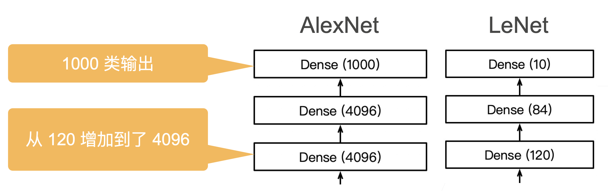
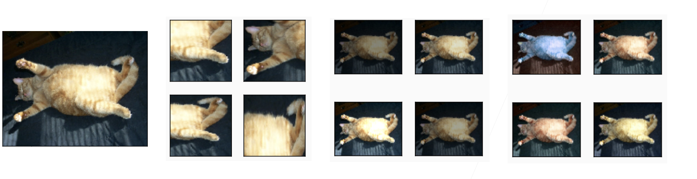
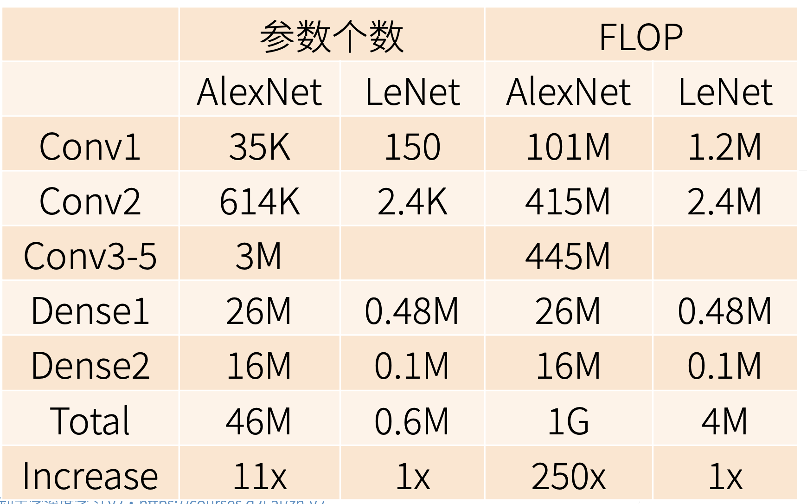

## AlexNet

### 本节目录


- [1.历史](#1历史)
  - [1.1 2000 流行的机器学习方法——SVM，核方法](#11-2000-流行的机器学习方法svm核方法)
  - [1.2 2000计算机视觉主要方法——几何学](#12-2000计算机视觉主要方法几何学)
  - [1.3 2010计算机视觉的热点问题——特征工程](#13-2010计算机视觉的热点问题特征工程)
  - [1.4 硬件的发展奠定了深度学习的兴起](#14-硬件的发展奠定了深度学习的兴起)
  - [1.5 ImageNet（2010）](#15-imagenet2010)
- [2.AlexNet架构](#2alexnet架构)
- [3.总结](#3总结)
- [4.QA](#4qa)
### 1.历史

#### 1.1 2000 流行的机器学习方法——SVM，核方法

- 核方法替代了之前的神经网络网络方法，SVM对于调参不敏感，现在也有一些应用
- 本质上是特征提取，具体的方法是选择核函数来计算，把特征映射到高纬空间，使得他们线性可分
- 经过核函数计算之后，原问题可以转化为凸优化问题，这是2006年左右的研究热点
- 核方法有很多漂亮的定理，有很好的数学解释性

- 2010年左右，深度学习才兴起

#### 1.2 2000计算机视觉主要方法——几何学

- 首先还是对图片进行特征抽取
- 希望把计算机视觉问题描述成几何问题，建立（非）凸优化模型，可以得到很多漂亮的定理。
- 可以假设这是一个几何问题，假设这个假设被满足了，可以推出很好的效果

#### 1.3 2010计算机视觉的热点问题——特征工程

- 特征工程就是怎么抽取一张图片的特征，因为直接输入一张图片效果非常的差
- 特征描述子：SIFT,SURF

#### 1.4 硬件的发展奠定了深度学习的兴起

- 数据的增长，硬件的计算能力奠定了人们对于方法的选择

<div align="center">
  
</div>


#### 1.5 ImageNet（2010）

<div align="center">
  
</div>

- AlexNet赢得了2012年ImageNet竞赛冠军

- 本质上是一个加强版的LeNet，更深更大

- AlexNet主要改进措施：
  - dropout（正则）
  - ReLu（梯度更大）
  - MaxPooling（取最大值，梯度相对增大）
  
- 影响：计算机视觉方法论的改变，从人工提取特征过渡到CNN学习特征

  <div align="center">
    
  </div>

### 2.AlexNet架构

<div align="center">
  
</div>

<div align="center">
  
</div>

<div align="center">
  
</div>

- 网络代码

```python
net = nn.Sequential(
这里，我们使用一个11*11的更大窗口来捕捉对象。
    # 同时，步幅为4，以减少输出的高度和宽度。
    # 另外，输出通道的数目远大于LeNet
    nn.Conv2d(1, 96, kernel_size=11, stride=4, padding=1), nn.ReLU(),
    nn.MaxPool2d(kernel_size=3, stride=2),
    # 减小卷积窗口，使用填充为2来使得输入与输出的高和宽一致，且增大输出通道数
    nn.Conv2d(96, 256, kernel_size=5, padding=2), nn.ReLU(),
    nn.MaxPool2d(kernel_size=3, stride=2),
    # 使用三个连续的卷积层和较小的卷积窗口。
    # 除了最后的卷积层，输出通道的数量进一步增加。
    # 在前两个卷积层之后，汇聚层不用于减少输入的高度和宽度
    nn.Conv2d(256, 384, kernel_size=3, padding=1), nn.ReLU(),
    nn.Conv2d(384, 384, kernel_size=3, padding=1), nn.ReLU(),
    nn.Conv2d(384, 256, kernel_size=3, padding=1), nn.ReLU(),
    nn.MaxPool2d(kernel_size=3, stride=2),
    nn.Flatten(),
    # 这里，全连接层的输出数量是LeNet中的好几倍。使用dropout层来减轻过拟合
    nn.Linear(6400, 4096), nn.ReLU(),
    nn.Dropout(p=0.5),
    nn.Linear(4096, 4096), nn.ReLU(),
    nn.Dropout(p=0.5),
    # 最后是输出层。由于这里使用Fashion-MNIST，所以用类别数为10，而非论文中的1000
    nn.Linear(4096, 10))
```


- 更多细节
  - 激活函数从sigmoid变成Relu，减缓梯度消失
  - 隐藏全连接层后加入了丢弃层（2个4096之后加入了dropout）
  - 数据增强，将一张图片进行变化，选取多个位置、光照之类的。

<div align="center">
  
</div>

- 复杂度对比
  - 参数个数增加，每次更新数据增加

<div align="center">
  
</div>

### 3.总结

- AlexNet 是更大更深的LeNet，10x参数个数，260x计算复杂度
- 新加入了dropout，relu，maxpooling，数据增强
- 标志着新一轮神经网络热潮开始了

### 4.QA

- 问题大部分都在问如何炼丹，炼丹的理论，为啥炼丹的步骤要这样不哪有？
  - 老师说这个确实不好理解，只能从自己的角度去尝试解释
- 数据增强了，但是效果还不如之前的，为啥？
  - 太正常了，属于超参数没调好
- 为啥LeNet不属于深度卷积神经网络？
  - 为了包装现在的产品，更好卖（确实是这么回答的），这个我们研究者需要学习，好好宣传自己的产品
- 网络要求输入的size是固定的，实际使用的时候图片不一定是要求的size，怎么处理？
  - 如果是大的图片，在保持长宽比的情况下，把短边压成输入的size，然后在新的图片中随机抠出来几张图片（要求和网络输入一致）进行预测。效果上不会有太大的影响