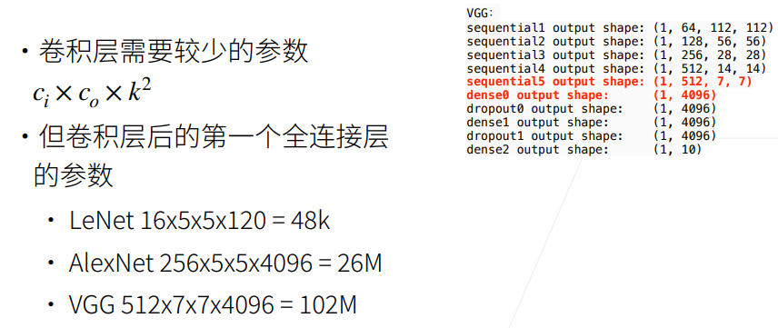
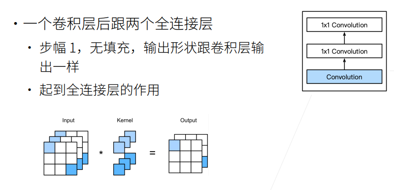
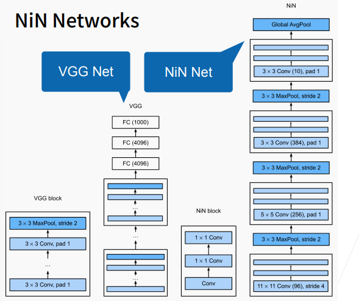

## 26-网络中的网络（NiN）

### 1. 动机

**全连接层的问题**

- **卷积层**需要的**参数较少**
- 而卷积层后的第一个**全连接层**的**参数较多**

<div align="center">
   
</div>

以VGG为例(图示)，全连接层需要先Flatten，输入维度为512x7x7，输出维度为4096，则需要参数个数为512x7x7x4096=102M。

### 2. NiN块

- 核心思想：一个卷积层后面跟两个1x1的卷积层，后两层起到全连接层的作用。

<div align="center">
   
</div>

### 3. NiN架构

- 无全连接层
- 交替使用NiN块和步幅为2的最大池化层
  - 逐步减小高宽和增大通道数
- 最后使用全局平均池化得到输出
  - 其输入通道是类别数

### 4. NiN Networks

<div align="center">
   
</div>

NiN架构如上图右边所示，若干个NiN块(图示中为4个块)+池化层；前3个块后接最大池化层，最后一块连接一个全局平均池化层。

### 5. 总结

- NiN块结构：使用卷积层加两个1x1卷积层
  - 后者对每个像素增加了非线性性
- NiN使用全局平均池化层来替代VGG和AlexNet中的全连接层
  - 不容易过拟合，更少的参数个数

### 6.代码
```python
# 如果在Colab上跑, 或没有安装过d2l包, 需要最开始pip install d2l
!pip install git+https://github.com/d2l-ai/d2l-zh@release  # installing d2l
```

**NiN块**

```python
import torch
from torch import nn
from d2l import torch as d2l

# 定义NiN块
def nin_block(in_channels, out_channels, kernel_size, strides, padding):
    return nn.Sequential(
        nn.Conv2d(in_channels, out_channels, kernel_size, strides, padding),
        nn.ReLU(), nn.Conv2d(out_channels, out_channels, kernel_size=1),
        nn.ReLU(), nn.Conv2d(out_channels, out_channels, kernel_size=1),
        nn.ReLU())
```

**NiN模型**


```python
net = nn.Sequential(
    nin_block(1, 96, kernel_size=11, strides=4, padding=0),
    nn.MaxPool2d(3, stride=2),
    nin_block(96, 256, kernel_size=5, strides=1, padding=2),
    nn.MaxPool2d(3, stride=2),
    nin_block(256, 384, kernel_size=3, strides=1, padding=1),
    nn.MaxPool2d(3, stride=2), nn.Dropout(0.5),
    # 标签类别数是10
    nin_block(384, 10, kernel_size=3, strides=1, padding=1),
    nn.AdaptiveAvgPool2d((1, 1)),          #全局平均池化，高宽都变成1
    nn.Flatten())             #消掉最后两个维度, 变成(batch_size, 10)
```

**demo测试，查看每个块的输出情况**


```python
X = torch.rand(size=(1, 1, 224, 224))
for layer in net:
    X = layer(X)
    print(layer.__class__.__name__, 'output shape:\t', X.shape)
```

```python
>>>
Sequential output shape:	 torch.Size([1, 96, 54, 54])
MaxPool2d output shape:		 torch.Size([1, 96, 26, 26])
Sequential output shape:	 torch.Size([1, 256, 26, 26])
MaxPool2d output shape:		 torch.Size([1, 256, 12, 12])
Sequential output shape:	 torch.Size([1, 384, 12, 12])
MaxPool2d output shape:		 torch.Size([1, 384, 5, 5])
Dropout output shape:		 torch.Size([1, 384, 5, 5])
Sequential output shape:	 torch.Size([1, 10, 5, 5])
AdaptiveAvgPool2d output shape:	 torch.Size([1, 10, 1, 1])
Flatten output shape:		 torch.Size([1, 10])
```

**训练模型**

```python
lr, num_epochs, batch_size = 0.1, 10, 128
train_iter, test_iter = d2l.load_data_fashion_mnist(batch_size, resize=224)
d2l.train_ch6(net, train_iter, test_iter, num_epochs, lr, d2l.try_gpu())
```

```python
>>> <Figure size 252x180 with 1 Axes>
```
