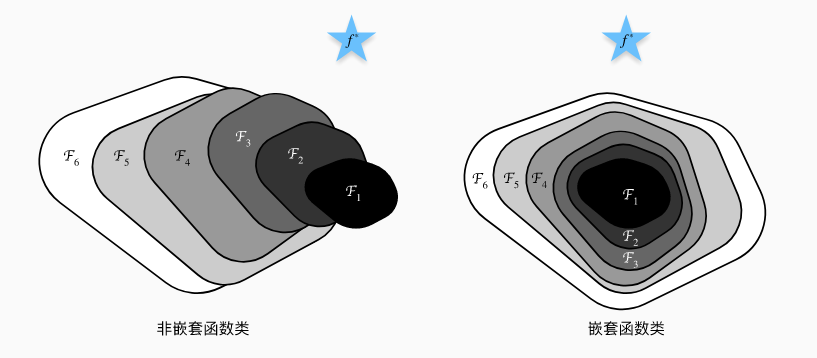
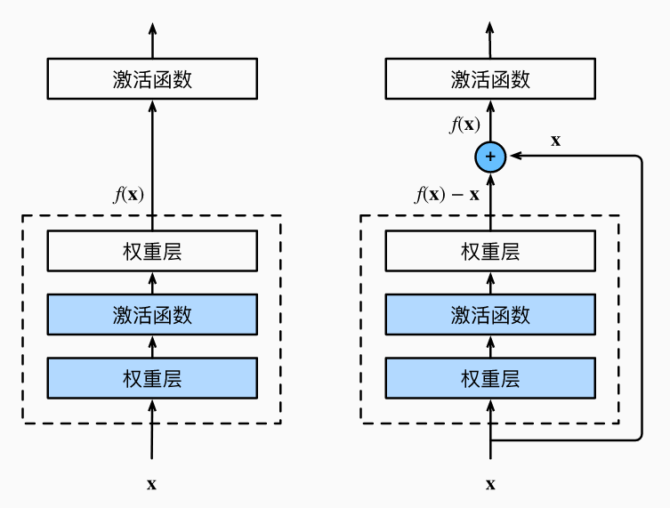
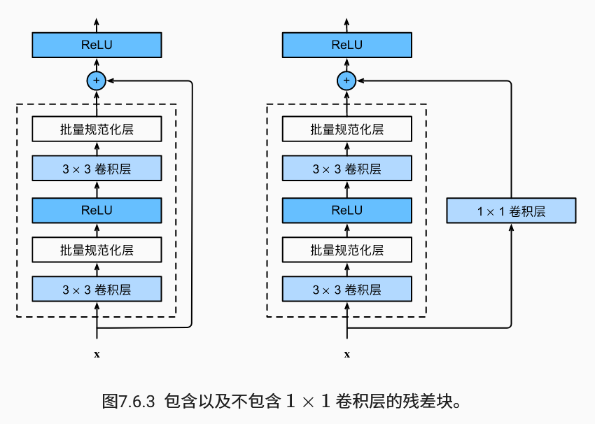
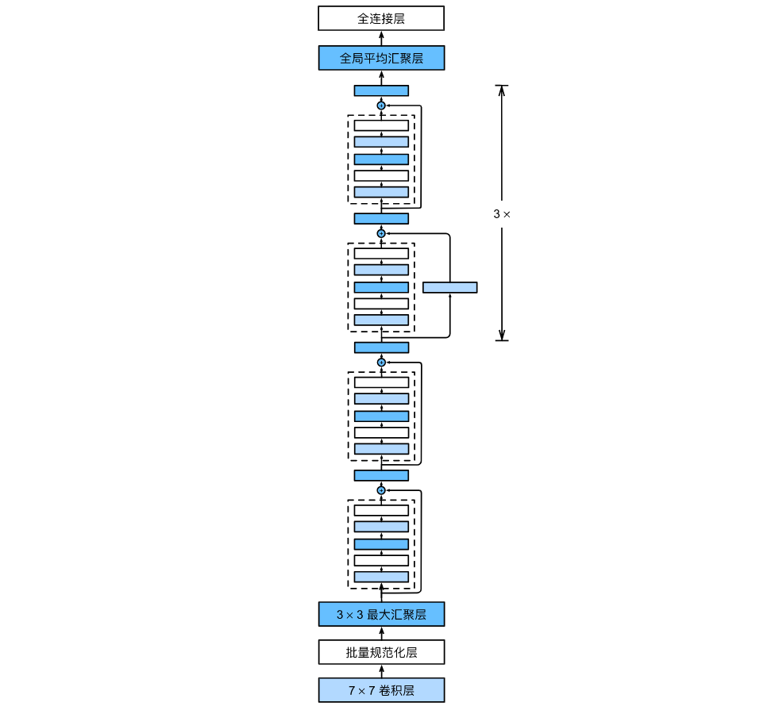
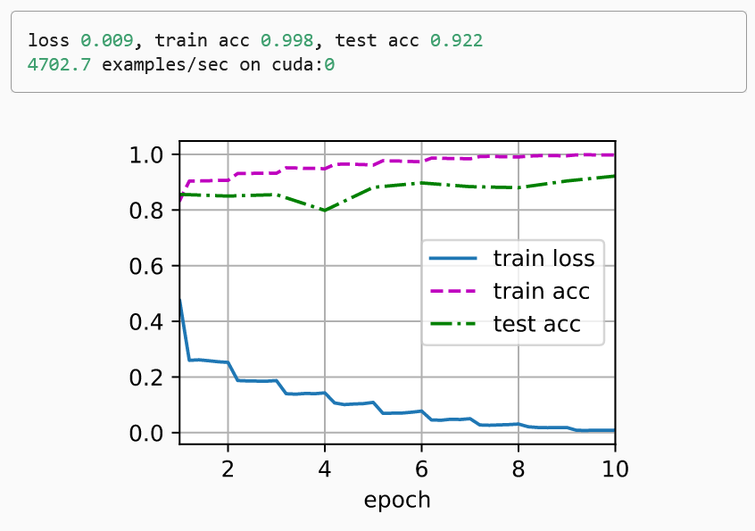

目录

\- [残差网络（ResNet）](#残差网络resnet)

  \- [函数类](#函数类)

  \- [残差块](#残差块)

  \- [ResNet模型](#resnet模型)

  \- [训练模型](#训练模型)

  \- [总结](#总结)

### 残差网络（ResNet）

随着我们设计越来越深的网络，深刻理解“新添加的层如何提升神经网络的性能”变得至关重要。更重要的是设计网络的能力，在ResNet这种网络中，添加层会使网络更具表现力


#### 函数类

- 假设有一类特定的神经网络架构F，它包括学习速率和其他超参数设置。 对于所有*f*∈F，存在一些参数集（例如权重和偏置），这些参数可以通过在合适的数据集上进行训练而获得。 现在假设*f*∗是我们真正想要找到的函数，如果是*f*∗∈F，那我们可以轻而易举的训练得到它，但通常我们不会那么幸运。 相反，我们将尝试找到一个函数*f*∗，这是我们在F中的最佳选择。
- 为了得到更近似真正*f*∗的函数我们需要设计一个更强大的架构F'，但是如果先前的框架F不包含于新框架F‘中就可能导致如下图中左侧的最优函数离实际预测函数误差反而随框架边强而增大，这不是我们期望的结果，所以我们选择使用下图中右侧的嵌套函数类以解决这个问题
- 引入方法：对于深度神经网络，如果我们能将新添加的层训练成*恒等映射*（identity function）*f*(**x**)=**x**，新模型和原模型将同样有效。 同时，由于新模型可能得出更优的解来拟合训练数据集，因此添加层似乎更容易降低训练误差。






#### 残差块

- 神经网络中的具体实现：假设我们的原始输入为*x*，而希望学出的理想映射为*f*(**x**)，左图虚线框中的部分需要直接拟合出该映射*f*(**x**)，而右图虚线框中的部分则需要拟合出残差映射*f*(**x**)−**x**。而右图正是ResNet的基础架构–*残差块*（residual block）

- 残差块的代码实现：

```python
import torch
from torch import nn
from torch.nn import functional as F
from d2l import torch as d2l


class Residual(nn.Module):
    def __init__(self, input_channels, num_channels,
                 use_1x1conv=False, strides=1):
        super().__init__()
        # 第一个卷积层
        self.conv1 = nn.Conv2d(input_channels, num_channels,
                               kernel_size=3, padding=1, stride=strides)
        # 第二个卷积层
        self.conv2 = nn.Conv2d(num_channels, num_channels,
                               kernel_size=3, padding=1)
        # 如果使用1 x 1卷积以使得输入变换成需要的形状
        if use_1x1conv:
            self.conv3 = nn.Conv2d(input_channels, num_channels,
                                   kernel_size=1, stride=strides)
        else:
            self.conv3 = None
        # 对应第一个卷积层的批量规范化层
        self.bn1 = nn.BatchNorm2d(num_channels)
        # 对应第二个卷积层的批量规范化层
        self.bn2 = nn.BatchNorm2d(num_channels)

    def forward(self, X):
        # 第一层：卷积 -> 规范化 -> relu激活
        Y = F.relu(self.bn1(self.conv1(X)))
        # 第二层：卷积 -> 规范化
        Y = self.bn2(self.conv2(Y))
        # 如果要让输入变换成需要的形状
        if self.conv3:
            # 对X使用1 x 1卷积，以使输出成为需要的形状
            X = self.conv3(X)
        # 嵌套模型的实现，即对上一次训练后的模型进行嵌套
        Y += X
        # relu激活并输出
        return F.relu(Y)
```




#### ResNet模型

- ResNet的前两层跟之前介绍的GoogLeNet中的一样： 在输出通道数为64、步幅为2的7×7卷积层后，接步幅为2的3×3的最大汇聚层。 不同之处在于ResNet每个卷积层后增加了批量规范化层。

```python
b1 = nn.Sequential(nn.Conv2d(1, 64, kernel_size=7, stride=2, padding=3),
                   nn.BatchNorm2d(64), nn.ReLU(),
                   nn.MaxPool2d(kernel_size=3, stride=2, padding=1))
```

- GoogLeNet在后面接了4个由Inception块组成的模块。 ResNet则使用4个由残差块组成的模块，每个模块使用若干个同样输出通道数的残差块。 第一个模块的通道数同输入通道数一致。 由于之前已经使用了步幅为2的最大汇聚层，所以无须减小高和宽。 之后的每个模块在第一个残差块里将上一个模块的通道数翻倍，并将高和宽减半。

```python
def resnet_block(input_channels, num_channels, num_residuals,
                 first_block=False):
    blk = []
    for i in range(num_residuals):
        if i == 0 and not first_block:
            blk.append(Residual(input_channels, num_channels,
                                use_1x1conv=True, strides=2))
        else:
            blk.append(Residual(num_channels, num_channels))
    return blk
```

- 接着在ResNet加入所有残差块，这里每个模块使用2个残差块。

```python
b2 = nn.Sequential(*resnet_block(64, 64, 2, first_block=True))
b3 = nn.Sequential(*resnet_block(64, 128, 2))
b4 = nn.Sequential(*resnet_block(128, 256, 2))
b5 = nn.Sequential(*resnet_block(256, 512, 2))
```

- 最后，与GoogLeNet一样，在ResNet中加入全局平均汇聚层，以及全连接层输出。

```python
net = nn.Sequential(b1, b2, b3, b4, b5,
                    nn.AdaptiveAvgPool2d((1,1)),
                    nn.Flatten(), nn.Linear(512, 10))
```

- 每个模块有4个卷积层（不包括恒等映射的1×1卷积层）。 加上第一个7×7卷积层和最后一个全连接层，共有18层。 因此，这种模型通常被称为ResNet-18。 通过配置不同的通道数和模块里的残差块数可以得到不同的ResNet模型，例如更深的含152层的ResNet-152。 虽然ResNet的主体架构跟GoogLeNet类似，但ResNet架构更简单，修改也更方便。这些因素都导致了ResNet迅速被广泛使用。



#### 训练模型

- 我们在Fashion-MNIST数据集上训练ResNet

```python
lr, num_epochs, batch_size = 0.05, 10, 256
train_iter, test_iter = d2l.load_data_fashion_mnist(batch_size, resize=96)
d2l.train_ch6(net, train_iter, test_iter, num_epochs, lr, d2l.try_gpu())
```



#### 总结

- 学习嵌套函数（nested function）是训练神经网络的理想情况。在深层神经网络中，学习另一层作为恒等映射（identity function）较容易（尽管这是一个极端情况）。
- 残差映射可以更容易地学习同一函数，例如将权重层中的参数近似为零。
- 利用残差块（residual blocks）可以训练出一个有效的深层神经网络：输入可以通过层间的残余连接更快地向前传播。
- 残差网络（ResNet）对随后的深层神经网络设计产生了深远影响。
