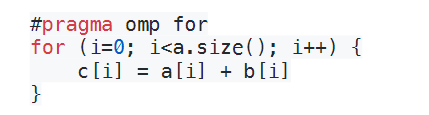
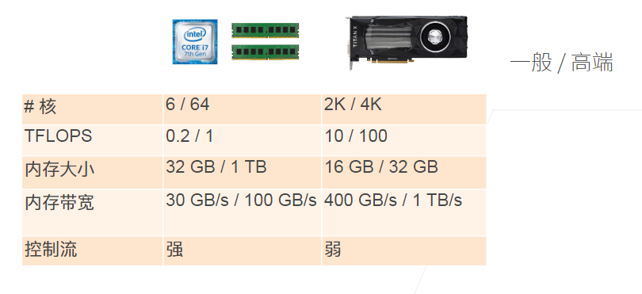
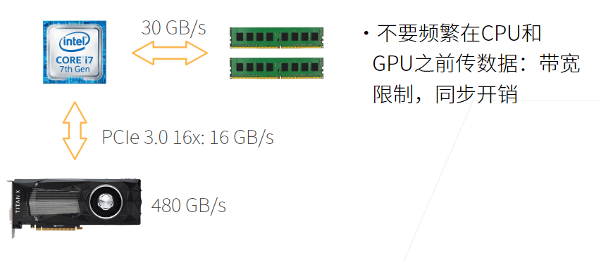

# CPU和GPU

### 本节目录：
- [CPU和GPU](#cpu和gpu)
    - [本节目录：](#本节目录)
    - [1.CPU：](#1cpu)
      - [1.1 提升CPU利用率一：](#11-提升cpu利用率一)
      - [1.2 样例分析：](#12-样例分析)
      - [1.3 提升CPU利用率二：](#13-提升cpu利用率二)
      - [1.4 样例分析：](#14-样例分析)
    - [2.CPU vs GPU:](#2cpu-vs-gpu)
      - [2.1 提升GPU利用率](#21-提升gpu利用率)
      - [2.2 CPU/GPU 带宽](#22-cpugpu-带宽)
      - [2.3 更多的CPUs和GPUs](#23-更多的cpus和gpus)
      - [2.4 CPU/GPU高性能计算编程](#24-cpugpu高性能计算编程)
    - [3.总结](#3总结)
    - [4.Q&A](#4qa)
### 1.CPU：

#### 1.1 提升CPU利用率一：

- 在计算a+b之前，需要准备数据
- 主内存->L3->L2->L1->寄存器
  - L1访问延时：0.5ms
  - L2访问延时：7ns（14XL1）
  - 主内存访问延时：100ns(200XL1)

- 提升空间和时间的内存本地性
  - 时间：重用数据使它们在缓存里
  - 空间：按序读写数据是的可以预读取

#### 1.2 样例分析：

- 如果一个矩阵是按行存储，访问一行比访问一列要快
  - CPU一次读取64字节（缓存线）
  - CPU会“聪明的”提前读取下一个（缓存线）

    

#### 1.3 提升CPU利用率二：

- 高端CPU有几十个核
  - EC2 P3.16xlarge:2 Intel Xeon CPUs,32物理核

- 并行来利用所用核
  - 超线程不一定提升性能，因为他们共享寄存器

#### 1.4 样例分析：

- 左边比右边慢（python）

    

- 左边调用n次函数，每次调用有开销
- 右边很容易被并行（例如下面的C++实现）

    

### 2.CPU vs GPU:

    

#### 2.1 提升GPU利用率

- 并行
  - 使用数千个线程

- 内存本地性
  - 缓存更小，架构更简单

- 少用控制语句
  - 支持有限
  - 同步开销大

#### 2.2 CPU/GPU 带宽

    

#### 2.3 更多的CPUs和GPUs

- CPU:AMD,ARM
- GPU:AMD,Intel,ARM,Qualcomm...

#### 2.4 CPU/GPU高性能计算编程

- CPU：C++或者任何高性能语言
  - 编译器成熟
- GPU
  - Nvida上用CUDA
    - 编译器和驱动成熟
  - 其他用OpenCL
    - 质量取决于硬件厂商

### 3.总结

- CPU:可以处理通用计算。性能优化考虑数据读写效率和多线程
- GPU：使用更多的小核和更好的内存带宽，适合能大规模并行的计算任务

### 4.Q&A

##### Q1:  如果要提高泛化性，就要增加数据？调参的意思是不是最大？

> 提高泛化性的有效手段是增加数据，但是数据的质量很重要，少量高质量数据和大量低质量数据可能有1:10或者1:100的换算关系。实际应用场景对调参要求不高，因为有不断增加的数据。
>

##### Q2:alexnet模型比resnet要大，为什么计算上resnet比alexnet运算量大？

> alexnet后面用到的几个连续的全连接层使模型变大，但是resnet使用的卷积层在少量参数下更消耗计算资源。模型大小和计算复杂度不能直接换算。
>

##### Q3:训练时为什么使用w-=lr\*w.grad,而不写做w=w-lr\*w.grad?

> 因为第二种写法定义了一个新的tensor，梯度参数会成为false
>

##### Q4:llc是显存还是缓存，是l1,l2,还是l3?

> llc是缓存，last level cash,是最后一层缓存，具体是ln取决于一共有几层缓存。
>

##### Q5:做计算时把for_lopps运算尽可能向量化？

> 是的，尽量不要用python写for-loop
>

##### Q6:可视化时，需要把数据在cpu和GPU之间切换，如何避免频繁传输？常见的错误操作有哪些？怎么看到和排查这种错误？

> 可视化操作不需要太担心，只要不是计算中来回传递就好。深度学习框架会有限制，只能在一个设备上做。框架没报错一般不会有太多问题
>

##### Q7:go怎么样？

> go分布式系统做的很好，和深度学习的分布式不太一样
>

##### Q8:怎样复现论文？

> 80%的论文无法复现，要读懂每一句话，和明白作者实现的细节。

##### Q9：分布式和高性能的区别？

> 没有本质区别，分布式更多考虑容错。高性能是分布式的一个应用
>

##### Q10:自动驾驶烧钱，短时间难以落地是不是和nas一样？

> 不是，自动驾驶有很好的商业前景。nas没有太多意义。
>

