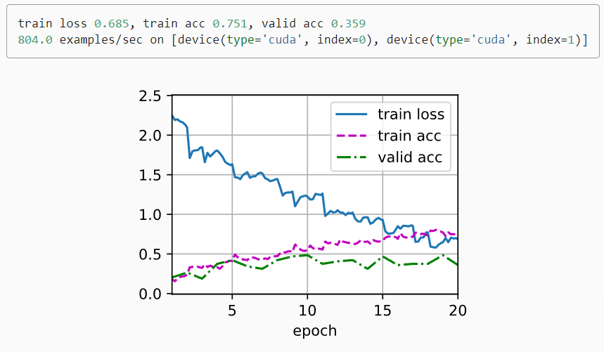

# CIFAR-10

### 1.目录
- [CIFAR-10](#cifar-10)
    - [1.目录](#1目录)
      - [2.1 下载数据集：](#21-下载数据集)
      - [2.2 整理数据集](#22-整理数据集)
    - [3.图像增广](#3图像增广)
    - [4.读取数据集](#4读取数据集)
    - [5.定义模型](#5定义模型)
    - [6.定义训练函数](#6定义训练函数)
    - [7.训练和验证模型](#7训练和验证模型)
    - [8.Q&A](#8qa)


首先，导入竞赛所需要的包和模块：

```python
import collections
import math
import os
import shutil
import pandas as pd
import torch
import torchvision
from torch import nn
from d2l import torch as d2l
```

#### 2.1 下载数据集：

```python
#@save
d2l.DATA_HUB['cifar10_tiny'] = (d2l.DATA_URL + 'kaggle_cifar10_tiny.zip',
                                '2068874e4b9a9f0fb07ebe0ad2b29754449ccacd')

# 如果你使用完整的Kaggle竞赛的数据集，设置demo为False
demo = True

if demo:
    data_dir = d2l.download_extract('cifar10_tiny')
else:
    data_dir = '../data/cifar-10/'
```

为了便于入门，我们提供包含前1000个训练图像和5个随机测试图像的数据集的小规模样本，如果要获取完整数据集，你需要将一下demo变量设置为False

#### 2.2 整理数据集

首先我们用以下函数读取CSV文件中的标签，它返回一个字典，该字典将文件名中不带拓展名德部分映射到其标签。

```python
def read_csv_labels(fname):
    """读取fname来给标签字典返回一个文件名"""
    with open(fname, 'r') as f:
        # 跳过文件头行(列名)
        lines = f.readlines()[1:]
    tokens = [
        # 训练样本 : 1000l.rstrip().split(',') for l in lines]
    return dict(((name, label) for name, label in tokens))

labels = read_csv_labels(os.path.join(data_dir, 'trainLabels.csv'))
print('# 训练样本 :', len(labels))
print('# 类别 :', len(set(labels.values())))
# 训练样本 : 1000
# 类别 : 10
```

接下来，我们定义reorg_train_valid函数来将验证集从原始的训练集中拆分出来。此函数中的参数valid_ratio是验证集中的样本数与原始训练集中的样本数之比。更具体的说，令n等于样本最少的类别中的图像数量，而r是比率。验证集将为每个类别拆分出max([nr],1)张图像。让我们以valid_ratio=0.1为例，由于原始的训练集有50000张图像，因此trian_valid_test/train路径中将有45000张图像用于训练，而剩下5000张图像将作为路径train_valid_test/valid中的验证集。组织数据集后，同类别的图像将被放置在同一文件夹下。

```python
def copyfile(filename, target_dir):
    """将文件复制到目标目录"""
    os.makedirs(target_dir, exist_ok=True)
    shutil.copy(filename, target_dir)

#@save
def reorg_train_valid(data_dir, labels, valid_ratio):
    """将验证集从原始的训练集中拆分出来"""
    # 训练数据集中样本最少的类别中的样本数
    n = collections.Counter(labels.values()).most_common()[-1][1]
    # 验证集中每个类别的样本数
    n_valid_per_label = max(1, math.floor(n * valid_ratio))
    label_count = {}
    for train_file in os.listdir(os.path.join(data_dir, 'train')):
        label = labels[train_file.split('.')[0]]
        fname = os.path.join(data_dir, 'train', train_file)
        copyfile(fname, os.path.join(data_dir, 'train_valid_test',
                                     'train_valid', label))
        if label not in label_count or label_count[label] < n_valid_per_label:
            copyfile(fname, os.path.join(data_dir, 'train_valid_test',
                                         'valid', label))
            label_count[label] = label_count.get(label, 0) + 1
        else:
            copyfile(fname, os.path.join(data_dir, 'train_valid_test',
                                         'train', label))
    return n_valid_per_label
```

其中os.listdir显示指定路径下的文件和文件夹列表

下面的reorg_test函数用来预测期间整理测试集，以方便读取。

```python
#@save
def reorg_test(data_dir):
    """在预测期间整理测试集，以方便读取"""
    for test_file in os.listdir(os.path.join(data_dir, 'test')):
        copyfile(os.path.join(data_dir, 'test', test_file),
                 os.path.join(data_dir, 'train_valid_test', 'test',
                              'unknown'))
```

最后我们使用一个函数来调用前面定义的函数read_csv_labels，reorg_train_valid和reorg_test。

```python
def reorg_cifar10_data(data_dir, valid_ratio):
    labels = read_csv_labels(os.path.join(data_dir, 'trainLabels.csv'))
    reorg_train_valid(data_dir, labels, valid_ratio)
    reorg_test(data_dir)
```

在这里，我们只将样本数据集的批量大小设置为32.在实际训练和测试中，应该使用Kaggle竞赛的完整数据集，并将batch_size设置为更大的整数，例如128.我们将10%的训练样本作为调整超参数的验证集。

```python
batch_size = 32 if demo else 128
valid_ratio = 0.1
reorg_cifar10_data(data_dir, valid_ratio)
```

### 3.图像增广

使用图像增广来解决过拟合问题。在训练中，我们可以随机水平翻转图像。我们可以对彩色图像的三个RGB通道执行标准化。下面为一些可以调整的操作

```python
transform_train = torchvision.transforms.Compose([
    # 在高度和宽度上将图像放大到40像素的正方形
    torchvision.transforms.Resize(40),
    # 随机裁剪出一个高度和宽度均为40像素的正方形图像，
    # 生成一个面积为原始图像面积0.64到1倍的小正方形，
    # 然后将其缩放为高度和宽度均为32像素的正方形
    torchvision.transforms.RandomResizedCrop(32, scale=(0.64, 1.0),
                                                   ratio=(1.0, 1.0)),
    torchvision.transforms.RandomHorizontalFlip(),
    torchvision.transforms.ToTensor(),
    # 标准化图像的每个通道
    torchvision.transforms.Normalize([0.4914, 0.4822, 0.4465],
                                     [0.2023, 0.1994, 0.2010])])
```

在测试期间，我们只对图像执行标准化，以消除评估结果中的随机性

```python
transform_test = torchvision.transforms.Compose([
    torchvision.transforms.ToTensor(),
    torchvision.transforms.Normalize([0.4914, 0.4822, 0.4465],
                                     [0.2023, 0.1994, 0.2010])])
```


### 4.读取数据集

读取由原始图像组成的数据集，每个样本都包括一张图片和一个标签。

```python
train_ds, train_valid_ds = [torchvision.datasets.ImageFolder(
    os.path.join(data_dir, 'train_valid_test', folder),
    transform=transform_train) for folder in ['train', 'train_valid']]

valid_ds, test_ds = [torchvision.datasets.ImageFolder(
    os.path.join(data_dir, 'train_valid_test', folder),
    transform=transform_test) for folder in ['valid', 'test']]
```

当验证集在超参数调整过程中用于模型评估中，不应引入图像增广的随机性。在最终预测之前，我们根据训练集合验证集组合而成的训练模型进行训练，以充分利用所有标记的数据

```python
train_iter, train_valid_iter = [torch.utils.data.DataLoader(
    dataset, batch_size, shuffle=True, drop_last=True)
    for dataset in (train_ds, train_valid_ds)]

valid_iter = torch.utils.data.DataLoader(valid_ds, batch_size, shuffle=False,
                                         drop_last=True)

test_iter = torch.utils.data.DataLoader(test_ds, batch_size, shuffle=False,
                                        drop_last=False)
```

### 5.定义模型

直接使用Resnet-18模型

```python
def get_net():
    num_classes = 10
    net = d2l.resnet18(num_classes, 3)
    return net

loss = nn.CrossEntropyLoss(reduction="none")
```

### 6.定义训练函数

```python
def train(net, train_iter, valid_iter, num_epochs, lr, wd, devices, lr_period,
          lr_decay):
    trainer = torch.optim.SGD(net.parameters(), lr=lr, momentum=0.9,
                              weight_decay=wd)
    scheduler = torch.optim.lr_scheduler.StepLR(trainer, lr_period, lr_decay)
    num_batches, timer = len(train_iter), d2l.Timer()
    legend = ['train loss', 'train acc']
    if valid_iter is not None:
        legend.append('valid acc')
    animator = d2l.Animator(xlabel='epoch', xlim=[1, num_epochs],
                            legend=legend)
    net = nn.DataParallel(net, device_ids=devices).to(devices[0])
    for epoch in range(num_epochs):
        net.train()
        metric = d2l.Accumulator(3)
        for i, (features, labels) in enumerate(train_iter):
            timer.start()
            l, acc = d2l.train_batch_ch13(net, features, labels,
                                          loss, trainer, devices)
            metric.add(l, acc, labels.shape[0])
            timer.stop()
            if (i + 1) % (num_batches // 5) == 0 or i == num_batches - 1:
                animator.add(epoch + (i + 1) / num_batches,
                             (metric[0] / metric[2], metric[1] / metric[2],
                              None))
        if valid_iter is not None:
            valid_acc = d2l.evaluate_accuracy_gpu(net, valid_iter)
            animator.add(epoch + 1, (None, None, valid_acc))
        scheduler.step()
    measures = (f'train loss {metric[0] / metric[2]:.3f}, '
                f'train acc {metric[1] / metric[2]:.3f}')
    if valid_iter is not None:
        measures += f', valid acc {valid_acc:.3f}'
    print(measures + f'\n{metric[2] * num_epochs / timer.sum():.1f}'
          f' examples/sec on {str(devices)}')
```

使用随机梯度下降和学习率规划来训练模型，以更快达到收敛。

### 7.训练和验证模型

以下所有超参数都可以调节

```python
devices, num_epochs, lr, wd = d2l.try_all_gpus(), 20, 2e-4, 5e-4
lr_period, lr_decay, net = 4, 0.9, get_net()
train(net, train_iter, valid_iter, num_epochs, lr, wd, devices, lr_period,
      lr_decay)
```

<div align="center">
    
</div>

### 8.Q&A

##### Q1:深度学习的损失函数一般是非凸的吗？

> 损失函数一般是凸的，但是神经网络是非凸的(非单层)。凸函数表示能力有限。

##### Q2:训练时的训练集交叉熵loss大于验证集，但是训练集acc也是大于验证集的？

> 应该是因为在训练集上加了数据增广

##### Q3:normalize参数怎么来的？

> 由imagenet数据集上RGB的均值和方差

##### Q4：weight decay和lr decay的作用有什么区别吗？

> weight decay是对权重更新的操作——正则化（统计），lr decay 是作用在学习率上——为了收敛（优化模型）

##### Q5:scheduler怎么设置是最好的最优的，怎么选择？

> 现在一般选用cosine函数，参数设置较少   。最好在前期保证比较大的lr，后期lr可以变小一点。具体流行什么说不准

##### Q6:lr decay和weight decay的效果？

> 效果类似，但是本质不同。