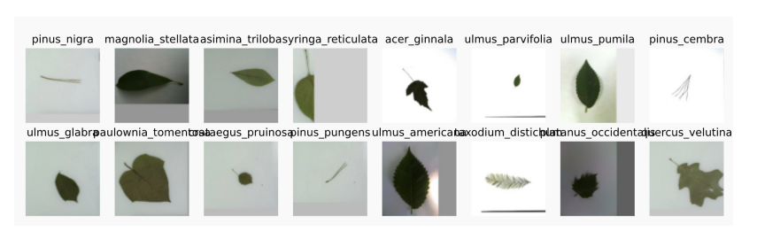

## 43-树叶分类竞赛技术总结
### 目录

- [1. 比赛结果](#1-比赛结果)
- [2. 结果分析](#2-结果分析)
- [3. 技术分析](#3-技术分析)
- [4. 模型方面](#4-模型方面)
- [5. AutoGluon](#5-autogluon)
- [6. 总结](#6-总结)
### 1. 比赛结果

- 176类，18353训练样本

    

- 165只队伍参加
  - 41只队伍精度 > 98% (非常好)
  - 83只队伍精度 > 95% (够用)

### 2. 结果分析

- 16只队伍提供了代码：
  - [Classify Leaves | Kaggle](https://www.kaggle.com/c/classify-leaves/code)

- 额外加上Neko Kiku
  - 很多人参考了此代码 [simple resnet baseline | Kaggle](https://www.kaggle.com/nekokiku/simple-resnet-baseline)

### 3. 技术分析

相比于课程介绍的代码，同学们主要做了下面这些加强：

- **数据增强**，在测试时多次使用稍弱的增强然后取平均

- 使用**多个模型**预测，最后结果加权平均
  - 有使用10种模型的，也有使用单一模型的
- **训练算法**和**学习率**
- **清理数据**

### 4. 模型方面

- 模型多为ResNet变种
  - DenseNet，ResNeXt，ResNeSt,  ...
  - EfficientNet

- 优化算法多为Adam或其变种
- 学习率一般是Cosine或者训练不动时往下调

### 5. AutoGluon

- 15行代码， 安装加训练耗时100分钟
  - [AutoGluon.vision: 0.96+ with 15 lines | Kaggle](https://www.kaggle.com/zhreshold/autogluon-vision-0-96-with-15-lines)
- 精度96%
  - 可以通过定制化提升精度
  - 下一个版本将搜索更多的模型超参数
  - AG目前主要仍是关注工业界应用上，而非比赛

### 6. 总结

- 提升精度思路：根据数据挑选增强，使用新模型、新优化算法，多个模型融合，测试时使用增强
- 数据相对简单，排名有相对随机性
- 在工业界应用中：
  - 少使用模型融合和测试时增强，计算代价过高
  - 通常固定模型超参数，而将精力主要花在提升数据质量

比赛/学术界：固定数据，调模型

工业界：固定模型，调数据