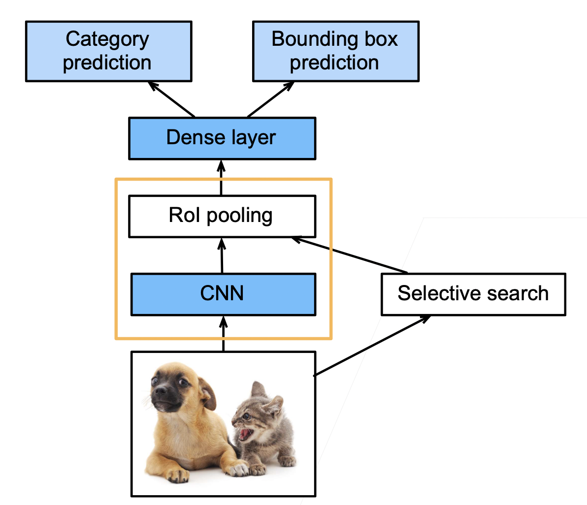
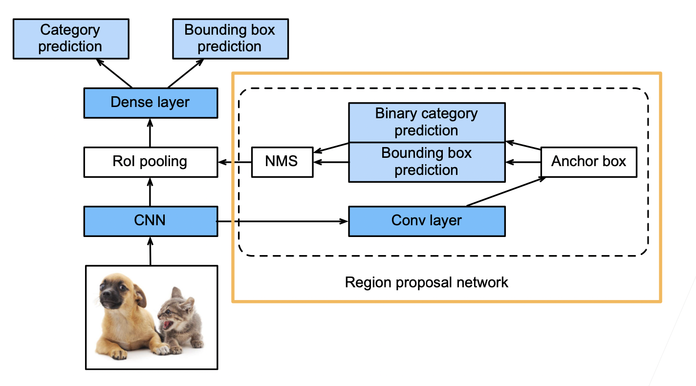
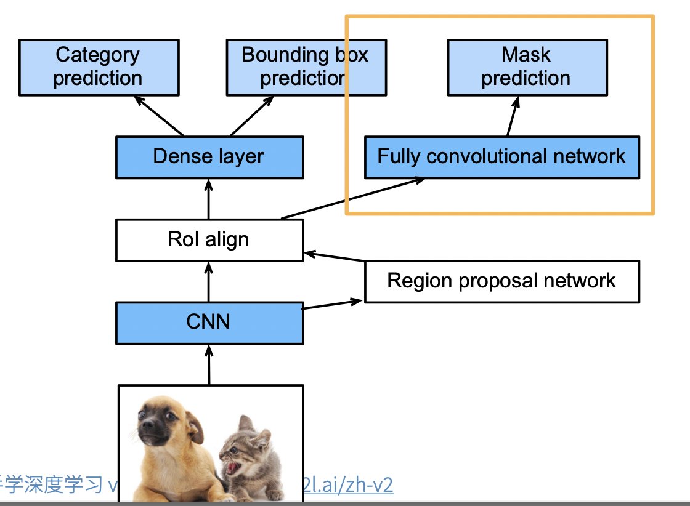
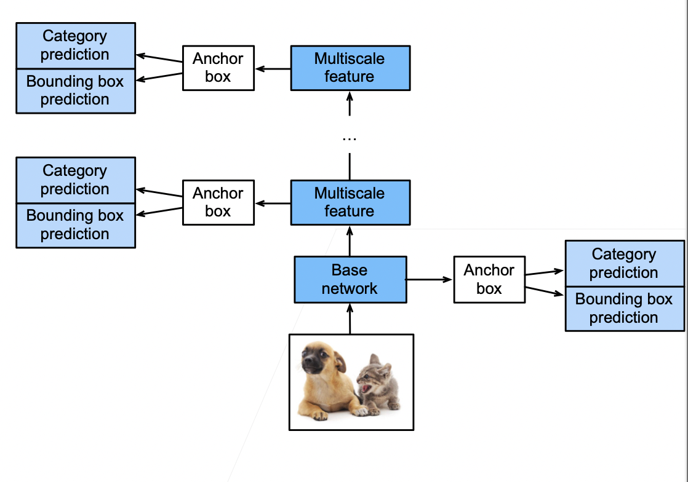

## 44.物体检测算法：R-CNN,SSD,YOLO
### 目录
- [44.物体检测算法：R-CNN,SSD,YOLO](#44物体检测算法r-cnnssdyolo)
  - [1.区域卷积神经网络](#1区域卷积神经网络)
    - [1.1.R-CNN](#11r-cnn)
    - [1.2 Fast RCNN](#12-fast-rcnn)
    - [1.3 Faster RCNN](#13-faster-rcnn)
    - [1.4 Mask RCNN](#14-mask-rcnn)
    - [1.5 总结](#15-总结)
  - [2. 单发多框检测（SSD single shot detection）](#2-单发多框检测ssd-single-shot-detection)
  - [3. YOLO（you only look once）](#3-yoloyou-only-look-once)

### 1.区域卷积神经网络

#### 1.1.R-CNN

- 使用启发式搜索算法来选择锚框
- 使用预训练模型来对每个锚框抽取特征（每个锚框当作一个图片，用CNN）
- 训练一个SVM来类别分类（神经网络之前，category prediction）
- 训练一个线性回归模型来预测边缘框偏移（bounding box prediction）
- 兴趣区域（Rol）池化层
  - 给定一个锚框，均匀分割（如果没法均匀分割，取整）成 n x m 块，输出每块的最大值（max pooling）
  - 不管锚框多大，总是输出nm个值
  - 目的：每个锚框都可以变成想要的形状

#### 1.2 Fast RCNN

- RCNN需要对每个锚框进行CNN运算，这些特征抽取计算有重复，并且锚框数量大，特征抽取的计算量也大。Fast RCNN改进了这种计算量大的问题

- 使用CNN对整张图片抽取特征（快的关键）

- 使用Rol池化层对每个锚框（将在原图片中搜索到的锚框，映射到CNN得到的结果上），生成固定长度的特征

  

    
  

   

#### 1.3 Faster RCNN

- 在Fast RCNN基础上变得更快
- 使用一个 **区域提议网络来替代启发式搜索获得更好的锚框**
- 如下图所示，将CNN结果输入到卷积层，然后用锚框去圈区域，这些锚框很多有好有坏，然后进行预测，binary 预测是预测这个锚框的好坏，即有没有有效的圈住物体，bounding box prediction预测是对锚框进行一些改进，最后用NMS（非极大值抑制）对锚框进行合并。
- 具体来说，区域提议网络的计算步骤如下：
  1. 使用填充为1的3×3的卷积层变换卷积神经网络的输出，并将输出通道数记为c。这样，卷积神经网络为图像抽取的特征图中的每个单元均得到一个长度为c的新特征。
  2. 以特征图的每个像素为中心，生成多个不同大小和宽高比的锚框并标注它们。
  3. 使用锚框中心单元长度为c的特征，分别预测该锚框的二元类别（含目标还是背景）和边界框。
  4. 使用非极大值抑制，从预测类别为目标的预测边界框中移除相似的结果。最终输出的预测边界框即是兴趣区域汇聚层所需的提议区域。

  

#### 1.4 Mask RCNN

- 如果有**像素级别的标号**，使用FCN（fully convolutional network）利用这些信息。可以提升CNN的性能
- **Rol align**。之前的Rol进行池化的时候，如果没法整除，可以直接取整。但是像素级别的标号预测的时候，会造成偏差的累积，导致边界预测不准确。未来避免这种情况，使用Rol align，也就是当没法整除，对每个像素值进行按比例分配。
- 具体来说，Mask R-CNN将兴趣区域汇聚层替换为了*兴趣区域对齐*层，使用*双线性插值*（bilinear interpolation）来保留特征图上的空间信息，从而更适于像素级预测。 兴趣区域对齐层的输出包含了所有与兴趣区域的形状相同的特征图。 它们不仅被用于预测每个兴趣区域的类别和边界框，还通过额外的全卷积网络预测目标的像素级位置。

  

#### 1.5 总结

- R-CNN是最早也是最有名的一类基于锚框和CNN的目标检测算法
- Fast/Faster RCNN 持续提升性能
- Faster RCNN和Mask RCNN是在要求高精度场景下常用的算法（但是速度是最慢的）

### 2. 单发多框检测（SSD single shot detection）

- 生成锚框
  - 对每个像素，生成多个以它为中心的锚框
  - 给定 n 个大小$s_1,...,s_n$和m个高宽比，生成n+m-1个锚框，其大小和高宽比分别为：$(s_1,r_1),(s_2,r_1)...,(s_n,r_1),(s_1,r_2),...,(s_1,r_m)$
- SSD模型
  - 对多个分辨率下的卷积特征，生成锚框，预测
  - 一个基础网络，抽取特征，然后用多个卷积层来减半高宽
  - 在每段都生成锚框
    - 底部段拟合小物体
    - 顶部段拟合大物体
  - 对每个锚框预测类别和边缘框

  

- 总结
  - 速度快，精度很低。这么多年，作者没有持续的提升，但是启发了后面的一系列工作，实现上相对比较简单。
  - SSD通过单神经网络来检测模型（single shot）
  - 以像素为中心的产生多个锚框
  - 在多个段的输出上进行多尺度的检测

### 3. YOLO（you only look once）

- SSD中锚框大量重复，因此浪费了很多计算资源
- YOLO将图片均分为 S X S 个锚框
- 每个锚框预测 B 个边缘框（防止多个物体出现在一个锚框里面）
- 后续版本 v2 v3 v4 有持续改进
- 非锚框算法

