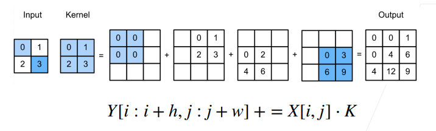
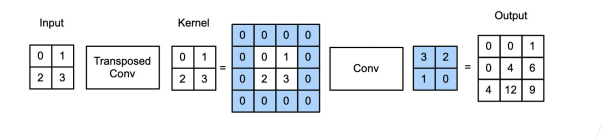
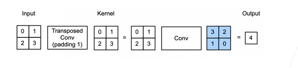
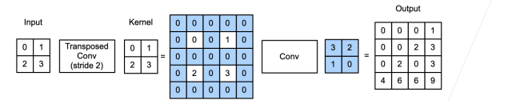

### 47-转置卷积

### 本节目录

- [1.转置卷积](#1转置卷积)
- [2.转置卷积是一种卷积](#2转置卷积是一种卷积)

### 1.转置卷积

- 转置卷积和卷积的区别：
  - 卷积不会增大输入的高宽，通常要么不变、要么减半
  - 转置卷积则可以用来增大输入高宽
- 转置卷积的具体实现：

如图所示，input里的每个元素和kernel相乘，最后把对应位置相加，相当于卷积的逆变换

- 为什么称之为“转置：
  - 对于卷积Y=X*W
    - 可以对W构造一个V，使得卷积等价于矩阵乘法Y'=VX'
    - 这里Y',X'是Y,X对应的向量版本
  - 转置卷积等价于Y'=VTX'
  - 如果卷积将输入从（h，w）变成了（h‘，w’）
    - 同样超参数的转置卷积则从（h‘，w’）变成为（h，w）

### 2.转置卷积是一种卷积

- 重新排列输入和核

  - 当填充为0步幅为1时：
    - 将输入填充k-1（k时核窗口）
    - 将核矩阵上下、左右翻转
    - 然后做正常卷积（填充0、步幅1）

  

  - 当填充为p步幅为1时：
    - 将输如填充k-p-1（k是核窗口）
    - 将核矩阵上下、左右翻转
    - 然后做正常卷积（填充0、步幅1）

  

  - 当填充为p步幅为s时：

    - 在行和列之间插入s-1行或列

    - 将输如填充k-p-1（k是核窗口）
    - 将核矩阵上下、左右翻转
    - 然后做正常卷积（填充0、步幅1）

  

- 形状换算

  - 输入高（宽）为n，核k，填充p，步幅s：

    - 转置卷积：n‘=sn+k-2p-s

    - 卷积：n’=[(n-k-2p+s)/s]向下取整

  - 如果让高宽成倍增加，那么k=2p+s

- 同反卷积的关系

  - 数学上的反卷积是指卷积的逆运算
    - 若Y=conv（X,K），那么X=deconv（Y,K）
  - 反卷积很少用在深度学习中
    - 我们说的反卷积神经网络指用了转置卷积的神经网络

- 总结

  - 转置卷积是一种变化了输入和核的卷积，来得到上采用的目的
  - 不等同于数学上的反卷积操作

