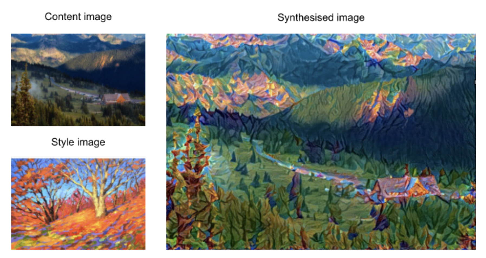
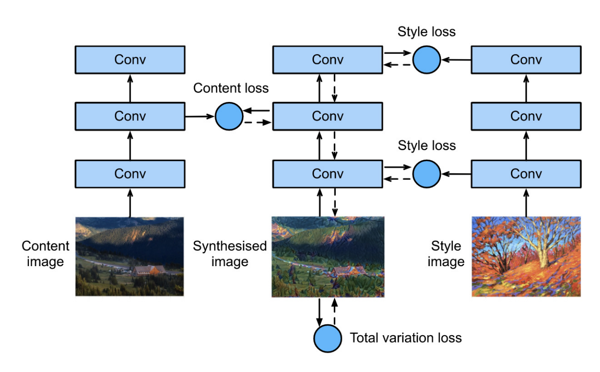

## 样式迁移

样式迁移类似于手机相机中的滤镜，指的是给定内容图片和风格图片，合成一张新的图片，使得他的内容与内容图片相似，而风格却是风格图片的样子，如下例：

### 方法

如下图所示，可以用一个预训练好的神经网络来实现样式迁移：

* 1：复制内容图片来初始化一张图片，之后将这张图片中的像素作为参数进行更新，最终得到合成的图片
* 2：将内容图片，当前的合成图片，样式图片分别输入一个相同的预训练好的神经网络
* 3：假设该神经网络的不同层分别提取与内容和风格相关的信息，可以据此得到一个损失：
  * 将合成图片与**内容**相关的层的输出与**内容**图片对应层的输出进行处理，得到**内容损失**
  * 将合成图片与**风格**相关的层的输出与**风格**图片对应层的输出进行处理，得到**风格损失**
  * 对合成图片本身，统计图片中的高频噪点（即过明或过暗像素点），得到**全变分损失**
  * 将三部分损失加起来得到总的样式迁移的**损失函数**
* 4：利用3定义的损失函数，以合成图片的每个像素点为参数进行梯度下降，得到最终合成的图片

### 内容损失

神经网络内容相关层的输出的相似度可以直接反应两张图片在内容上的相似度，因此内容损失可以直接将对应层的输出视为内容直接求平方差损失。

### 风格损失：格拉姆矩阵

对于内容层，可以直接将对应层的输出求平方差损失，但是对于风格则略有不同

一般认为，风格层对应的输出的多个通道分别对应着不同类型的信息，如果将输出的形状从$[batch\_size=1,channels,h,w]$转化为$[channels,h*w]$就能得到通道数个向量，以$x_1,x_2...x_c$表示，代表不同通道所提取出的不同信息，而风格可以视作这些信息之间的关联，即相似度。

定义格拉姆矩阵$\bold X * \bold X^T \in R^{c \cdot c}$，矩阵的第i行第j列即向量$x_i$与$x_j$的内积，这个矩阵就代表了一张图片的风格。

对于生成图片和风格图片的格拉姆矩阵求平方差损失就能得到所需的风格损失

此外，为了让风格损失不受格拉姆矩阵及向量的大小影响，实际将格拉姆矩阵除以这些大小$channnels*h*w$。

### 全变分损失

用于去除高频噪点（过明过暗像素点）
$$
\sum_{i, j} \left|x_{i, j} - x_{i+1, j}\right| + \left|x_{i, j} - x_{i, j+1}\right|
$$
