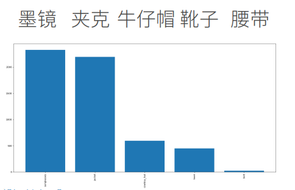

## 课程竞赛：牛仔行头检测

### 主要内容

图像中的目标检测，检测牛仔的装备，主要包括：夹克，墨镜，靴子，牛仔帽，腰带

有6937张训练图片，12660个标注框，数据集使用MS-COCO格式，可以调用pycocotools库，评测使用mAP（评测对每个类预测的框的好坏）

挑战：五个类别出现次数不同，墨镜、夹克次数多，牛仔帽、靴子其次，腰带很少

### 安排

Kaggle不支持mAP，提交结果csv文件时网址不同

公私榜分配和之前不同，之前kaggle从所有数据中选出一部分作为私榜，本次限定了时间公榜结束后12小时内拿到私榜数据并提交结果，至多提交三次

提供了一个示例程序

