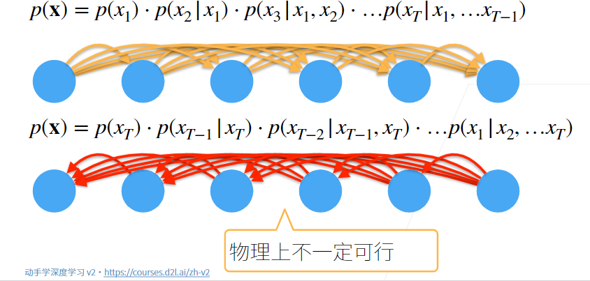
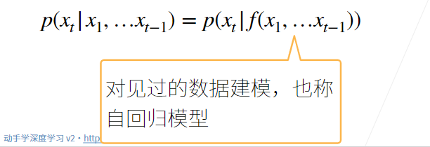
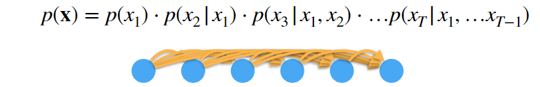
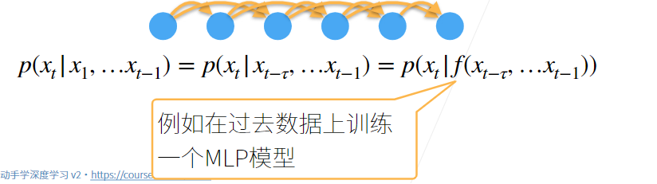
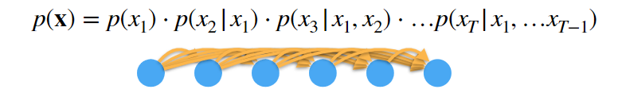
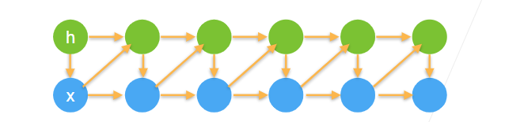

# 序列模型

### 1.目录
- [序列模型](#序列模型)
    - [1.目录](#1目录)
    - [2.序列数据](#2序列数据)
      - [2.1 更多例子](#21-更多例子)
    - [3.统计工具](#3统计工具)
    - [4.序列模型](#4序列模型)
      - [4.1 方案A:马尔科夫假设](#41-方案a马尔科夫假设)
      - [4.2 方案B:潜变量模型](#42-方案b潜变量模型)
    - [5.总结](#5总结)
    - [6.Q&A：](#6qa)
### 2.序列数据

- 实际中很多数据是有时序的
- 电影的评价随时间变化而变化
  - 拿了奖后评分上升，直到奖项被遗忘
  - 看了很多好电影后，人们的期望变高
  - 季节性：贺岁片，暑期档
  - 导演、演员的负面报道导致评分变低

#### 2.1 更多例子

- 音乐、文本、语言和视频都是连续的
  - 标题“狗咬人”远没有“人咬狗”那么令人惊讶

- 大地震发生后，很有可能会有几次较小的余震
- 人的互动是连续的，从网上吵架可以看出
- 预测明天的股价要比填补昨天遗失的股价更困难

### 3.统计工具

- 在时间t观察到，那么得到T个不独立的随机变量

- 使用条件概率展开

  

    

### 4.序列模型

    

- 对条件概率建模

    

#### 4.1 方案A:马尔科夫假设

    

- 假设当前数据只跟τ个过去数据点相关

    

#### 4.2 方案B:潜变量模型

    

- 引入潜变量来表示过去信息
  - 这样

    

### 5.总结

- 时序模型中，当前数据跟之前观察到的数据相关
- 自回归模型使用自身过去数据来预测未来
- 马尔科夫模型假设当前只跟最近少数数据相关，从而简化模型
- 潜变量模型使用潜变量来概括历史信息

### 6.Q&A：

##### Q1:在常规范围内tau是不是越大越好。刚才例子tau=5是不是比4好？

> 当然比4好，也有局限性，tau特别大，训练样本变小，模型变复杂

##### Q2：潜变量模型和隐马尔科夫模型有什么区别？

> 没有太多联系，两个不同的观点，但是潜变量模型可以使用隐马尔科夫假设。潜变量-怎么建模，隐马尔科夫-这个数据和之前多少个数据有关。

##### Q3：若预测一个月，tau=30,预测7天，tau=7，是否有这样的关系？

> tau取决于对数据的理解，没有固定的规则

##### Q4：在预测未来方面，现在的sota模型能做到多好？

> 具体问题具体分析，在有些领域做得好比如写作，写代码，在一些领域做的不好，比如预测股票。

##### Q5:tau能够随着xt的变化而变化吗？这样感觉更符合实际情况

> 当然可以，有计算量的增加，也不一定更好

##### Q6:预测电池之类很多参数的未来变化趋势时怎么长步预测？

> 与数据关系比较大，负类样本较少，所以比较难训练