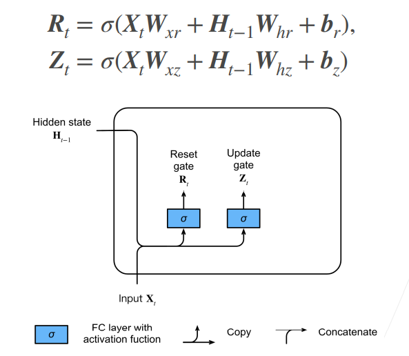
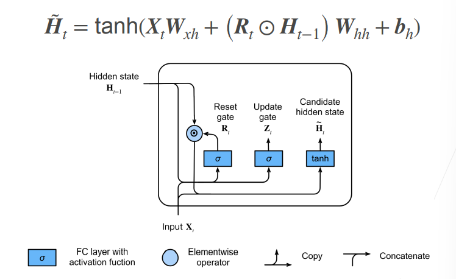
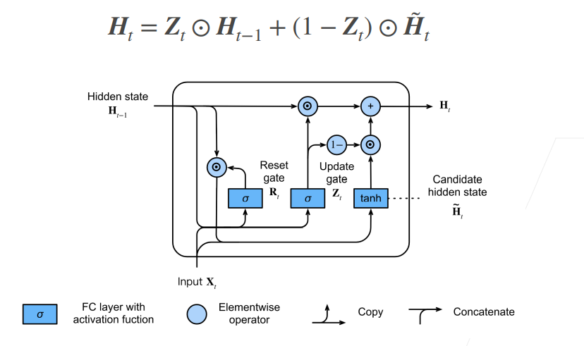
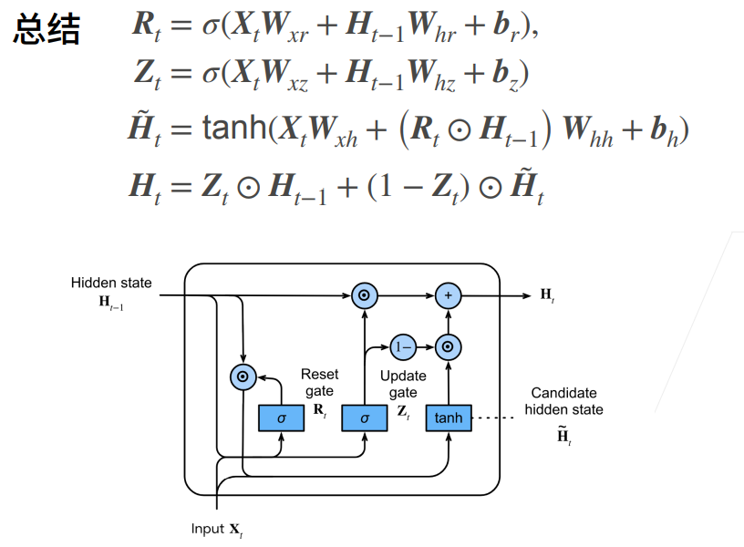

## 56-门控循环单元(GRU)

### 1. 动机：如何关注一个序列

- 不是每个观察值都是同等重要

    

比如上图中的序列，若干个猫中出现了一个鼠，那么我们应该重点关注这个鼠，而中间重复出现的猫则减少关注。文本序列同理，通常长文本我们需要关注的是几个关键词，关键句。

- 想只记住相关的观察需要：
  - 能**关注**的机制（**更新门**）：顾名思义，是否需要根据我的输入，更新隐藏状态
  - 能**遗忘**的机制（**重置门**）：更新候选项时，是否要考虑前一隐藏状态。

### 2. 门的概念

- 更新门Zt，重置门Rt的公式大体相同，唯一不同的是学习到的参数。

- 需要注意的是，计算门的方式和原来RNN的实现中计算新的隐状态相似，只是激活函数改成了sigmoid。
- 门本来是电路中的一个概念，0,1代表不同的电平，可以用于控制电路的通断。此处sigmoid将门的数值归一化到0到1之间，是一种"软更新"方式。而从后面的公式上可以看出，本讲课程采用的是低电平有效（越靠近0，门的作用越明显）的方式控制。

    

### 3. 候选隐状态

    

- 候选隐状态，如果抛开公式中的$R_{t}$遗忘门来说，这个和之前RNN中计算当前步的隐状态没有差别。

- 但是这里引入了遗忘门，如果$R_{t}$无限接近于0，那么此时候选隐状态将不再考虑前一隐状态的影响，也就是和MLP没有区别，起到“遗忘”的作用；
- 反之，如果$R_{t}$无限接近于1，那么与RNN计算隐状态的过程没有差别，不进行遗忘。
- 公式中的⊙表示逐元素乘积。

> 为什么叫候选隐状态？
>
> 在RNN中，这个所谓的候选隐状态就是当前步的隐状态（$R_{t}$无限接近1时）。但是由于引入了更新门，我们需要考虑是直接沿用上一步的隐藏状态，还是像RNN一样使用当前步计算的隐状态。所以这个结合了当前输入计算的隐状态，不能立马变成当前的$H_{t}$，而是需要用更新门和前一隐状态$H_{t-1}$做一个加权，所以它是一个候选项。

### 4. 隐状态

    

用更新门对**候选隐状态**和**前一隐状态**做加权，得到当前步**隐状态**的值。

如果$Z_{t}$无限接近于0，更新起作用，候选隐状态“转正”，变为当前隐状态。

如果$Z_{t}$无限接近于1，更新不起作用，当前隐状态还是沿用前一隐状态。

### 5. 总结

    

上图四行公式概括了GRU模型。在RNN的基础上，最重要的是引入了**更新门和重置门**，来决定前一隐状态对当前隐状态的影响。以最开始的猫鼠序列的例子来说，如果我的模型一直看到猫，模型可以学习到隐状态不怎么去更新，于是隐状态一直保留了猫的信息，而看到老鼠，隐状态才进行更新。

- 对于一个更具体的例子而言(语言模型)：

“The cat, which already ate ……, __(is/ was) full.”，假设我的句子很长，预测完前面的词后需要预测下一个词is还是was，如果引入这种更新/重置的机制，那我们的模型可以在was这个词之前尽可能去保持隐状态的信息，从而即使阅读了一个很长的定语从句，但我们还是保留了cat这个词的单数信息，从而模型预测下一个词为'was'。

- 一个与RNN的联动在于：

如果更新门完全发挥作用（无限接近于0），重置门不起作用（无限接近于1），此时GRU模型退化为RNN模型。

### 6. QA

问题：GRU为什么需要两个门？

> 重置门和更新门各司其职。重置门单方面控制自某个节点开始，之前的记忆（隐状态）不在乎了，直接清空影响，同时也需要更新门帮助它实现记忆的更新。更新门更多是用于处理梯度消失问题，可以选择一定程度地保留记忆，防止梯度消失。
>
> 重置门影响的是当前步新的候选隐状态的计算，更新门影响的是当前步隐状态的更新程度。