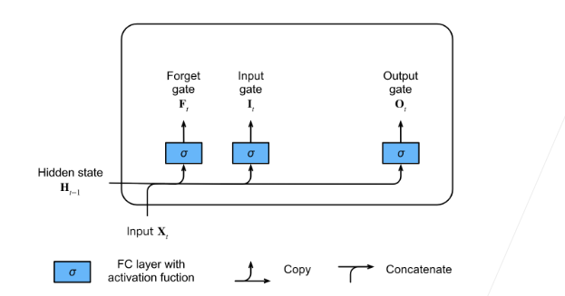
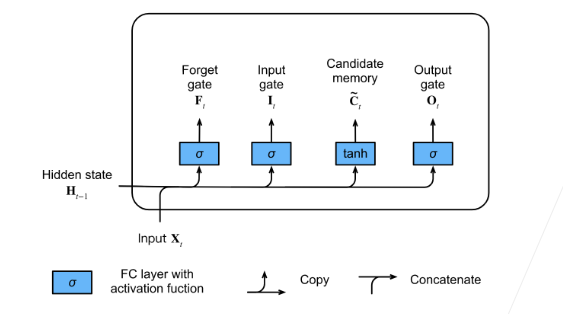
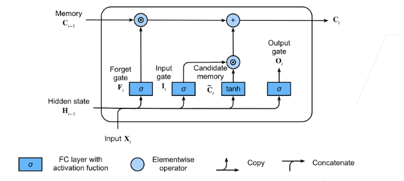

# 长短期记忆网络

### 1.目录

### 2.长短期记忆网络：

- 忘记门：将值朝0减少
- 输入门：决定是不是忽略掉输入数据
- 输出门：决定是不是使用隐状态

可以说，长短期记忆网络的设计灵感来自于计算机的逻辑门。 长短期记忆网络引入了*记忆元*（memory cell），或简称为*单元*（cell）。 有些文献认为记忆元是隐状态的一种特殊类型， 它们与隐状态具有相同的形状，其设计目的是用于记录附加的信息。 为了控制记忆元，我们需要许多门。 其中一个门用来从单元中输出条目，我们将其称为*输出门*（output gate）。 另外一个门用来决定何时将数据读入单元，我们将其称为*输入门*（input gate）。 我们还需要一种机制来重置单元的内容，由*遗忘门*（forget gate）来管理， 这种设计的动机与门控循环单元相同， 能够通过专用机制决定什么时候记忆或忽略隐状态中的输入。 让我们看看这在实践中是如何运作的。

#### 2.1 门：

输入门：

忘记门：

输出门：

这三个门的算式和普通RNN计算Ht算式相同。

<div align="center">
    
</div>

#### 2.2候选记忆单元


相当于在ht-1到ht的预测中又加了一层隐藏单元

<div align="center">
    
</div>


#### 2.2记忆单元


如果遗忘门始终为\(1\)且输入门始终为\(0\)， 则过去的记忆元 将随时间被保存并传递到当前时间步。 引入这种设计是为了缓解梯度消失问题， 并更好地捕获序列中的长距离依赖关系。

<div align="center">
    
</div>


#### 2.3隐状态


最后，我们需要定义如何计算隐状态， 这就是输出门发挥作用的地方。 在长短期记忆网络中，它仅仅是记忆元的的门控版本。 这就确保了Ht的值始终在区间\((-1, 1)\)内.

只要输出门接近1，我们就能够有效地将所有记忆信息传递给预测部分， 而对于输出门接近\(0\)，我们只保留记忆元内的所有信息，而不需要更新隐状态。

<div align="center">
    
</div>

#### 2.4总结

LSTM的计算流程：


### 3.从零实现

加载时光机器数据集

```python
import torch
from torch import nn
from d2l import torch as d2l

batch_size, num_steps = 32, 35
train_iter, vocab = d2l.load_data_time_machine(batch_size, num_steps)
```

#### 3.1初始化模型参数

```python
def get_lstm_params(vocab_size, num_hiddens, device):
    num_inputs = num_outputs = vocab_size

    def normal(shape):
        return torch.randn(size=shape, device=device)*0.01

    def three():
        return (normal((num_inputs, num_hiddens)),
                normal((num_hiddens, num_hiddens)),
                torch.zeros(num_hiddens, device=device))

    W_xi, W_hi, b_i = three()  # 输入门参数
    W_xf, W_hf, b_f = three()  # 遗忘门参数
    W_xo, W_ho, b_o = three()  # 输出门参数
    W_xc, W_hc, b_c = three()  # 候选记忆元参数
    # 输出层参数
    W_hq = normal((num_hiddens, num_outputs))
    b_q = torch.zeros(num_outputs, device=device)
    # 附加梯度
    params = [W_xi, W_hi, b_i, W_xf, W_hf, b_f, W_xo, W_ho, b_o, W_xc, W_hc,
              b_c, W_hq, b_q]
    for param in params:
        param.requires_grad_(True)
    return params
```


#### 3.2定义模型

在初始化函数中， 长短期记忆网络的隐状态需要返回一个*额外*的记忆元， 单元的值为0，形状为（批量大小，隐藏单元数）。 因此，我们得到以下的状态初始化。

```python
def init_lstm_state(batch_size, num_hiddens, device):
    return (torch.zeros((batch_size, num_hiddens), device=device),
            torch.zeros((batch_size, num_hiddens), device=device))
```

实际模型的定义与我们前面讨论的一样： 提供三个门和一个额外的记忆元。 请注意，只有隐状态才会传递到输出层， 而记忆元\(\mathbf{C}_t\)不直接参与输出计算。

```python
def lstm(inputs, state, params):
    [W_xi, W_hi, b_i, W_xf, W_hf, b_f, W_xo, W_ho, b_o, W_xc, W_hc, b_c,
     W_hq, b_q] = params
    (H, C) = state
    outputs = []
    for X in inputs:
        I = torch.sigmoid((X @ W_xi) + (H @ W_hi) + b_i)
        F = torch.sigmoid((X @ W_xf) + (H @ W_hf) + b_f)
        O = torch.sigmoid((X @ W_xo) + (H @ W_ho) + b_o)
        C_tilda = torch.tanh((X @ W_xc) + (H @ W_hc) + b_c)
        C = F * C + I * C_tilda
        H = O * torch.tanh(C)
        Y = (H @ W_hq) + b_q
        outputs.append(Y)
    return torch.cat(outputs, dim=0), (H, C)
```


#### 3.3训练和预测

```python
vocab_size, num_hiddens, device = len(vocab), 256, d2l.try_gpu()
num_epochs, lr = 500, 1
model = d2l.RNNModelScratch(len(vocab), num_hiddens, device, get_lstm_params,
                            init_lstm_state, lstm)
d2l.train_ch8(model, train_iter, vocab, lr, num_epochs, device)
```


<div align="center">
    
</div>


### Q&A

##### Q1：请问LSTM如果不要C,把公式里的换成，好像可以实现隐藏状态往下传递？

> 的可以约束的大小在0-1之间，避免梯度爆炸，而且使算式更加自然，c换成h复杂度降低。

##### Q2：I,F,O,C_tilda的初始化为零？

> 这些是计算的中间变量，不需要初始化

##### Q3：如何计算模型占用显存，batch占用的显存？

> 取决于框架和库，没法具体算

 