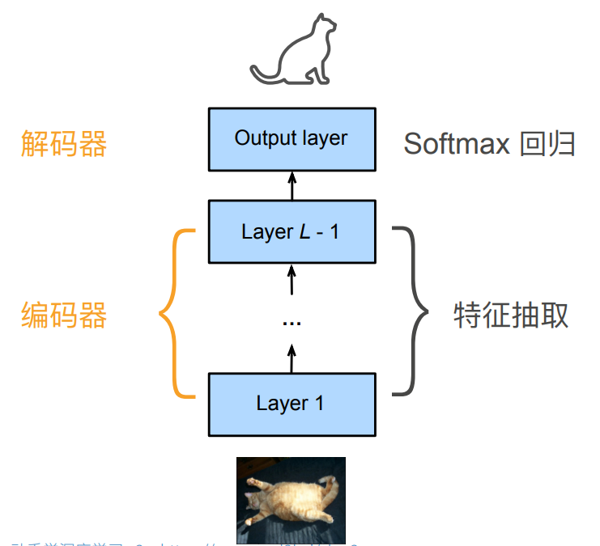
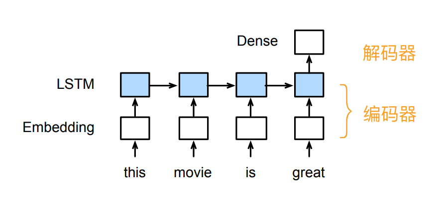
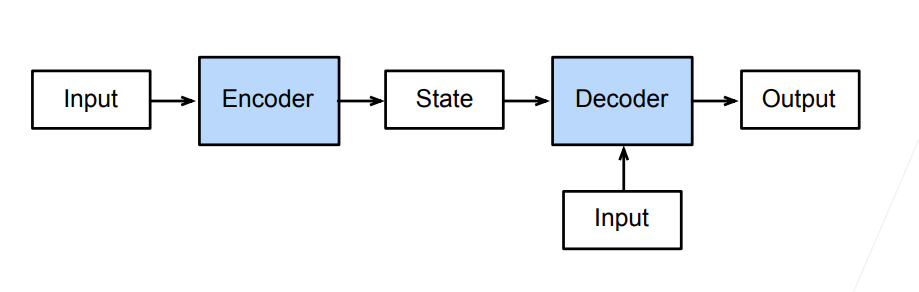

## 编码器-解码器架构

### CNN中的解释

考虑一个CNN模型：

整个CNN实际上可以看作一个编码器，解码器两部分。

* 底层的神经网络，也就是编码器将输入编码成能被模型识别的中间表达形式，也就是特征
* 解码器将中间结果解码为输出

### RNN中的解释

对于RNN而言，同样有着类似的划分

* 编码器将输入文本表示为向量
* 解码器将向量表示为输出

### 抽象的编码器-解码器架构

指一个模型被分为两块：

* 一块是编码器，也叫encoder，用于将输入处理为一个中间状态
* 一块是解码器，也叫decoder，用于将中间状态表示为输出
* 解码器也可以有额外的输入提供信息

