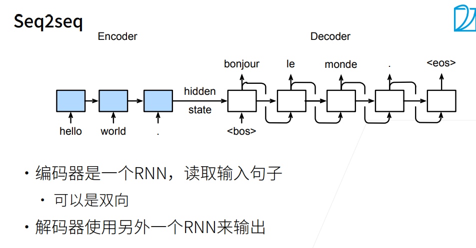
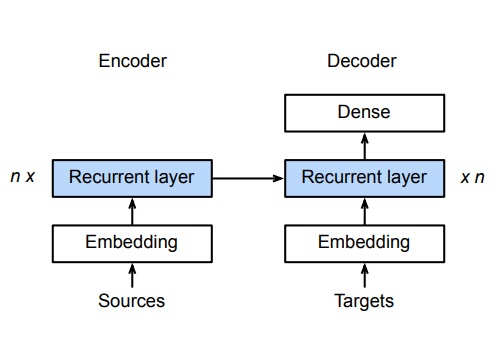
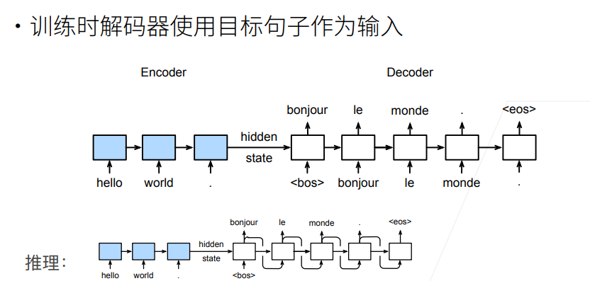
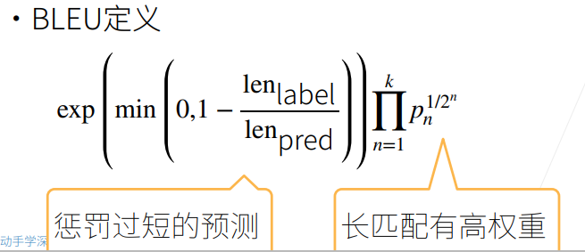
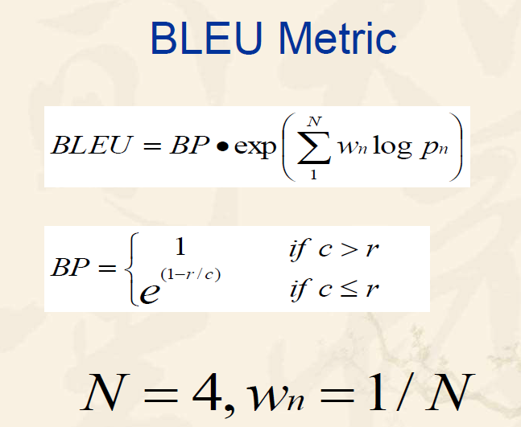
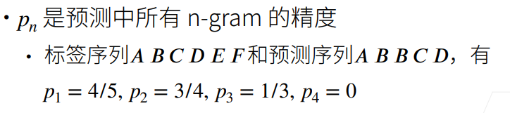

## 62-序列到序列学习

### 1. 应用举例：机器翻译

- 给定一个源语言的句子，自动翻译成目标语言
- 这两个句子可以有不同的长度

### 2. 模型架构：Seq2seq

    

- 序列到序列模型由**编码器-解码器**构成。

- **编码器**RNN可以是**双向**，由于输入的句子是完整地，可以正着看，也可以反着看；而**解码器**只能是**单向**，由于预测时，只能正着去预测。
- 编码器，解码器采用**不同的RNN**，此RNN也可以是GRU，LSTM等。

### 3. 编码器-解码器细节

    

- 编码器的RNN**没有**连接**输出层**

- **编码器**的**最后时间步的隐状态**用作**解码器**的**初始隐状态**（图中箭头的传递）

### 4. 训练和推理

    

- 第3节中提到编码器没有输出层，只有解码器有，于是损失函数的计算只关注解码器的输出层。
- 训练和预测（推理）有区别的，训练时解码器使用目标句子（真值）作为输入，以指导模型训练；而推理时无法提前得知真值，需要一步一步进行预测。

### 5. 衡量生成序列的好坏：BLEU

#### 5.1 BLUE值定义：

    

宗成庆老师《统计自然语言处理》（第二版）一书中关于BLEU的定义：

    

同时，吴恩达深度学习课程中也是使用这一方式定义。但观察两种方式，BP惩罚因子的计算是一致的，pn也是使用了几何平均的方式，只是对于wn这一加权值的选择有所不同。

#### 5.2 定义式解析

    

BLEU值衡量的是精确率，而且对不同n-gram进行集成打分。

- BP惩罚因子：为了惩罚过短的句子，由于过短的句子基数小，精确率容易提升，所以加上一个BP乘子，当预测句子长度<参考句子长度，则BP<1。

- wn的选择：李沐老师课程中是采用了$\frac{1}{2^n}$​作为加权因子，n越大，加权因子越小，但由于pn<1，赋予的权重越大，即长匹配具有更高的权重。而宗老师的书中所述：在BLEU的基线系统中取N＝4，wn＝1/N，也可以参考。

### 6. QA

问题：LSTM、GRU、Seq2Seq的区别是什么？

> Seq2Seq是一种由编码器和解码器组成的框架，而LSTM、GRU是组成编码器和解码器的一种单元。

问题：encoder的输出和decoder的输入，拼接和按位相加起来有什么区别么？

> 不能够按位加，由于encoder的输出最后维度是hidden_size，而decoder的输入最后维度是embedding_size，可能不一样，所以用拼接。

问题：embedding层是做word2vec吗？

> 这里不是，这里是从头开始训练。现在用的比较多得都是预训练，BERT等。