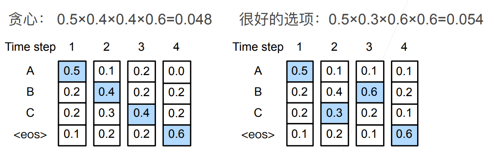

## 束搜索

在序列生成问题中，常用的方法是一个个词元地进行生成，但是先前步生成的词元会影响之后词元的概率分布，为此，我们需要使用搜索算法来得到一个较好的序列

### 贪心搜索

贪心搜索即每个时间步都选择具有最高条件概率的词元。
$$
y_{t'} = \operatorname*{argmax}_{y \in \mathcal{Y}} P(y \mid y_1, \ldots, y_{t'-1}, \mathbf{c})
$$
我们的目标是找到一个最有序列，他的联合概率，也就是每步之间的条件概率的乘积，最大。
$$
\prod_{t'=1}^{T'} P(y_{t'} \mid y_1, \ldots, y_{t'-1}, \mathbf{c})
$$
然而，贪心搜索很可能搜索到的不是最优解，例如：

左侧的搜索方式为贪心搜索，每次找到当前条件概率最大的选项进行预测，但是这样可能会导致之后的条件概率较小，从而导致最终的联合概率较小，生成的序列不优。

而右侧的选择方式虽然在第二步选择了较小的选项，但之后在第三步时有了条件概率为0.6选项，最终结果反而更好。

### 穷举搜索

穷举搜索枚举所有可能的输出序列及其概率，然后选择概率最大的作为最终的输出，枚举搜索可以保证得到最优解，但是计算复杂度很高，难以实现

### 束搜索（beam search）

束搜索综合了贪心搜索和穷举搜索，在能接受的计算成本下得到比贪心搜索更好的结果。

束搜索有一个超参数，名为**束宽（beam size）**$k$，束搜索的具体流程如下：

* 1：在第一时间步选择条件概率最高的k个选项
* 2：对随后的每个时间步，基于上一时间步的k个候选输出序列预测这一时间步的所有可能选项的条件概率，从中取k个最大的

* 3：最后基于每步得到的序列，删去截止符和其后元素，获得最终候选序列集合，取出加权条件概率最大的

加权条件概率公式如下：
$$
\frac{1}{L^\alpha} \log P(y_1, \ldots, y_{L}\mid \mathbf{c}) = \frac{1}{L^\alpha} \sum_{t'=1}^L \log P(y_{t'} \mid y_1, \ldots, y_{t'-1}, \mathbf{c}),
$$
式中$\frac{1}{L^\alpha}$用于调整长序列的评估值使得长短序列间的比较公平

束宽k的选择：

* k=1时实际为贪心搜索
* k越小搜索速度越快，但结果越差，k越大则搜索速度越慢，但结果越好

束搜索只在测试时使用