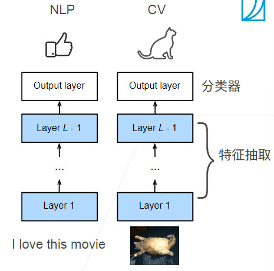
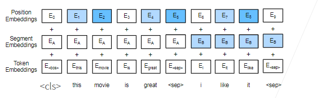
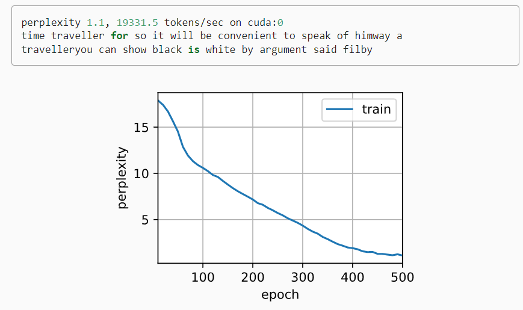
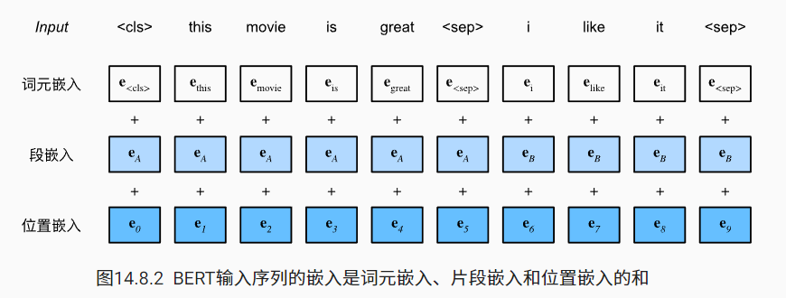

## BERT预训练

### 1.目录：
- [BERT预训练](#bert预训练)
  - [1.目录：](#1目录)
  - [2.BERT:](#2bert)
    - [2.1 NLP里的迁移学习](#21-nlp里的迁移学习)
    - [2.2 BERT的动机](#22-bert的动机)
    - [2.3 BERT架构](#23-bert架构)
    - [2.4 对输入的修改](#24-对输入的修改)
    - [2.5 预训练任务](#25-预训练任务)
      - [2.5.1 带掩码的语言模型](#251-带掩码的语言模型)
      - [2.5.2 下一个句子预测](#252-下一个句子预测)
    - [2.6 总结](#26-总结)
  - [3.代码实现](#3代码实现)
    - [3.1 获取输入：](#31-获取输入)
    - [3.2 BERT实现](#32-bert实现)
    - [3.3 预训练任务](#33-预训练任务)
      - [3.3.1 遮掩语言模型](#331-遮掩语言模型)
      - [3.3.2 下一句预测](#332-下一句预测)
    - [3.4 整合代码](#34-整合代码)
    - [3.5 小结](#35-小结)
  - [Q&A：](#qa)

### 2.BERT:

#### 2.1 NLP里的迁移学习

- 使用预训练好的模型来抽取词，句子的特征
  - 例如word2vec或语言模型

- 不更新预训练好的模型
- 需要构建新的网络来抓取任务需要的信息
  - Word2vec忽略了时序信息
  - 语言模型只看了一个方向

#### 2.2 BERT的动机

- 基于微调的NLP模型
- 预训练的模型抽取了足够多的信息
- 新的任务只需要增加一个简单地输出层

<div align="center">
    
</div>

#### 2.3 BERT架构

- 只有编码器的Transformer
- 两个版本：
  - Base:#blocks=12,hidden size=768,#heads=12,#parameters=110M
  - Large:#blocks=24,hidden size=1024,#heads=16,#paramerter=340M

- 在大规模数据上训练>3B词

#### 2.4 对输入的修改

- 每个样本是一个句子对
- 加入额外的片段嵌入
- 位置编码可学习

<div align="center">
    
</div>

#### 2.5 预训练任务

##### 2.5.1 带掩码的语言模型

- Transformer的编码器是双向的，标准语言模型要求单向
- 带掩码的语言模型每次随机（15%概率）将一些词元换成<mask>
- <div align="center">
      
  </div>

##### 2.5.2 下一个句子预测

- 预测一个句子对中两个句子是不是相邻
- 训练样本中：
  - 50%概率选择相邻句子对：<cls>this movie is great <sep> i like it <sep>
  - 50%概率选择随机句子对：<cls>this movie is great<sep> hello world<sep>

- 将<cls>对应的输出放到一个全连接层来预测

#### 2.6 总结

- BERT针对微调设计
- 基于Transformer的编码器做了如下修改
  - 模型更大，训练数据更多
  - 输入句子对，片段嵌入，可学习的位置编码
  - 训练时使用两个任务：
    - 带掩码的语言模型
    - 下一个句子预测

### 3.代码实现

#### 3.1 获取输入：

在自然语言处理中，有些任务（如情感分析）以单个文本作为输入，而有些任务（如自然语言推断）以一对文本序列作为输入。BERT输入序列明确地表示单个文本和文本对。当输入为单个文本时，BERT输入序列是特殊类别词元“<cls>”、文本序列的标记、以及特殊分隔词元“<sep>”的连结。当输入为文本对时，BERT输入序列是“<cls>”、第一个文本序列的标记、“<sep>”、第二个文本序列标记、以及“<sep>”的连结。我们将始终如一地将术语“BERT输入序列”与其他类型的“序列”区分开来。例如，一个*BERT输入序列*可以包括一个*文本序列*或两个*文本序列*。

为了区分文本对，根据输入序列学到的片段嵌入eA和eB分别被添加到第一序列和第二序列的词元嵌入中。对于单文本输入，仅使用eA。

下面的`get_tokens_and_segments`将一个句子或两个句子作为输入，然后返回BERT输入序列的标记及其相应的片段索引。

```python
#@save
def get_tokens_and_segments(tokens_a, tokens_b=None):
    """获取输入序列的词元及其片段索引"""
    tokens = ['<cls>'] + tokens_a + ['<sep>']
    # 0和1分别标记片段A和B
    segments = [0] * (len(tokens_a) + 2)
    if tokens_b is not None:
        tokens += tokens_b + ['<sep>']
        segments += [1] * (len(tokens_b) + 1)
    return tokens, segments
```

BERT选择Transformer编码器作为其双向架构。在Transformer编码器中常见是，位置嵌入被加入到输入序列的每个位置。然而，与原始的Transformer编码器不同，BERT使用*可学习的*位置嵌入。总之， 下图表明BERT输入序列的嵌入是词元嵌入、片段嵌入和位置嵌入的和。

<div align="center">
    
</div>

#### 3.2 BERT实现

下面的`BERTEncoder`类类似于 [10.7节](https://zh-v2.d2l.ai/chapter_attention-mechanisms/transformer.html#sec-transformer)中实现的`TransformerEncoder`类。与`TransformerEncoder`不同，`BERTEncoder`使用片段嵌入和可学习的位置嵌入。

```python
#@save
class BERTEncoder(nn.Module):
    """BERT编码器"""
    def __init__(self, vocab_size, num_hiddens, norm_shape, ffn_num_input,
                 ffn_num_hiddens, num_heads, num_layers, dropout,
                 max_len=1000, key_size=768, query_size=768, value_size=768,
                 **kwargs):
        super(BERTEncoder, self).__init__(**kwargs)
        self.token_embedding = nn.Embedding(vocab_size, num_hiddens)
        self.segment_embedding = nn.Embedding(2, num_hiddens)
        self.blks = nn.Sequential()
        for i in range(num_layers):
            self.blks.add_module(f"{i}", d2l.EncoderBlock(
                key_size, query_size, value_size, num_hiddens, norm_shape,
                ffn_num_input, ffn_num_hiddens, num_heads, dropout, True))
        # 在BERT中，位置嵌入是可学习的，因此我们创建一个足够长的位置嵌入参数
        self.pos_embedding = nn.Parameter(torch.randn(1, max_len,
                                                      num_hiddens))

    def forward(self, tokens, segments, valid_lens):
        # 在以下代码段中，X的形状保持不变：（批量大小，最大序列长度，num_hiddens）
        X = self.token_embedding(tokens) + self.segment_embedding(segments)
        X = X + self.pos_embedding.data[:, :X.shape[1], :]
        for blk in self.blks:
            X = blk(X, valid_lens)
        return X
```

假设词表大小为10000，为了演示`BERTEncoder`的前向推断，让我们创建一个实例并初始化它的参数。

```python
vocab_size, num_hiddens, ffn_num_hiddens, num_heads = 10000, 768, 1024, 4
norm_shape, ffn_num_input, num_layers, dropout = [768], 768, 2, 0.2
encoder = BERTEncoder(vocab_size, num_hiddens, norm_shape, ffn_num_input,
                      ffn_num_hiddens, num_heads, num_layers, dropout)
```

我们将`tokens`定义为长度为8的2个输入序列，其中每个词元是词表的索引。使用输入`tokens`的`BERTEncoder`的前向推断返回编码结果，其中每个词元由向量表示，其长度由超参数`num_hiddens`定义。此超参数通常称为Transformer编码器的*隐藏大小*（隐藏单元数）

```python
tokens = torch.randint(0, vocab_size, (2, 8))
segments = torch.tensor([[0, 0, 0, 0, 1, 1, 1, 1], [0, 0, 0, 1, 1, 1, 1, 1]])
encoded_X = encoder(tokens, segments, None)
encoded_X.shape
```

#### 3.3 预训练任务

##### 3.3.1 遮掩语言模型

我们实现了下面的`MaskLM`类来预测BERT预训练的掩蔽语言模型任务中的掩蔽标记。预测使用单隐藏层的多层感知机（`self.mlp`）。在前向推断中，它需要两个输入：`BERTEncoder`的编码结果和用于预测的词元位置。输出是这些位置的预测结果。

```python
#@save
class MaskLM(nn.Module):
    """BERT的掩蔽语言模型任务"""
    def __init__(self, vocab_size, num_hiddens, num_inputs=768, **kwargs):
        super(MaskLM, self).__init__(**kwargs)
        self.mlp = nn.Sequential(nn.Linear(num_inputs, num_hiddens),
                                 nn.ReLU(),
                                 nn.LayerNorm(num_hiddens),
                                 nn.Linear(num_hiddens, vocab_size))

    def forward(self, X, pred_positions):
        num_pred_positions = pred_positions.shape[1]
        pred_positions = pred_positions.reshape(-1)
        batch_size = X.shape[0]
        batch_idx = torch.arange(0, batch_size)
        # 假设batch_size=2，num_pred_positions=3
        # 那么batch_idx是np.array（[0,0,0,1,1]）
        batch_idx = torch.repeat_interleave(batch_idx, num_pred_positions)
        masked_X = X[batch_idx, pred_positions]
        masked_X = masked_X.reshape((batch_size, num_pred_positions, -1))
        mlm_Y_hat = self.mlp(masked_X)
        return mlm_Y_hat
```

为了演示`MaskLM`的前向推断，我们创建了其实例`mlm`并对其进行了初始化。回想一下，来自`BERTEncoder`的正向推断`encoded_X`表示2个BERT输入序列。我们将`mlm_positions`定义为在`encoded_X`的任一输入序列中预测的3个指示。`mlm`的前向推断返回`encoded_X`的所有掩蔽位置`mlm_positions`处的预测结果`mlm_Y_hat`。对于每个预测，结果的大小等于词表的大小。

```python
mlm = MaskLM(vocab_size, num_hiddens)
mlm_positions = torch.tensor([[1, 5, 2], [6, 1, 5]])
mlm_Y_hat = mlm(encoded_X, mlm_positions)
mlm_Y_hat.shape
```

通过掩码下的预测词元`mlm_Y`的真实标签`mlm_Y_hat`，我们可以计算在BERT预训练中的遮蔽语言模型任务的交叉熵损失。

```python
mlm_Y = torch.tensor([[7, 8, 9], [10, 20, 30]])
loss = nn.CrossEntropyLoss(reduction='none')
mlm_l = loss(mlm_Y_hat.reshape((-1, vocab_size)), mlm_Y.reshape(-1))
mlm_l.shape
```

##### 3.3.2 下一句预测

下面的`NextSentencePred`类使用单隐藏层的多层感知机来预测第二个句子是否是BERT输入序列中第一个句子的下一个句子。由于Transformer编码器中的自注意力，特殊词元“<cls>”的BERT表示已经对输入的两个句子进行了编码。因此，多层感知机分类器的输出层（`self.output`）以`X`作为输入，其中`X`是多层感知机隐藏层的输出，而MLP隐藏层的输入是编码后的“<cls>”词元。

```python
#@save
class NextSentencePred(nn.Module):
    """BERT的下一句预测任务"""
    def __init__(self, num_inputs, **kwargs):
        super(NextSentencePred, self).__init__(**kwargs)
        self.output = nn.Linear(num_inputs, 2)

    def forward(self, X):
        # X的形状：(batchsize,num_hiddens)
        return self.output(X)
```

我们可以看到，`NextSentencePred`实例的前向推断返回每个BERT输入序列的二分类预测。

```python
encoded_X = torch.flatten(encoded_X, start_dim=1)
# NSP的输入形状:(batchsize，num_hiddens)
nsp = NextSentencePred(encoded_X.shape[-1])
nsp_Y_hat = nsp(encoded_X)
nsp_Y_hat.shape
```

#### 3.4 整合代码

在预训练BERT时，最终的损失函数是掩蔽语言模型损失函数和下一句预测损失函数的线性组合。现在我们可以通过实例化三个类`BERTEncoder`、`MaskLM`和`NextSentencePred`来定义`BERTModel`类。前向推断返回编码后的BERT表示`encoded_X`、掩蔽语言模型预测`mlm_Y_hat`和下一句预测`nsp_Y_hat`。

```python
#@save
class BERTModel(nn.Module):
    """BERT模型"""
    def __init__(self, vocab_size, num_hiddens, norm_shape, ffn_num_input,
                 ffn_num_hiddens, num_heads, num_layers, dropout,
                 max_len=1000, key_size=768, query_size=768, value_size=768,
                 hid_in_features=768, mlm_in_features=768,
                 nsp_in_features=768):
        super(BERTModel, self).__init__()
        self.encoder = BERTEncoder(vocab_size, num_hiddens, norm_shape,
                    ffn_num_input, ffn_num_hiddens, num_heads, num_layers,
                    dropout, max_len=max_len, key_size=key_size,
                    query_size=query_size, value_size=value_size)
        self.hidden = nn.Sequential(nn.Linear(hid_in_features, num_hiddens),
                                    nn.Tanh())
        self.mlm = MaskLM(vocab_size, num_hiddens, mlm_in_features)
        self.nsp = NextSentencePred(nsp_in_features)

    def forward(self, tokens, segments, valid_lens=None,
                pred_positions=None):
        encoded_X = self.encoder(tokens, segments, valid_lens)
        if pred_positions is not None:
            mlm_Y_hat = self.mlm(encoded_X, pred_positions)
        else:
            mlm_Y_hat = None
        # 用于下一句预测的多层感知机分类器的隐藏层，0是“<cls>”标记的索引
        nsp_Y_hat = self.nsp(self.hidden(encoded_X[:, 0, :]))
        return encoded_X, mlm_Y_hat, nsp_Y_hat
```

#### 3.5 小结

- word2vec和GloVe等词嵌入模型与上下文无关。它们将相同的预训练向量赋给同一个词，而不考虑词的上下文（如果有的话）。它们很难处理好自然语言中的一词多义或复杂语义。
- 对于上下文敏感的词表示，如ELMo和GPT，词的表示依赖于它们的上下文。
- ELMo对上下文进行双向编码，但使用特定于任务的架构（然而，为每个自然语言处理任务设计一个特定的体系架构实际上并不容易）；而GPT是任务无关的，但是从左到右编码上下文。
- BERT结合了这两个方面的优点：它对上下文进行双向编码，并且需要对大量自然语言处理任务进行最小的架构更改。
- BERT输入序列的嵌入是词元嵌入、片段嵌入和位置嵌入的和。
- 预训练包括两个任务：掩蔽语言模型和下一句预测。前者能够编码双向上下文来表示单词，而后者则显式地建模文本对之间的逻辑关系。

### Q&A：

##### Q1:BERT是不是很少用在CV上？

> transformer架构这几年在大量的用于CV上

##### Q2:展示一下10W batch 训练结果？

> 微调时会用到

##### Q3：使用BERT large时显存不足，有什么方法吗？

> 单机多卡，模型并行，或改用小模型