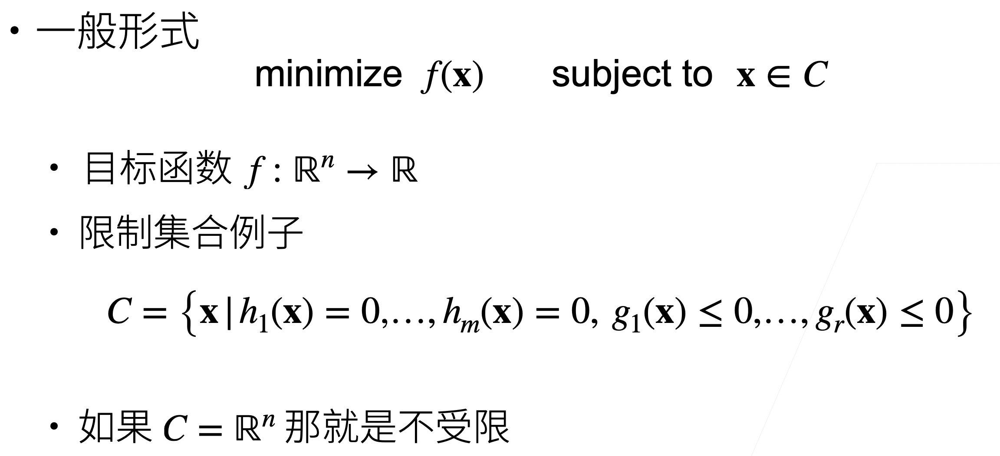
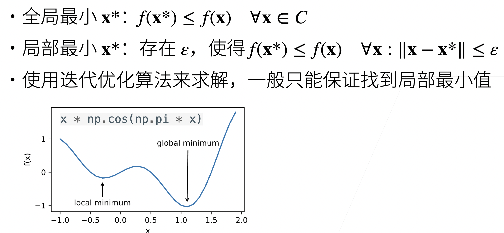
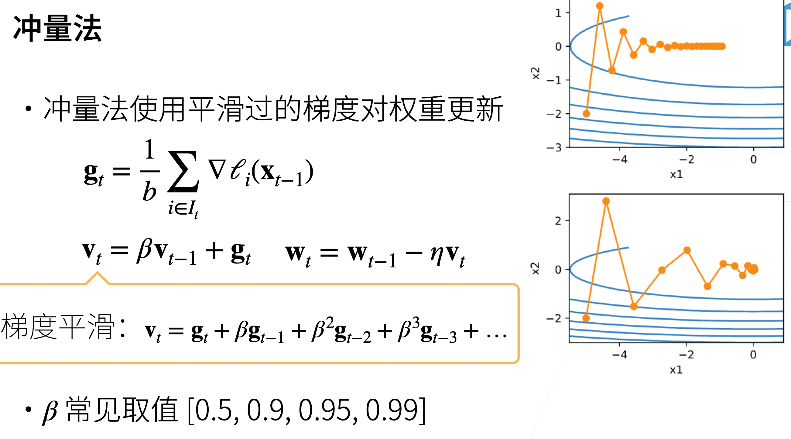
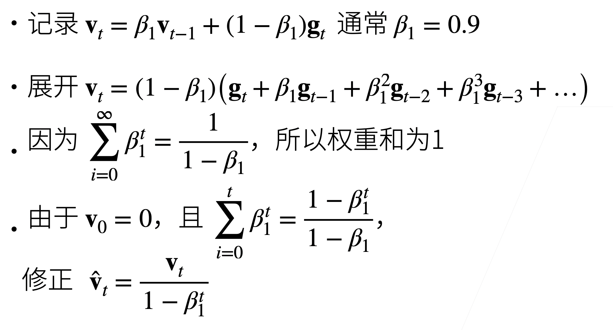
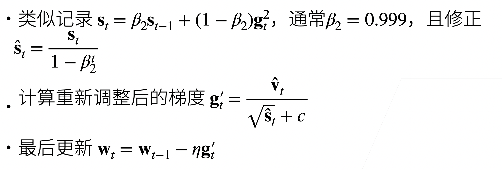

## 72.优化算法
### 目录
- [72.优化算法](#72优化算法)
  - [目录](#目录)
  - [1.优化问题](#1优化问题)
  - [2.局部最小 vs 全局最小](#2局部最小-vs-全局最小)
  - [3.凸集和凸函数](#3凸集和凸函数)
  - [4.梯度下降](#4梯度下降)
  - [5.冲量法](#5冲量法)
  - [6.Adam](#6adam)
  - [总结](#总结)
### 1.优化问题

  

### 2.局部最小 vs 全局最小

  

### 3.凸集和凸函数

- 凸集：形象化来说，就是这个集合上任意两个点连一条线，这个线在集合里面
- 凸函数：形象上来说函数上任取两个点连线，函数都在该线下面
- 凸优化问题：局部最小一定是全局最小。严格凸优化问题有唯一的全局最小。
  - 凸：线性回归，softmax回归
  - 非凸：其他（MLP,CNN,RNN,attention）

### 4.梯度下降

- 梯度下降——最简单的迭代求解算法
- 随机梯度下降
  - 求导数需要求所有样本导数，样本多的情况下代价太大
  - 理论依据：所用样本，和随机选取一个样本得到的数学期望是一样的。
- 小批量随机梯度下降（实际应用的）
  - 计算原因：计算单样本的梯度难以完全利用硬件资源
  - 采集一个随机子集
  - 理论依据：无偏近，但降低了方差

### 5.冲量法

- 使用平滑过的梯度对权重更新，不容易震荡
- momentum

  

### 6.Adam

- 非常平滑，对于学习率不敏感
- 对于t比较小的时候，由于$v_0=0$,所以会导致一开始值比较小，做了一个修正。

  

- 为什么除以$\sqrt{\widehat{s}_t}+\epsilon$？
  - 在nlp里面常用，起到正则化的作用，控制每个维度的值在合适的大小。

  

### 总结

- 深度学习模型大部分是非凸的
- 小批量随机梯度下降是最常见的优化算法
- 冲量是对梯度做平滑
- Adam是对梯度做平滑，且对梯度各个维度值做重新调整，对于学习率不敏感

